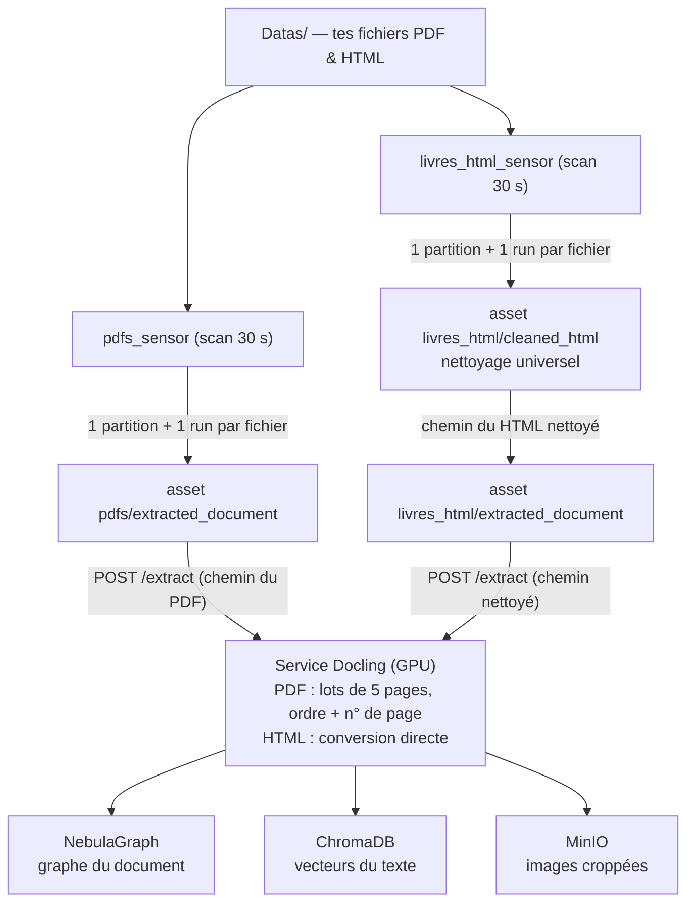

# RAG Assistant Pipeline 🚀

Ce projet est un pipeline d'ingestion de documents (HTML et PDF) conçu pour alimenter un assistant RAG (Retrieval-Augmented Generation). Il utilise **Docling** pour l'extraction structurée intelligente, **NebulaGraph** pour le Knowledge Graph, **ChromaDB** pour le stockage vectoriel, **MinIO** pour les médias, et **Dagster** pour l'orchestration.

---

## 🛠 Architecture & Technologies

- **Docling-Service (FastAPI)** : Microservice dédié à l'extraction de documents via Docling (sur GPU). Les images et tableaux complexes en sont extraits et découpés *(crop)* avec PyMuPDF.
- **Orchestration (Dagster)** : Les sources sont déclarées dans `src/pipeline/sources.yaml` ; une factory génère pour chacune ses partitions (une par fichier), son job et son sensor. Les sources HTML passent par un asset de nettoyage universel (trafilatura + readability) avant extraction.
- **Base Graphe** : [NebulaGraph](https://nebula-graph.io/) couplé au Studio pour créer la cartographie relationnelle (Document > Section > Text > Image/Table).
- **Base Vectorielle** : [ChromaDB](https://www.trychroma.com/) couplé à des modèles d'embeddings locaux (`SentenceTransformers`).
- **Stockage Objet** : [MinIO](https://min.io/) pour héberger les images extraites et récupérables via la clé `minio_url`.
- **Plateforme** : Entièrement déployé sous forme de conteneurs multi-services via Docker-Compose.

### Schéma du pipeline



Chaque source déclarée dans `sources.yaml` génère sa propre chaîne (sensor → partitions → assets → job), préfixée par son nom. Le service Docling est le seul à écrire dans les trois stores.

---

## 🚀 Quickstart

### 1. Configurer l'environnement
```bash
# Copier le gabarit et remplir les valeurs (notamment les mots de passe)
cp .env.example .env
# Générer un mot de passe MinIO sécurisé :
# openssl rand -base64 24
```

### 2. Démarrer les services
Assurez-vous d'avoir Docker et le plugin NVIDIA Container Toolkit installés (si utilisation GPU).
```bash
# Construire et lancer toute la stack en arrière-plan
docker compose up -d --build
```

**Machine sans GPU ?** Créez un `docker-compose.override.yml` (gitignoré) pour retirer la
réservation nvidia de Docling — l'extraction tourne alors en CPU, plus lentement :
```yaml
services:
  docling-service:
    deploy: !override
      resources:
        limits:
          memory: 10G
```

### 3. Accéder aux interfaces
| Service | URL | Note |
| :--- | :--- | :--- |
| **Dagster (UI)** | [http://localhost:3002](http://localhost:3002) | Gestion, exécution des assets et activation des Sensors. |
| **Nebula Studio** | [http://localhost:7001](http://localhost:7001) | **Host:** `graphd` \| **Port:** `9669` \| Credentials : voir `.env` |
| **MinIO Console** | [http://localhost:9101](http://localhost:9101) | Credentials : voir `.env` |
| **Docling API** | `http://localhost:8000/extract` | API interne (accessible côté host via port 8000). |
| **ChromaDB** | `http://localhost:8080/api/v1` | Point d'entrée de la base vectorielle. |

### 4. Lancer l'ingestion
1. Placez vos fichiers dans le dossier `./Datas` de la racine du projet (par défaut : `Datas/pdfs/` pour les PDF, `Datas/htms/` pour les HTML).
2. Ouvrez l'interface **Dagster** : chaque source déclarée dans `src/pipeline/sources.yaml` a son propre sensor (`pdfs_sensor`, `livres_html_sensor`, ...), actif par défaut dans **Overview -> Sensors**.
3. Le système détecte automatiquement un nouveau fichier (une partition par fichier) et lance le pipeline complet pour l'ingérer dans Nebula, ChromaDB, et MinIO !

---

## ➕ Ajouter une nouvelle source

Ajouter une source (ex: un site capturé avec [SingleFile](https://github.com/gildas-lormeau/SingleFile)) ne demande **aucun code Python** :

1. Déposez les fichiers dans un sous-dossier de `./Datas`, ex. `Datas/captures/monsite/`.
2. Déclarez la source dans `src/pipeline/sources.yaml` :
   ```yaml
   - name: capture_monsite
     glob: "captures/monsite/**/*.html"
     type: html
     cleaning:                                    # optionnel
       extra_remove_selectors: [".cookie-banner"]
   ```
3. Rechargez le code location dans l'UI Dagster (bouton **Reload definitions**). Un sensor `capture_monsite_sensor` apparaît et ingère les fichiers.

### Nettoyage HTML universel

Les sources HTML passent par un nettoyage en étages, sans configuration par site :
1. **Formules mathématiques** : les formules rendues (KaTeX, MathJax v2/v3, MathML) sont remplacées par leur source LaTeX — `$...$` (inline) ou `$$...$$` (bloc) — récupérée dans le DOM avant toute suppression. Sans ça, le rendu web produit du texte dupliqué illisible.
2. **Pré-passe d'hygiène** : suppression des scripts, styles, éléments cachés (`sf-hidden`, `display:none`), chrome de page (nav, rôles ARIA), commentaires, icônes inline (< 4 Ko) et décorations d'ancres dans les titres. Les **images base64 volumineuses sont exportées vers MinIO** et leur `src` réécrit (comme les crops PDF) ; les `header`/`footer` internes à un `<article>` sont conservés (ils portent le titre).
3. **Extraction de contenu** : un profil par site (s'il est déclaré) gagne directement ; sinon les conteneurs sémantiques HTML5 (`<article>`, `<main>`) font autorité ; sinon [trafilatura](https://trafilatura.readthedocs.io/) et readability-lxml sont comparés et le plus complet gagne. Si aucun `<h1>` ne survit, le titre de la page est réinjecté (structure propre pour Docling).
4. **Garde-fou** : si trop peu de texte est extrait, le HTML pré-nettoyé est conservé tel quel (rien n'est perdu) et un warning apparaît dans les logs Dagster.

La stratégie retenue, les tailles avant/après et le nombre d'images exportées sont visibles dans les métadonnées de l'asset `cleaned_html` de chaque partition. Si un site ressort mal, déclarez-lui un profil `detect`/`content`/`strip` dans `sources.yaml` (voir l'exemple en tête du fichier).

---

## 🗺️ Exploration du Graphe (NebulaGraph)

Le pipeline génère un graphe sémantique où chaque document est un nœud central relié à ses composants (titres, paragraphes, images, etc.).

### 🔍 Requêtes nGQL types (à taper dans l'onglet Console)

**IMPORTANT : Ne tapez pas `USE rag_space;` dans la console !** 
Dans Nebula Studio, vous devez **d'abord** sélectionner l'espace `rag_space` depuis le menu déroulant en haut à droite. Ensuite, vous pourrez exécuter les requêtes suivantes :

1. **Voir un document complet et sa structure** (ronds reliés) :
   ```ngql
   MATCH p=(d:Document)-[r:PARENT_OF]->(e) 
   WHERE d.filename == "statisticsfordatascience" 
   RETURN p;
   ```

2. **Visualiser uniquement le squelette (titres et sections)** :
   ```ngql
   MATCH p=(d:Document)-[:PARENT_OF]->(s:SectionHeader) 
   RETURN p;
   ```

3. **Trouver les images et leurs légendes** (relations sémantiques) :
   ```ngql
   MATCH p=(c:Caption)-[:LINKED_TO]->(res) 
   RETURN p;
   ```

### 🎨 Guide de Visualisation (Studio v3.8.0)

Pour un rendu optimal, configurez les couleurs par **Tag** dans l'interface :
1. Sélectionnez l'espace **`rag_space`** en haut à droite.
2. Dans l'onglet **Console** ou **Visualisation** :
   - **Document** : 🔴 Rouge (Nœud racine)
   - **SectionHeader** : 🔵 Bleu (Structure)
   - **Paragraph** : ⚪ Gris (Contenu)
   - **Table / Picture** : 🟢 Vert (Ressources riches)
   - **Caption** : 🟡 Jaune (Métadonnées liées)
3. Utilisez le **Vertex Filter** pour isoler des types spécifiques (ex: ne montrer que `Code` et `Formula`).

---

## 📁 Structure du Projet

```text
RAG_Assistant/
├── Datas/                      # Dossier source partagé pour vos livres (HTML/PDF)
│   └── .cleaned/               # HTML nettoyés (générés par le pipeline)
├── documentation/              # Documentation technique détaillée de l'architecture
├── src/
│   ├── docling_service/        # API FastAPI pour l'extraction et PyMuPDF
│   └── pipeline/               # Orchestration Dagster
│       ├── sources.yaml        # Déclaration des sources (1 bloc = 1 source)
│       ├── sources.py          # Modèles de configuration des sources
│       ├── factory.py          # Génération assets/jobs/sensors par source
│       ├── cleaning.py         # Nettoyage HTML universel (trafilatura/readability)
│       └── definitions.py      # Point d'entrée Dagster
├── docker-compose.yml          # Configuration de la stack
├── Dockerfile.dagster          # Environnement Dagster
└── Dockerfile.docling          # Environnement extraction GPU
```
