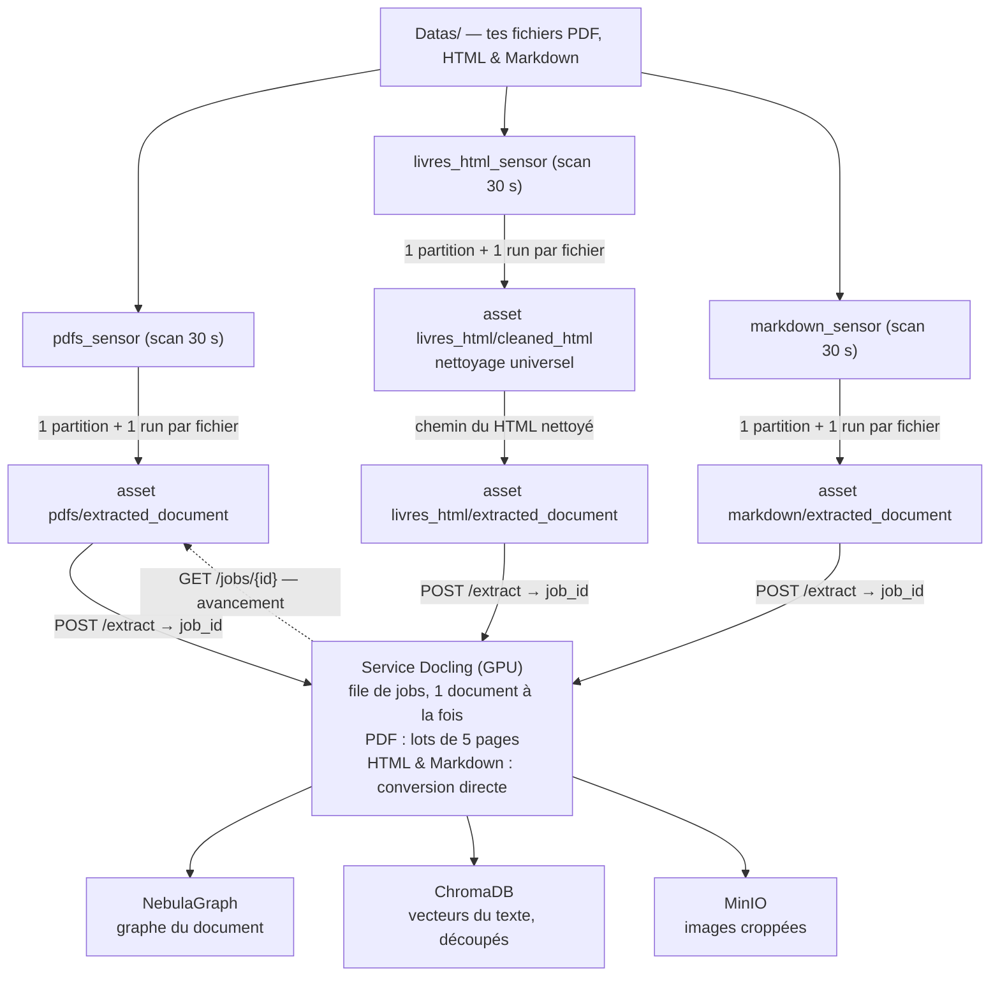

# RAG Assistant Pipeline

**Pipeline d'ingestion de documents PDF, HTML et Markdown pour un assistant RAG : extraction structurée via Docling, graphe de connaissances NebulaGraph, base vectorielle ChromaDB, médias sur MinIO, orchestration Dagster.**


---

## Architecture & Technologies

- **Docling-Service (FastAPI)** : Microservice dédié à l'extraction de documents via Docling (sur GPU). Les images et tableaux complexes en sont extraits et découpés *(crop)* avec PyMuPDF. L'extraction est **asynchrone** : `POST /extract` met en file et rend un identifiant de job, qu'un worker unique déroule pendant que Dagster suit l'avancement.
- **Orchestration (Dagster)** : Les sources sont déclarées dans `src/pipeline/sources.yaml` ; une factory génère pour chacune ses partitions (une par fichier), son job et son sensor. Les sources HTML passent par un asset de nettoyage universel (trafilatura + readability) avant extraction ; les PDF et les Markdown partent directement à l'extraction.
- **Base Graphe** : [NebulaGraph](https://nebula-graph.io/) couplé au Studio pour créer la cartographie relationnelle (Document > Section > Text > Image/Table).
- **Base Vectorielle** : [ChromaDB](https://www.trychroma.com/) couplé à des modèles d'embeddings locaux (`SentenceTransformers`).
- **Stockage Objet** : [MinIO](https://min.io/) pour héberger les images extraites et récupérables via la clé `minio_url`.
- **Plateforme** : Entièrement déployé sous forme de conteneurs multi-services via Docker-Compose.

### Schéma du pipeline


```mermaid
flowchart TD
    A["Datas/ — tes fichiers PDF, HTML & Markdown"] --> S1["pdfs_sensor (scan 30 s)"]
    A --> S2["livres_html_sensor (scan 30 s)"]
    A --> S3["markdown_sensor (scan 30 s)"]
    S1 -- "1 partition + 1 run par fichier" --> E1["asset pdfs/extracted_document"]
    S3 -- "1 partition + 1 run par fichier" --> E3["asset markdown/extracted_document"]
    S2 -- "1 partition + 1 run par fichier" --> C["asset livres_html/cleaned_html<br/>nettoyage universel"]
    C -- "chemin du HTML nettoyé" --> E2["asset livres_html/extracted_document"]
    E1 -- "POST /extract → job_id" --> D["Service Docling (GPU)<br/>file de jobs, 1 document à la fois<br/>PDF : lots de 5 pages<br/>HTML & Markdown : conversion directe"]
    E2 -- "POST /extract → job_id" --> D
    E3 -- "POST /extract → job_id" --> D
    D -. "GET /jobs/{id} — avancement" .-> E1
    D --> N["NebulaGraph<br/>graphe du document"]
    D --> V["ChromaDB<br/>vecteurs du texte, découpés"]
    D --> M["MinIO<br/>images croppées"]
```

Chaque source déclarée dans `sources.yaml` génère sa propre chaîne (sensor → partitions → assets → job), préfixée par son nom. Le service Docling est le seul à écrire dans les trois stores.

Le débit est cadencé à deux niveaux : la file Dagster (`max_concurrent_runs: 2` dans `dagster.yaml`) limite le nombre de runs simultanés, et le service Docling ne convertit qu'un document à la fois. Un corpus de plusieurs dizaines de livres se déroule donc sans saturer la machine — il prend le temps qu'il prend, et l'avancement de chaque document est visible dans les logs de son run.

> Détails : [documentation/architecture.md](documentation/architecture.md)

## Documentation

| Document | Contenu |
|---|---|
| [architecture.md](documentation/architecture.md) | Services, flux de bout en bout, décisions d'architecture |
| [SECURITY.md](documentation/SECURITY.md) | Secrets, isolation réseau, audit des dépendances |
| [services/](documentation/services/) | Une fiche technique par service (ChromaDB, Dagster, Docling, MinIO, NebulaGraph, PostgreSQL) |
| [extraction_donnees.md](documentation/extraction_donnees.md) | Algorithme d'extraction Docling, crop des médias, format JSON |
| [orchestration.md](documentation/orchestration.md) | Détail de l'orchestrateur Dagster |
| [graphe_connaissances.md](documentation/graphe_connaissances.md) | Modèle de graphe NebulaGraph et requêtes nGQL |
| [base_vectorielle.md](documentation/base_vectorielle.md) | Stockage et recherche vectorielle ChromaDB |
| [stockage_objets.md](documentation/stockage_objets.md) | Stockage des médias sur MinIO |
| [llm_integration_plan.md](documentation/llm_integration_plan.md) | Contrat d'interface avec l'agent RAG (projet séparé) |
| [rag_evaluation_strategy.md](documentation/rag_evaluation_strategy.md) | Stratégie d'évaluation du RAG |

## Quickstart

### 1. Configurer l'environnement
```bash
# Copier le gabarit et remplir les valeurs (notamment les mots de passe)
cp .env.example .env
# Générer un mot de passe MinIO sécurisé :
# openssl rand -base64 24
```

### 2. Démarrer les services
Assurez-vous d'avoir Docker et le plugin NVIDIA Container Toolkit installés (si utilisation GPU).
```bash
# Construire et lancer toute la stack en arrière-plan
docker compose up -d --build
```

**Machine sans GPU ?** Créez un `docker-compose.override.yml` (gitignoré) pour retirer la
réservation nvidia de Docling — l'extraction tourne alors en CPU, plus lentement :
```yaml
services:
  docling-service:
    deploy: !override
      resources:
        limits:
          memory: 10G
```

### 3. Accéder aux interfaces
| Service | URL | Note |
| :--- | :--- | :--- |
| **Dagster (UI)** | [http://localhost:3002](http://localhost:3002) | Gestion, exécution des assets et activation des Sensors. |
| **Nebula Studio** | [http://localhost:7001](http://localhost:7001) | **Host:** `graphd` \| **Port:** `9669` \| Credentials : voir `.env` |
| **MinIO Console** | [http://localhost:9001](http://localhost:9001) | Credentials : voir `.env` |
| **Docling API** | `http://localhost:8000/health` | `POST /extract` rend un `job_id`, suivi sur `GET /jobs/{id}`. |
| **ChromaDB** | `http://localhost:8080/api/v1` | Point d'entrée de la base vectorielle. |

Seuls Dagster et Nebula Studio sont exposés par `docker-compose.yml`. Les autres services ne le sont que via `docker-compose.override.yml` (gitignoré, cf. § *Machine sans GPU* ci-dessus) : si l'un de ces ports est déjà pris sur votre machine, c'est là qu'il faut le décaler.

### 4. Lancer l'ingestion
1. Placez vos fichiers dans le dossier `./Datas` de la racine du projet (par défaut : `Datas/pdfs/` pour les PDF, `Datas/htms/` pour les HTML, `Datas/mds/` pour le Markdown).
2. Ouvrez l'interface **Dagster** : chaque source déclarée dans `src/pipeline/sources.yaml` a son propre sensor (`pdfs_sensor`, `livres_html_sensor`, ...), actif par défaut dans **Overview -> Sensors**.
3. Le système détecte automatiquement un nouveau fichier (une partition par fichier) et lance le pipeline complet pour l'ingérer dans Nebula, ChromaDB, et MinIO !

---

## Ajouter une nouvelle source

Ajouter une source (ex: un site capturé avec [SingleFile](https://github.com/gildas-lormeau/SingleFile)) ne demande **aucun code Python** :

1. Déposez les fichiers dans un sous-dossier de `./Datas`, ex. `Datas/captures/monsite/`.
2. Déclarez la source dans `src/pipeline/sources.yaml` :
   ```yaml
   - name: capture_monsite
     glob: "captures/monsite/**/*.html"
     type: html
     cleaning:                                    # optionnel
       extra_remove_selectors: [".cookie-banner"]
   ```
3. Rechargez le code location dans l'UI Dagster (bouton **Reload definitions**). Un sensor `capture_monsite_sensor` apparaît et ingère les fichiers.

### Les trois types de sources

| `type` | Chaîne d'assets | Quand l'utiliser |
|---|---|---|
| `pdf` | extraction directe, par lots de pages, images croppées vers MinIO | Livres et documents paginés |
| `html` | nettoyage universel puis extraction | Captures de sites, livres découpés en chapitres HTML |
| `md` | extraction directe | Markdown déjà propre : notes, exports, documentation |

Le Markdown ne passe pas par le nettoyage : il n'a ni boilerplate à retirer ni image inline à exporter.

```yaml
- name: markdown
  glob: "mds/**/*.md"
  type: md
```

Un point mérite d'être connu : **Docling convertit le Markdown ligne par ligne**. Un fichier dont les paragraphes sont coupés à 80 colonnes produirait donc un élément par ligne, et la recherche vectorielle porterait sur des fragments de 75 caractères. Les paragraphes sont pour cette raison recollés avant conversion — sans toucher au fichier source, et en laissant intacts blocs de code, tableaux, listes, titres et retours à la ligne explicites.

### Nettoyage HTML universel

Les sources HTML passent par un nettoyage en étages, sans configuration par site :
1. **Formules mathématiques** : les formules rendues (KaTeX, MathJax v2/v3, MathML) sont remplacées par leur source LaTeX — `$...$` (inline) ou `$$...$$` (bloc) — récupérée dans le DOM avant toute suppression. Sans ça, le rendu web produit du texte dupliqué illisible.
2. **Pré-passe d'hygiène** : suppression des scripts, styles, éléments cachés (`sf-hidden`, `display:none`), chrome de page (nav, rôles ARIA), commentaires, icônes inline (< 4 Ko) et décorations d'ancres dans les titres. Les **images base64 volumineuses sont exportées vers MinIO** et leur `src` réécrit (comme les crops PDF) ; les `header`/`footer` internes à un `<article>` sont conservés (ils portent le titre).
3. **Extraction de contenu** : un profil par site (s'il est déclaré) gagne directement ; sinon les conteneurs sémantiques HTML5 (`<article>`, `<main>`) font autorité ; sinon [trafilatura](https://trafilatura.readthedocs.io/) et readability-lxml sont comparés et le plus complet gagne. Si aucun `<h1>` ne survit, le titre de la page est réinjecté (structure propre pour Docling).
4. **Garde-fou** : si trop peu de texte est extrait, le HTML pré-nettoyé est conservé tel quel (rien n'est perdu) et un warning apparaît dans les logs Dagster.

La stratégie retenue, les tailles avant/après et le nombre d'images exportées sont visibles dans les métadonnées de l'asset `cleaned_html` de chaque partition. Si un site ressort mal, déclarez-lui un profil `detect`/`content`/`strip` dans `sources.yaml` (voir l'exemple en tête du fichier).

---

## Ingestion à grande échelle

Un corpus de plusieurs dizaines de livres de 300 à 400 pages se déroule sans intervention, mais demande de savoir quoi regarder.

**Comment le débit est cadencé.** Le sensor crée une partition et un run par fichier. La file Dagster n'en exécute que deux à la fois (`max_concurrent_runs` dans `dagster.yaml`), et le service Docling ne convertit qu'un document à la fois : les autres runs attendent visiblement dans **Runs → Queued**. Rien ne sature, rien ne se perd, et l'ordre est celui de la découverte.

**Suivre un document.** Chaque run journalise l'avancement de son job toutes les 15 secondes : pages traitées, éléments extraits, chunks écrits. À la fin, les métadonnées de l'asset `extracted_document` récapitulent le total et la durée. Côté service :

```bash
docker compose logs -f docling-service
```

**Ce qui fait échouer un run — et ce que ça veut dire.**

| Message | Cause | Quoi faire |
|---|---|---|
| `Job ... inconnu du service Docling (redémarrage ?)` | Le service a redémarré, la file est en mémoire | Relancer la partition depuis l'UI Dagster |
| `N batch(s) non convertis` | Des pages n'ont pas pu être lues par Docling | Les autres pages sont bien ingérées ; le message liste les pages manquantes |
| `Service Docling toujours pas prêt` | Modèles ou schéma NebulaGraph pas encore initialisés | Attendre la fin du démarrage (`docker compose ps` : `healthy`) |
| `nGQL rejeté ...` | Écriture refusée par le graphe | Le run échoue volontairement plutôt que de laisser un graphe incomplet |

**Ré-ingérer proprement.** Les identifiants d'éléments sont déterministes : ré-ingérer un document écrase ses nœuds et ses vecteurs au lieu de les dupliquer. Pour repartir de zéro sur tous les stores, le script tourne **dans le réseau Docker** (il s'adresse à `chromadb` et `graphd` par leur nom de service) :

```bash
docker compose exec docling-service python -m src.wipe_stores
```

Le space NebulaGraph étant supprimé, redémarrez ensuite le service pour qu'il recrée le schéma :

```bash
docker compose restart docling-service
```

**Contrôle avant-vol.** Avant de lancer le gros corpus, vérifiez que les trois stores répondent :

```bash
docker compose exec docling-service python -m src.verify_data
```

**Contrôle après ingestion.** Un rapport sur la qualité de l'index vectoriel : volume, bruit résiduel, taille des chunks, et surtout part des chunks qui dépassent la fenêtre du modèle d'embedding — ceux-là sont tronqués par le modèle lui-même, en silence.

```bash
docker compose exec docling-service python -m src.index_report
```

**Volumétrie.** Mesurée sur le corpus de référence (1 PDF de 280 pages + 36 chapitres HTML + 1 Markdown) : 536 Mo dans `Datas/database/` — 242 Mo pour NebulaGraph, 226 Mo pour ChromaDB, 68 Mo pour MinIO — soit 24 709 nœuds de graphe, 5 246 chunks vectorisés et 1 246 images. Comptez de l'ordre de **4 à 5 Go pour 50 livres de 300 pages**.

**Débit.** Toujours sur ce corpus : 39 documents ingérés en 4 minutes, dont le PDF de 280 pages en ~3 minutes à lui seul. Comptez **3 à 4 heures pour 50 livres**, sans surveillance.

**Mémoire.** Le service d'extraction se stabilise autour de 6 Go (limite fixée à 10 Go dans `docker-compose.yml`), l'essentiel étant les modèles chargés une fois pour toutes. Aucune dérive observée d'un document à l'autre.

---

## Exploration du Graphe (NebulaGraph)

Le pipeline génère un graphe sémantique où chaque document est un nœud central relié à ses composants (titres, paragraphes, images, etc.).

### Requêtes nGQL types (à taper dans l'onglet Console)

**IMPORTANT : Ne tapez pas `USE rag_space;` dans la console !**
Dans Nebula Studio, vous devez **d'abord** sélectionner l'espace `rag_space` depuis le menu déroulant en haut à droite. Ensuite, vous pourrez exécuter les requêtes suivantes :

1. **Voir un document complet et sa structure** (ronds reliés) :
   ```ngql
   MATCH p=(d:Document)-[r:PARENT_OF]->(e)
   WHERE d.filename == "statisticsfordatascience"
   RETURN p;
   ```

2. **Visualiser uniquement le squelette (titres et sections)** :
   ```ngql
   MATCH p=(d:Document)-[:PARENT_OF]->(s:SectionHeader)
   RETURN p;
   ```

3. **Trouver les images et leurs légendes** (relations sémantiques) :
   ```ngql
   MATCH p=(c:Caption)-[:LINKED_TO]->(res)
   RETURN p;
   ```

### Guide de Visualisation (Studio v3.8.0)

Pour un rendu optimal, configurez les couleurs par **Tag** dans l'interface :
1. Sélectionnez l'espace **`rag_space`** en haut à droite.
2. Dans l'onglet **Console** ou **Visualisation** :
   - **Document** : Rouge (Nœud racine)
   - **SectionHeader** : Bleu (Structure)
   - **Paragraph** : Gris (Contenu)
   - **Table / Picture** : Vert (Ressources riches)
   - **Caption** : Jaune (Métadonnées liées)
3. Utilisez le **Vertex Filter** pour isoler des types spécifiques (ex: ne montrer que `Code` et `Formula`).

---

## Structure du Projet

```text
RAG_Assistant/
├── Datas/                      # Dossier source partagé pour vos livres (HTML/PDF)
│   └── .cleaned/               # HTML nettoyés (générés par le pipeline)
├── documentation/              # Documentation technique détaillée de l'architecture
├── src/
│   ├── docling_service/        # Microservice d'extraction (GPU)
│   │   ├── main.py             # Application FastAPI : /extract, /jobs, /health
│   │   ├── jobs.py             # File de jobs et worker unique
│   │   ├── extraction.py       # Conversion Docling (PDF paginé, HTML/MD direct)
│   │   ├── elements.py         # Taxonomie des labels, hiérarchie et positions
│   │   ├── storage.py          # Persistance d'un lot : graphe puis vecteurs
│   │   ├── nebula.py           # Écritures NebulaGraph groupées, pool partagé
│   │   ├── ngql.py             # Échappement et construction des requêtes nGQL
│   │   ├── vectors.py          # Embeddings par lots et upsert ChromaDB
│   │   ├── blocks.py           # Regroupement en blocs, filtrage du bruit
│   │   ├── chunking.py         # Découpage des textes longs, contextualisation
│   │   ├── markdown.py         # Normalisation du Markdown avant conversion
│   │   └── images.py           # Crop PyMuPDF et export MinIO
│   └── pipeline/               # Orchestration Dagster
│       ├── sources.yaml        # Déclaration des sources (1 bloc = 1 source)
│       ├── sources.py          # Modèles de configuration des sources
│       ├── factory.py          # Génération assets/jobs/sensors par source
│       ├── cleaning.py         # Nettoyage HTML universel (trafilatura/readability)
│       ├── schemas.py          # Contrat de données partagé avec rag-agent-chat
│       └── definitions.py      # Point d'entrée Dagster
├── docker-compose.yml          # Configuration de la stack
├── Dockerfile.dagster          # Environnement Dagster
└── Dockerfile.docling          # Environnement extraction GPU
```

---

## Tests

```bash
uv sync && uv pip install -r requirements-dev.txt && uv run pytest
```

La logique sensible du service d'extraction (échappement nGQL, découpage des textes, hiérarchie et positions des éléments, file de jobs) vit dans des modules sans dépendance lourde : elle est donc testée sans Docling, torch ni NebulaGraph.

---

## Licences & composants

| Composant | Rôle | Licence |
|---|---|---|
| Dagster | Orchestration du pipeline | Apache-2.0 |
| Docling | Extraction de documents | MIT |
| BeautifulSoup4 / lxml | Parsing HTML | MIT / BSD-3-Clause |
| trafilatura | Extraction de contenu web | Apache-2.0 |
| readability-lxml | Extraction d'article | Apache-2.0 |
| ChromaDB | Base vectorielle | Apache-2.0 |
| Nebula Graph | Graphe de connaissances | Apache-2.0 |
| PostgreSQL | Métadonnées Dagster | PostgreSQL License (open-source) |
| MinIO | Stockage d'objets | AGPL-3.0 |
| requests | Client HTTP | Apache-2.0 |
| **Ce projet** | Code applicatif | MIT — Copyright (c) 2026 floSa `<à confirmer : aucun fichier LICENSE présent>` |
