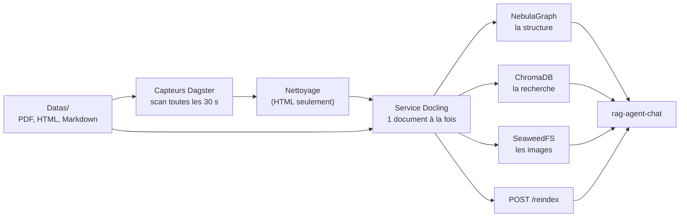

# RAG Assistant Pipeline

**Il avale des livres techniques et en fabrique trois choses qu'un agent
conversationnel interroge : un graphe (la structure), un index vectoriel (la
recherche par le sens), un stockage d'objets (les images). Il ne répond à
aucune question — c'est le travail de
[`rag-agent-chat`](https://github.com/floSa/rag-agent-chat), qui vit dans un
autre dépôt et lit ces trois stores.**


---

## Par où commencer

| Vous voulez… | Lisez |
|---|---|
| **savoir ce que le projet garantit, sans le lancer** | **[`documentation/etat_des_lieux.md`](documentation/etat_des_lieux.md)** — à lire en premier |
| **le lancer, ingérer, vérifier, revenir en arrière** | **[`documentation/livraison.md`](documentation/livraison.md)** — le mode d'emploi complet, chaque commande datée |
| l'exploitation courante en détail | [`documentation/guide_du_depot.md`](documentation/guide_du_depot.md) |
| toute la documentation | [`documentation/`](documentation/) — [architecture](documentation/architecture.md), [extraction](documentation/extraction_donnees.md), [graphe](documentation/graphe_connaissances.md), [index vectoriel](documentation/base_vectorielle.md), [stockage d'objets](documentation/stockage_objets.md), [orchestration](documentation/orchestration.md), [sécurité](documentation/SECURITY.md), [fiches par service](documentation/services/) |
| le contrat avec l'agent, et ce qui est ouvert | [`documentation/axes_amelioration.md`](documentation/axes_amelioration.md) (le registre) |

## Architecture

- **`docling-service`** (FastAPI) — extraction Docling, découpage, encodage.
  **Le seul à écrire dans les trois stores.** `POST /extract` met en file et
  rend un `job_id` ; un worker unique convertit **un document à la fois**.
- **Dagster** — les sources sont déclarées dans `src/pipeline/sources.yaml` ;
  une fabrique génère pour chacune ses partitions (une par fichier), son job et
  son capteur. Les HTML passent par un nettoyage universel ; les PDF et les
  Markdown partent directement à l'extraction.
- **[NebulaGraph](https://nebula-graph.io/)** — la structure
  (`Document > Section > Text > Image/Table`), avec le Studio.
- **[ChromaDB](https://www.trychroma.com/)** — la recherche par le sens,
  embeddings locaux (`SentenceTransformers`).
- **[SeaweedFS](https://github.com/seaweedfs/seaweedfs)** — le stockage d'objets,
  par sa passerelle S3 (`seaweedfs:8333`). **Il a remplacé MinIO le 25 septembre
  2026** ; MinIO reste debout, intact, comme retour arrière.
- Tout tourne en conteneurs, par Docker Compose, **sur processeur** — le GPU est
  une surcouche facultative.


```mermaid
flowchart LR
    A["Datas/<br/>PDF, HTML, Markdown"] --> S["Capteurs Dagster<br/>scan toutes les 30 s"]
    S --> C["Nettoyage<br/>(HTML seulement)"]
    C --> D["Service Docling<br/>1 document à la fois"]
    A --> D
    D --> N["NebulaGraph<br/>la structure"]
    D --> V["ChromaDB<br/>la recherche"]
    D --> M["SeaweedFS<br/>les images"]
    D --> R["POST /reindex"]
    N --> AG["rag-agent-chat"]
    V --> AG
    M --> AG
    R --> AG
```

## Démarrer

```bash
cp .env.example .env     # puis remplir — le gabarit porte le motif de chaque variable
docker compose up -d --build
docker compose ps        # seaweedfs et docling-service doivent passer « healthy »
```

Dagster est sur `http://localhost:3002`, Nebula Studio sur
`http://localhost:7001`. Déposez vos fichiers dans `Datas/pdfs/`, `Datas/htms/`
ou `Datas/mds/` : le capteur de la source — `pdfs_sensor`, `livres_html_sensor`
ou `markdown_sensor` — les voit dans les 30 s et l'ingestion part seule.

**Réingérer un fichier inchangé ne se fait pas tout seul, et c'est voulu** : sa
clé de run est déjà consommée. La réingestion **se demande**, en posant un
marqueur sur le curseur du capteur — **l'étiquette doit être neuve à chaque
fois**, sans quoi la clé est déjà consommée et il ne se passe rien, sans un mot :

```bash
docker compose exec -T -w /opt/dagster/app -e PYTHONPATH=/opt/dagster/app \
  dagster-webserver dagster sensor cursor livres_html_sensor \
    --set 'reingerer:<étiquette>' -w src/workspace.yaml
```

Puis la purge, le redémarrage de `docling-service` et la relecture du curseur :
**§3 de [`documentation/livraison.md`](documentation/livraison.md)**.

> **Sur une pile déjà en service, ne jouez pas `docker compose up -d` nu** : il
> recrée tout ce dont la configuration a changé, **`minio` compris**, et cela
> détruit le retour arrière. Le détail, et les quatre autres pièges qui ne font
> pas de bruit, sont au **§6 de
> [`documentation/livraison.md`](documentation/livraison.md)** — à lire avant de
> toucher à une pile existante.

## Vérifier

```bash
uv sync && make all
```

`lint`, `typecheck`, `test`, le rejeu des mutations, puis `format-check`. Dans le
clone principal, `make install` remplace `uv sync` : il arme aussi les hooks git.

Les sondes de l'index, du graphe et du stockage — `verify_contract`,
`index_report`, `comparer`, le jeu de questions, le rappel vectoriel, les huit
comptes — sont au **§4 de [`documentation/livraison.md`](documentation/livraison.md)**,
avec leur commande, leur attendu et leur dernière mesure.

## L'état, au 25 septembre 2026

| | |
|---|---|
| documents indexés | **23** |
| chunks dans l'index vectoriel | **4 367** |
| sommets dans le graphe | **15 196** (15 173 sans les `Document`), **15 173** arêtes `PARENT_OF` |
| objets dans le stockage | **212**, servis par **SeaweedFS** |
| tests automatisés | **1 084**, tous verts ; **35** mutations rouges |
| `make all` | **verte, sans exception à connaître** |
| `verify_contract` | **`rc=1`**, et c'est l'attendu : la seule anomalie connue est les 52 tables HTML sans image |

**Les défauts connus, les prochaines étapes et ce qui n'est PAS vérifié** sont
aux §7, §8 et §10 de
[`documentation/livraison.md`](documentation/livraison.md).

## Licences

Voir [`documentation/guide_du_depot.md`](documentation/guide_du_depot.md#licences--composants).
