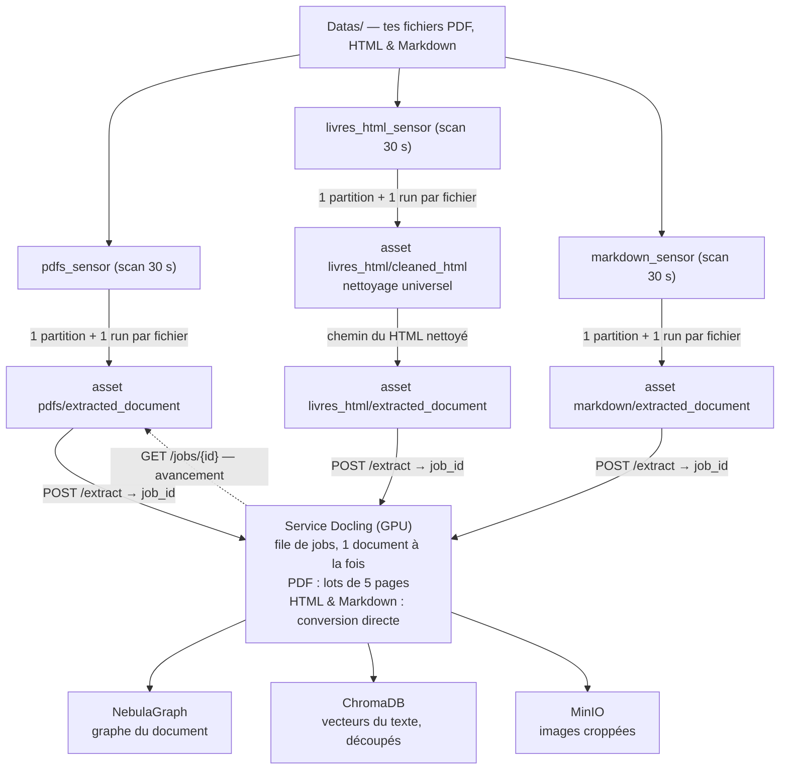

# RAG Assistant Pipeline

**Pipeline d'ingestion de documents PDF, HTML et Markdown pour un assistant RAG : extraction structurée via Docling, graphe de connaissances NebulaGraph, base vectorielle ChromaDB, médias sur MinIO, orchestration Dagster.**


---

## Architecture & Technologies

- **Docling-Service (FastAPI)** : Microservice dédié à l'extraction de documents via Docling (sur GPU). Les images et tableaux complexes en sont extraits et découpés *(crop)* avec PyMuPDF. L'extraction est **asynchrone** : `POST /extract` met en file et rend un identifiant de job, qu'un worker unique déroule pendant que Dagster suit l'avancement.
- **Orchestration (Dagster)** : Les sources sont déclarées dans `src/pipeline/sources.yaml` ; une factory génère pour chacune ses partitions (une par fichier), son job et son sensor. Les sources HTML passent par un asset de nettoyage universel (trafilatura + readability) avant extraction ; les PDF et les Markdown partent directement à l'extraction.
- **Base Graphe** : [NebulaGraph](https://nebula-graph.io/) couplé au Studio pour créer la cartographie relationnelle (Document > Section > Text > Image/Table).
- **Base Vectorielle** : [ChromaDB](https://www.trychroma.com/) couplé à des modèles d'embeddings locaux (`SentenceTransformers`).
- **Stockage Objet** : [MinIO](https://min.io/) pour héberger les images extraites et récupérables via la clé `minio_url`.
- **Plateforme** : Entièrement déployé sous forme de conteneurs multi-services via Docker-Compose.

### Schéma du pipeline


```mermaid
flowchart TD
    A["Datas/ — tes fichiers PDF, HTML & Markdown"] --> S1["pdfs_sensor (scan 30 s)"]
    A --> S2["livres_html_sensor (scan 30 s)"]
    A --> S3["markdown_sensor (scan 30 s)"]
    S1 -- "1 partition + 1 run par fichier" --> E1["asset pdfs/extracted_document"]
    S3 -- "1 partition + 1 run par fichier" --> E3["asset markdown/extracted_document"]
    S2 -- "1 partition + 1 run par fichier" --> C["asset livres_html/cleaned_html<br/>nettoyage universel"]
    C -- "chemin du HTML nettoyé" --> E2["asset livres_html/extracted_document"]
    E1 -- "POST /extract → job_id" --> D["Service Docling (GPU)<br/>file de jobs, 1 document à la fois<br/>PDF : lots de 5 pages<br/>HTML & Markdown : conversion directe"]
    E2 -- "POST /extract → job_id" --> D
    E3 -- "POST /extract → job_id" --> D
    D -. "GET /jobs/{id} — avancement" .-> E1
    D --> N["NebulaGraph<br/>graphe du document"]
    D --> V["ChromaDB<br/>vecteurs du texte, découpés"]
    D --> M["MinIO<br/>images croppées"]
```

Chaque source déclarée dans `sources.yaml` génère sa propre chaîne (sensor → partitions → assets → job), préfixée par son nom. Le service Docling est le seul à écrire dans les trois stores.

Le débit est cadencé à deux niveaux : la file Dagster (`max_concurrent_runs: 2` dans `dagster.yaml`) limite le nombre de runs simultanés, et le service Docling ne convertit qu'un document à la fois. Un corpus de plusieurs dizaines de livres se déroule donc sans saturer la machine — il prend le temps qu'il prend, et l'avancement de chaque document est visible dans les logs de son run.

> Détails : [documentation/architecture.md](documentation/architecture.md)

## Documentation

| Document | Contenu |
|---|---|
| **[CHANGEMENTS.md](documentation/CHANGEMENTS.md)** | **Ce qui a changé et ce que ça implique côté `rag-agent-chat` — à lire en premier** |
| [architecture.md](documentation/architecture.md) | Services, flux de bout en bout, décisions d'architecture |
| [SECURITY.md](documentation/SECURITY.md) | Secrets, isolation réseau, audit des dépendances |
| [services/](documentation/services/) | Une fiche technique par service (ChromaDB, Dagster, Docling, MinIO, NebulaGraph, PostgreSQL) |
| [extraction_donnees.md](documentation/extraction_donnees.md) | Algorithme d'extraction Docling, crop des médias, format JSON |
| [orchestration.md](documentation/orchestration.md) | Détail de l'orchestrateur Dagster |
| [graphe_connaissances.md](documentation/graphe_connaissances.md) | Modèle de graphe NebulaGraph et requêtes nGQL |
| [base_vectorielle.md](documentation/base_vectorielle.md) | Stockage et recherche vectorielle ChromaDB |
| [stockage_objets.md](documentation/stockage_objets.md) | Stockage des médias sur MinIO |
| [llm_integration_plan.md](documentation/llm_integration_plan.md) | Contrat d'interface avec l'agent RAG (projet séparé) |
| [rag_evaluation_strategy.md](documentation/rag_evaluation_strategy.md) | Stratégie d'évaluation du RAG |
| **[axes_amelioration.md](documentation/axes_amelioration.md)** | **Le registre du chantier : le contrat avec `rag-agent-chat`, ce qui est ouvert, ce qui est traité — chaque ligne vérifiable dans le code** |
| **[pilotage_du_chantier.md](documentation/pilotage_du_chantier.md)** | **Le mandat du pilote : reprise sur un poste neuf, état du chantier, plan de lots, conventions** |

## Quickstart

### 1. Configurer l'environnement
```bash
# Copier le gabarit et remplir les valeurs (notamment les mots de passe)
cp .env.example .env
# Générer un mot de passe MinIO sécurisé :
# openssl rand -base64 24
```

### 2. Démarrer les services
Docker suffit : **la stack démarre sur processeur, sans GPU ni NVIDIA Container Toolkit**.
```bash
# Construire et lancer toute la stack en arrière-plan
docker compose up -d --build
```

> **Vérifiez le modèle d'embedding avant d'ingérer quoi que ce soit.** Il doit être identique
> à celui de `rag-agent-chat`, et un désaccord ne lève aucune erreur — la recherche rend des
> passages plausibles et faux. Le service refuse désormais de démarrer sur un autre modèle ;
> si le conteneur meurt au lancement, lisez son journal avant toute autre hypothèse :
> ```bash
> docker compose exec docling-service printenv EMBEDDING_MODEL_NAME
> ```

> **Après avoir modifié `.env`**, `docker compose restart` ne suffit pas : il relance le conteneur avec son ancien environnement. Utilisez `docker compose up -d --force-recreate <service>`, puis vérifiez avec `docker compose exec <service> printenv <VARIABLE>`.

> Construisez bien **toute** la stack. `dagster-webserver` et `dagster-daemon` partagent le même `Dockerfile.dagster` mais donnent deux images distinctes : n'en reconstruire qu'une laisse l'autre sur l'ancienne base, et les runs s'exécutent dans le *daemon*.

**Machine avec GPU ?** Le compose principal ne réserve **aucun** GPU : une réservation
`nvidia` écrite en dur rend le service *incréable* là où le runtime manque, avec un
`could not select device driver "nvidia"` qui bloque toute la stack. Pour rendre un GPU à
Docling, superposez le fichier prévu :
```bash
docker compose -f docker-compose.yml -f docker-compose.gpu.yml up -d
```
L'extraction et l'encodage y gagnent en vitesse ; rien d'autre ne change.

### 3. Accéder aux interfaces
| Service | URL | Note |
| :--- | :--- | :--- |
| **Dagster (UI)** | [http://localhost:3002](http://localhost:3002) | Gestion, exécution des assets et activation des Sensors. |
| **Nebula Studio** | [http://localhost:7001](http://localhost:7001) | **Host:** `graphd` \| **Port:** `9669` \| Credentials : voir `.env` |
| **MinIO Console** | [http://localhost:9001](http://localhost:9001) | Credentials : voir `.env` |
| **Docling API** | `http://localhost:8000/health` | `POST /extract` rend un `job_id`, suivi sur `GET /jobs/{id}`. |
| **ChromaDB** | `http://localhost:8080/api/v1` | Point d'entrée de la base vectorielle. |

Seuls Dagster et Nebula Studio sont exposés par `docker-compose.yml`. Les autres services ne le sont que via un `docker-compose.override.yml` (gitignoré) que vous créez : si l'un de ces ports est déjà pris sur votre machine, c'est là qu'il faut le décaler.

### 4. Lancer l'ingestion
1. Placez vos fichiers dans le dossier `./Datas` de la racine du projet (par défaut : `Datas/pdfs/` pour les PDF, `Datas/htms/` pour les HTML, `Datas/mds/` pour le Markdown).
2. Ouvrez l'interface **Dagster** : chaque source déclarée dans `src/pipeline/sources.yaml` a son propre sensor (`pdfs_sensor`, `livres_html_sensor`, ...), actif par défaut dans **Overview -> Sensors**.
3. Le système détecte automatiquement un nouveau fichier (une partition par fichier) et lance le pipeline complet pour l'ingérer dans Nebula, ChromaDB, et MinIO !

---

## Ajouter une nouvelle source

Ajouter une source (ex: un site capturé avec [SingleFile](https://github.com/gildas-lormeau/SingleFile)) ne demande **aucun code Python** :

1. Déposez les fichiers dans un sous-dossier de `./Datas`, ex. `Datas/captures/monsite/`.
2. Déclarez la source dans `src/pipeline/sources.yaml` :
   ```yaml
   - name: capture_monsite
     glob: "captures/monsite/**/*.html"
     type: html
     cleaning:                                    # optionnel
       extra_remove_selectors: [".cookie-banner"]
   ```
3. Rechargez le code location dans l'UI Dagster (bouton **Reload definitions**). Un sensor `capture_monsite_sensor` apparaît et ingère les fichiers.

### Les trois types de sources

| `type` | Chaîne d'assets | Quand l'utiliser |
|---|---|---|
| `pdf` | extraction directe, par lots de pages, images croppées vers MinIO | Livres et documents paginés |
| `html` | nettoyage universel puis extraction | Captures de sites, livres découpés en chapitres HTML |
| `md` | extraction directe | Markdown déjà propre : notes, exports, documentation |

Le Markdown ne passe pas par le nettoyage : il n'a ni boilerplate à retirer ni image inline à exporter.

```yaml
- name: markdown
  glob: "mds/**/*.md"
  type: md
```

Deux points méritent d'être connus.

**Docling convertit le Markdown ligne par ligne.** Un fichier dont les paragraphes sont coupés à 80 colonnes produirait donc un élément par ligne, et la recherche porterait sur des fragments de 75 caractères. Les paragraphes sont pour cette raison recollés avant conversion — sans toucher au fichier source, et en laissant intacts blocs de code, tableaux, listes, titres et retours à la ligne explicites.

**Un Markdown ne contient jamais ses images, il les désigne.** Les deux syntaxes sont reconnues — `![[fichier.jpg|1000]]` d'Obsidian et `` du standard — et les images sont envoyées sur MinIO puis rattachées à leur place exacte dans le document. Corollaire : **copiez le dossier entier**, notes *et* pièces jointes. Une note copiée seule perd ses figures.

### Nettoyage HTML universel

Les sources HTML passent par un nettoyage en étages, sans configuration par site :
1. **Formules mathématiques** : les formules rendues (KaTeX, MathJax v2/v3, MathML) sont remplacées par leur source LaTeX — `$...$` (inline) ou `$$...$$` (bloc) — récupérée dans le DOM avant toute suppression. Sans ça, le rendu web produit du texte dupliqué illisible.
2. **Pré-passe d'hygiène** : suppression des scripts, styles, éléments cachés (`sf-hidden`, `display:none`), chrome de page (nav, rôles ARIA), commentaires, icônes inline (< 4 Ko) et décorations d'ancres dans les titres. Les **images base64 volumineuses sont exportées vers MinIO** et leur `src` réécrit (comme les crops PDF) ; les `header`, `footer` et `aside` internes à un `<article>`/`<main>` sont conservés — le premier porte le titre de chapitre, le dernier les encadrés du livre (interviews, notes, avertissements).
3. **Extraction de contenu** : un profil par site (s'il est déclaré) gagne directement ; sinon les conteneurs sémantiques HTML5 (`<article>`, `<main>`) font autorité ; sinon [trafilatura](https://trafilatura.readthedocs.io/) et readability-lxml sont comparés et le plus complet gagne. Si aucun `<h1>` ne survit, le titre de la page est réinjecté (structure propre pour Docling).
4. **Garde-fou** : si trop peu de texte est extrait, le HTML pré-nettoyé est conservé tel quel (rien n'est perdu) et un warning apparaît dans les logs Dagster.

**Ce que « nettoyer » retire exactement.** Le fichier maigrit énormément — une capture SingleFile de 2,8 Mo tombe à 62 Ko — mais **cette division par 45 porte sur le poids du fichier, pas sur le contenu**. Le volume d'une capture est fait de scripts, de feuilles de style et d'images encodées en base64 dans le HTML lui-même. Mesuré sur les chapitres de `Practical MLOps` :

| | Avant nettoyage | Après nettoyage |
|---|---|---|
| Poids du fichier | 2,77 Mo | 61,6 Ko |
| Caractères de texte | 34 704 | 34 316 |
| Blocs de code | 186 | 186 |
| Images | 13 | 13 (déplacées sur MinIO) |
| Tableaux | conservés | conservés |

**Le texte perd environ 1 %**, et ce 1 % est le chrome du lecteur : « Table of contents », « Search », « Sign out ». Code, images, tableaux et titres passent intégralement.

La stratégie retenue, les tailles avant/après et le nombre d'images exportées sont visibles dans les métadonnées de l'asset `cleaned_html` de chaque partition. Si un site ressort mal, déclarez-lui un profil `detect`/`content`/`strip` dans `sources.yaml` (voir l'exemple en tête du fichier).

### Ce qui n'est ingéré qu'une fois : détection des doublons

Sur une bibliothèque constituée au fil des années, le même ouvrage revient sous deux noms — une copie de sauvegarde, un téléchargement refait. Deux cas, deux traitements :

| Cas | Traitement |
|---|---|
| **Le même fichier, même chemin, ré-ingéré** | Les identifiants d'éléments sont déterministes et les écritures sont des *upserts* : la nouvelle version écrase l'ancienne. Aucun doublon possible, c'est acquis depuis le début. |
| **Le même fichier, sous un autre nom ou un autre dossier** | L'empreinte SHA-256 du fichier est portée par le nœud `Document`. Avant toute conversion, le service cherche si un autre document porte la même empreinte : si oui, le fichier est **ignoré**, le run réussit et signale `duplicate_of` avec le chemin de l'original. |

Le contrôle a lieu **avant la conversion** : reconnaître un doublon coûte une lecture de fichier, le convertir pour rien coûte plusieurs minutes de GPU.

**Ce que ça ne détecte pas, volontairement** : deux éditions différentes du même livre, ou le même ouvrage en PDF et en HTML. Les fichiers diffèrent, donc les empreintes aussi. Les rapprocher demanderait une comparaison approximative, qui écarterait à tort des ouvrages légitimes — un risque plus grave que le doublon lui-même.

### La hiérarchie des titres

Un chapitre contient des sections, qui contiennent des sous-sections. Cette imbrication est reconstruite à l'ingestion, **avec une règle unique pour les trois formats** :

> Le parent d'un titre est le titre précédent de **rang supérieur**. Les autres éléments se rattachent au titre le plus profond encore ouvert.

Ce qui change d'un format à l'autre n'est pas la règle, mais d'où vient le rang :

| Format | Signal | Résultat |
|---|---|---|
| **HTML** | le parent que Docling déclare | hiérarchie fidèle, jusqu'à 4 niveaux |
| **Markdown** | l'attribut `level` (1 pour `##`, 2 pour `###`) | fidèle aux dièses du fichier |
| **PDF** | la **taille de police**, lue dans le fichier | reconstruite, voir ci-dessous |

Le code n'a aucune branche par format : il essaie les signaux dans l'ordre et prend le premier qui répond. **Si aucun ne répond, tous les titres restent frères sous le document** — le comportement d'avant. La hiérarchie n'est jamais inventée.

**Le cas des PDF.** Docling ne déclare aucun parent sur un PDF et met tous les titres au même niveau — mesuré : 333 en-têtes, tous au niveau 1. Mais la taille de police est **écrite en clair dans le fichier** ; on la lit, on ne l'estime pas. Le relevé se fait une fois par document : la taille qui porte le plus de caractères est celle du corps du texte, les tailles supérieures sont celles des titres, et leur rang donne le niveau.

**Aucune valeur n'est écrite en dur** — un ouvrage composé en 24/22/20 points se segmente exactement comme un ouvrage en 20/18/16.

Deux garde-fous : un titre dont la boîte est **contenue dans une image ou un tableau** est écarté (le texte d'une figure peut être grand), et un titre **pas plus grand que le corps du texte** n'ouvre pas de niveau. Un titre écarté prend le rang le plus profond, jamais le rang zéro — le promouvoir chapitre remettrait tout l'arbre à zéro.

La profondeur est plafonnée à 3 : l'objectif est de reconstruire un bloc avec ses titres parents pour l'agent, pas de reproduire une arborescence complète.

**Vérifié contre le sommaire imprimé de l'ouvrage, ligne à ligne :**

```
[0] 3
[0] A Developer's Approach to Data Cleaning
    [1] Understanding basic data cleaning
        [2] Common data issues
        [2] Contextual data issues
    [1] R and common data issues
        [2] Outliers
            [3] Step 1 – Profiling the data
            [3] Step 2 – Addressing the outliers
        [2] Domain expertise
    [1] Summary
```

Chaque chunk porte sa profondeur sous la clé `depth`. Le rapport d'index (`src/index_report.py`) compte les documents par profondeur atteinte, ce qui montre d'un coup d'œil lesquels sont restés plats.

### La langue de chaque document

Chaque document est identifié dans l'une de sept langues (`en`, `fr`, `es`, `de`, `it`, `pt`, `nl`), et cette langue est portée par le nœud `Document` **et par chaque chunk** — l'agent peut donc filtrer sans repasser par le graphe. La valeur reste vide quand le doute est permis.

C'est important : le modèle qui transforme le texte en vecteurs n'est entraîné que sur de l'anglais. Une question française sur un livre anglais fait remonter les passages français, même hors sujet. Le détail, la mesure et les quatre façons de traiter le problème sont dans [base_vectorielle.md](documentation/base_vectorielle.md#limite-mesurée--le-modèle-dembedding-ne-parle-quanglais).

### Ce qui n'est pas ingéré : index, sommaire, pages liminaires

Un livre ne contient pas que du livre. **L'index est le pire cas pour un RAG** : une liste de mots suivis de numéros de page, sans une seule phrase à indexer, mais qui contient tout le vocabulaire de l'ouvrage — il ressort donc sur presque toutes les questions sans jamais rien apporter. Sommaire, couverture et page de copyright ont le même profil.

Sont écartés par défaut : `Index`, `Table of Contents`, `Contents`, `Cover`, `Copyright`, `Credits`, `Colophon`, `Title page`, `Dedication`, `About the author`, `About the reviewer`, et leurs équivalents français. La liste complète est `FRONT_BACK_MATTER_TITLES` dans [`matter.py`](src/docling_service/matter.py).

**Ne sont pas écartés, volontairement** : préface, glossaire (`Key Terms`) et annexes. C'est de la prose, et un glossaire répond même très bien aux questions « c'est quoi X ? ».

Le repérage dépend du format :

| Format | Comment la partie est reconnue |
|---|---|
| Livre découpé en fichiers (HTML, MD) | **Par le nom du fichier**. `Index.html` n'est même pas transformé en partition : ni run, ni place, ni bruit. |
| PDF | **Par les signets du document** — l'arborescence cliquable du volet gauche d'un lecteur PDF. Elle donne le titre de chaque partie et sa page de début. |

**Le décalage des pages ne se pose pas.** C'est le piège attendu : dans un livre, le sommaire imprimé annonce des numéros qui ne correspondent pas au rang réel de la page dans le fichier, avec un écart d'une à deux pages. Les signets, eux, ne portent pas un numéro imprimé mais une **destination interne** que le format résout en page physique. Vérifié sur `statisticsfordatascience.pdf` : le sommaire imprimé annonce la préface page 1, alors qu'elle commence physiquement page 19 — et le signet donne bien 19.

**Filet de sortie.** Beaucoup de PDF n'ont pas de signets, ou en ont d'incomplets. Dans ce cas l'index est reconnu **à sa forme** : des lignes courtes terminées par un ou plusieurs numéros de page, cherchées uniquement dans le dernier quart du document pour ne pas confondre un index avec un tableau de résultats en plein chapitre.

Un garde-fou refuse d'écarter plus de 35 % d'un document : au-delà, c'est forcément un signet parent mal interprété, pas un index.

Pour ajuster, par source dans `sources.yaml` :

```yaml
  - name: livres_html
    glob: "htms/**/*.html"
    type: html
    skip_front_back_matter: true          # défaut
    extra_skip_titles: ["About this book"] # ajouts à la liste par défaut
```

Le nombre de pages écartées apparaît dans les métadonnées du job (`skipped_pages`) et dans les logs du service.

---

## Ingestion à grande échelle

Un corpus de plusieurs dizaines de livres de 300 à 400 pages se déroule sans intervention, mais demande de savoir quoi regarder.

**Comment le débit est cadencé.** Le sensor crée une partition et un run par fichier. La file Dagster n'en exécute que deux à la fois (`max_concurrent_runs` dans `dagster.yaml`), et le service Docling ne convertit qu'un document à la fois : les autres runs attendent visiblement dans **Runs → Queued**. Rien ne sature, rien ne se perd, et l'ordre est celui de la découverte.

Validé en conditions réelles : 120 fichiers déposés d'un coup produisent **120 partitions et 120 runs dans un seul passage de sensor**, drainés en 6 minutes. Un test unitaire garde cette propriété jusqu'à 250 fichiers.

**Si le service redémarre en cours de route.** Sa file de jobs vit en mémoire : les documents en cours sont perdus. Les assets portent pour cette raison une politique de reprise (deux tentatives, délai croissant) qui rattrape le cas sans intervention. Les échecs propres à un document, eux, ne sont pas retentés — inutile de reconvertir 400 pages pour retomber sur la même page illisible.

**Suivre un document.** Chaque run journalise l'avancement de son job toutes les 15 secondes : pages traitées, éléments extraits, chunks écrits. À la fin, les métadonnées de l'asset `extracted_document` récapitulent le total et la durée. Côté service :

```bash
docker compose logs -f docling-service
```

**Ce qui fait échouer un run — et ce que ça veut dire.**

| Message | Cause | Quoi faire |
|---|---|---|
| `Job ... inconnu du service Docling (redémarrage ?)` | Le service a redémarré, la file est en mémoire | Relancer la partition depuis l'UI Dagster |
| `N batch(s) non convertis` | Des pages n'ont pas pu être lues par Docling | Les autres pages sont bien ingérées ; le message liste les pages manquantes |
| `Service Docling toujours pas prêt` | Modèles ou schéma NebulaGraph pas encore initialisés | Attendre la fin du démarrage (`docker compose ps` : `healthy`) |
| `nGQL rejeté ...` | Écriture refusée par le graphe | Le run échoue volontairement plutôt que de laisser un graphe incomplet |

**Ré-ingérer proprement.** Les identifiants d'éléments sont déterministes : ré-ingérer un document écrase ses nœuds et ses vecteurs au lieu de les dupliquer. Pour repartir de zéro sur **les trois stores** — collection ChromaDB, space NebulaGraph et bucket MinIO —, le script tourne **dans le réseau Docker** (il s'adresse à `chromadb`, `graphd` et `minio` par leur nom de service) :

```bash
docker compose exec docling-service python -m src.wipe_stores
```

Le space NebulaGraph étant supprimé, redémarrez ensuite le service pour qu'il recrée le schéma. C'est aussi le seul moyen de faire évoluer le schéma du graphe : NebulaGraph ne sait pas modifier la longueur des identifiants après coup.

> Le bucket MinIO était auparavant laissé intact, et les crops d'images des ingestions précédentes s'y accumulaient. Ce n'était pas une fuite — l'agent ne sert que les objets référencés par le graphe (`RESTRICT_MEDIA_TO_GRAPH=true`), donc un objet dont le nœud a disparu est déjà inaccessible — mais c'était de la place perdue à chaque réingestion. Le script sort en **code d'erreur** si l'un des trois stores résiste : une purge partielle est pire qu'une purge absente, on croit repartir propre et on réingère par-dessus des restes.

```bash
docker compose restart docling-service
```

**Réindexation lexicale de l'agent.** Une fois l'ingestion retombée, le pipeline appelle
`POST /reindex` sur `rag-agent-chat`. L'agent tient son index BM25 **en mémoire** : sans cet
appel, un document ingéré après son démarrage reste trouvable en recherche dense — la requête
part à ChromaDB à chaque fois — mais **invisible en recherche lexicale** jusqu'à son prochain
redémarrage. La recherche devient silencieusement asymétrique.

L'agent possède bien un filet — il compare le nombre de chunks de sa collection à celui qu'il a
indexé — mais ce filet **ne voit pas** une réingestion qui retire autant de chunks qu'elle en
ajoute, ce qui est précisément le cas d'une réingestion. D'où un contrat, et non une option.

**Une fois par rafale, pas une fois par document.** L'appel ne vit pas dans l'asset
d'extraction : il a son propre job, `agent_reindex_job`, et son propre sensor. Ce sensor
regarde l'état des runs d'ingestion, et n'arme le job que lorsque **plus aucun n'est en vol**
— ni en cours, ni en attente dans la file — et qu'au moins un a réussi depuis la dernière
réindexation. Le nombre d'appels ne suit donc pas le nombre de documents : une rafale de N
documents donne **une** reconstruction BM25 au lieu de N, chacune étant complète et synchrone
côté agent. Un corpus déposé en goutte-à-goutte donne en revanche une
réindexation par rafale, ce qui est le comportement voulu — un document ingéré doit devenir
cherchable.

Un échec d'appel **ne fait jamais échouer une ingestion réussie** : il ne le peut plus, l'appel
vivant dans son propre run.

**Mais il fait rougir le sien, et il est retenté.** Le run de réindexation échoue pour de bon,
donc il apparaît là où l'on regarde les échecs. Et le sensor le retente au tick suivant, aussi
longtemps qu'il le faut : il ne tient aucun curseur à lui, il compare le repère de la dernière
ingestion réussie à celui de la dernière **réindexation réussie**. Tant que ce second repère
n'existe pas, il reste quelque chose à faire. L'agent peut être légitimement arrêté — c'est le
cas d'une première mise en route — et il verra alors des runs rouges jusqu'à ce qu'il réponde.
C'est bruyant, et c'est voulu : la version précédente avançait son repère à l'**émission** de
la demande, si bien qu'une réindexation manquée était perdue définitivement, sans que rien ne
rougisse nulle part.

| Variable | Rôle | Défaut |
|---|---|---|
| `AGENT_SERVICE_URL` | Racine de l'API de l'agent sur `rag_network`. **Vide = appel désactivé**, annoncé au démarrage de Dagster et à chaque tick du sensor | `http://agent-api:8000` |
| `AGENT_API_KEY` | Clé d'API, si l'agent en exige une | *(vide)* |

**Contrôle avant-vol.** Avant de lancer le gros corpus, vérifiez que les trois stores répondent :

```bash
docker compose exec docling-service python -m src.verify_data
```

**Contrôle après ingestion.** Un rapport sur la qualité de l'index vectoriel : volume, bruit résiduel, taille des chunks, et surtout part des chunks qui dépassent la fenêtre du modèle d'embedding — ceux-là sont tronqués par le modèle lui-même, en silence.

```bash
docker compose exec docling-service python -m src.index_report
```

**Volumétrie.** Mesurée sur le corpus de référence — 1 PDF de 280 pages, 35 chapitres HTML de deux ouvrages, 6 notes Markdown, soit 42 documents : 750 Mo dans `Datas/database/` — 401 Mo pour ChromaDB, 264 Mo pour NebulaGraph, 86 Mo pour MinIO — soit 23 741 nœuds de graphe et 5 592 chunks vectorisés. Une bonne part de ces 750 Mo est de l'amorce fixe : les 280 pages de PDF pèsent à elles seules 31 Mo d'images sur MinIO. Comptez de l'ordre de **15 à 25 Go pour 300 livres**, dominés par les images.

**Débit.** Voir le tableau détaillé dans [orchestration.md](documentation/orchestration.md#combien-de-temps-prend-une-ingestion) : un chapitre HTML en 6 s, un PDF de 300 pages en 1 à 2 min, **1 h 30 à 2 h pour 50 livres**, sans surveillance.

**Mémoire.** Relevée toutes les 20 à 30 secondes pendant une demi-heure d'ingestion continue (111 mesures en régime) : **médiane 6,08 Gio, pic 6,43 Gio**, contre une limite de 10 Go fixée dans `docker-compose.yml` — soit 3,5 Gio de marge. L'essentiel est constitué des modèles, chargés une fois pour toutes ; la consommation ne monte pas avec le nombre de documents traités.

Si vous relevez une consommation qui grimpe au fil des livres, c'est anormal : coupez et signalez-le, plutôt que d'attendre le plafond.

---

## Exploration du Graphe (NebulaGraph)

Le pipeline génère un graphe sémantique où chaque document est un nœud central relié à ses composants (titres, paragraphes, images, etc.).

### Requêtes nGQL types (à taper dans l'onglet Console)

**IMPORTANT : Ne tapez pas `USE rag_space;` dans la console !**
Dans Nebula Studio, vous devez **d'abord** sélectionner l'espace `rag_space` depuis le menu déroulant en haut à droite. Ensuite, vous pourrez exécuter les requêtes suivantes :

1. **Voir un document complet et sa structure** (ronds reliés) :
   ```ngql
   MATCH p=(d:Document)-[r:PARENT_OF]->(e)
   WHERE d.filename == "statisticsfordatascience"
   RETURN p;
   ```

2. **Visualiser uniquement le squelette (titres et sections)** :
   ```ngql
   MATCH p=(d:Document)-[:PARENT_OF]->(s:SectionHeader)
   RETURN p;
   ```

3. **Trouver les images et leurs légendes** (relations sémantiques) :
   ```ngql
   MATCH p=(c:Caption)-[:LINKED_TO]->(res)
   RETURN p;
   ```

### Guide de Visualisation (Studio v3.8.0)

Pour un rendu optimal, configurez les couleurs par **Tag** dans l'interface :
1. Sélectionnez l'espace **`rag_space`** en haut à droite.
2. Dans l'onglet **Console** ou **Visualisation** :
   - **Document** : Rouge (Nœud racine)
   - **SectionHeader** : Bleu (Structure)
   - **Paragraph** : Gris (Contenu)
   - **Table / Picture** : Vert (Ressources riches)
   - **Caption** : Jaune (Métadonnées liées)
3. Utilisez le **Vertex Filter** pour isoler des types spécifiques (ex: ne montrer que `Code` et `Formula`).

---

## Structure du Projet

```text
RAG_Assistant/
├── Datas/                      # Dossier source partagé pour vos livres (HTML/PDF)
│   └── .cleaned/               # HTML nettoyés (générés par le pipeline)
├── documentation/              # Documentation technique détaillée de l'architecture
├── src/
│   ├── docling_service/        # Microservice d'extraction (GPU)
│   │   ├── main.py             # Application FastAPI : /extract, /jobs, /health
│   │   ├── jobs.py             # File de jobs et worker unique
│   │   ├── extraction.py       # Conversion Docling (PDF paginé, HTML/MD direct)
│   │   ├── elements.py         # Taxonomie des labels, hiérarchie et positions
│   │   ├── storage.py          # Persistance d'un lot : graphe puis vecteurs
│   │   ├── nebula.py           # Écritures NebulaGraph groupées, pool partagé
│   │   ├── ngql.py             # Échappement et construction des requêtes nGQL
│   │   ├── vectors.py          # Embeddings par lots et upsert ChromaDB
│   │   ├── blocks.py           # Regroupement en blocs, filtrage du bruit
│   │   ├── chunking.py         # Découpage des textes longs, contextualisation
│   │   ├── markdown.py         # Normalisation du Markdown avant conversion
│   │   ├── matter.py           # Index, sommaire, pages liminaires : hors contenu
│   │   ├── hierarchy.py        # Arbre des titres : pile et profondeur
│   │   ├── ranking.py          # Rang d'un titre (parent Docling, level, police)
│   │   ├── language.py         # Détection de la langue par mots-outils
│   │   └── images.py           # Crop PyMuPDF et export MinIO
│   └── pipeline/               # Orchestration Dagster
│       ├── sources.yaml        # Déclaration des sources (1 bloc = 1 source)
│       ├── sources.py          # Modèles de configuration des sources
│       ├── factory.py          # Génération assets/jobs/sensors par source
│       ├── cleaning.py         # Nettoyage HTML universel (trafilatura/readability)
│       ├── schemas.py          # Contrat de données partagé avec rag-agent-chat
│       └── definitions.py      # Point d'entrée Dagster
├── docker-compose.yml          # Configuration de la stack
├── Dockerfile.dagster          # Environnement Dagster
└── Dockerfile.docling          # Environnement extraction GPU
```

---

## Tests

```bash
make install && make all
```

`make install` appelle `uv sync`, qui installe les dépendances de production
**et** le groupe `dev` déclaré dans `pyproject.toml` : `pytest`, `ruff`, `mypy`
et les stubs de typage. La porte qualité est donc reproductible depuis la seule
source de vérité du dépôt, sans liste annexe à se rappeler. `make all` enchaîne
`lint`, `typecheck`, `test` et `format-check` — chaque outil derrière `uv run`,
donc aux versions épinglées par `uv.lock` — et s'arrête à la première étape
rouge.

### La porte ne réécrit plus le dépôt qu'elle contrôle

`make all` appelait `format`, c'est-à-dire `ruff format src/`, qui **écrit**. La
porte réécrivait donc trois fichiers avant de les contrôler, et chaque
développeur devait se souvenir de révoquer `git checkout -- src/` avant chaque
commit, sous peine de livrer du reformatage sans rapport avec son sujet. Un
garde-fou qui repose sur la mémoire du suivant n'est pas un garde-fou.

Les deux gestes sont désormais séparés :

| Cible | Ce qu'elle fait | Où elle vit |
|---|---|---|
| `make format` | **écrit** — `ruff format src/` | geste volontaire, dans aucune porte |
| `make format-check` | **constate** — `ruff format --check src/` | dernière étape de `make all` |

**Conséquence assumée : `make all` est ROUGE sur `main`, et c'est voulu.**
`format-check` signale trois fichiers —
`src/docling_service/extraction.py`, `language.py`, `matter.py` (`mesuré` le
31 août 2026 : « 3 files would be reformatted, 33 files already formatted ») :
des lignes qui tiennent dans les 100 colonnes mais ont été pliées à la main.

**Ce que le prochain développeur doit en faire : rien.** Ne lance pas
`make format` pour éteindre ce rouge. Ces trois fichiers sont réservés au lot de
la hiérarchie, qui réécrit `extraction.py` : les reformater maintenant
mélangerait un reformatage massif à un diff qui n'a rien à voir, et rendrait
illisible la relecture du lot qui compte. Le rouge est un constat exact sur
l'état du dépôt, consigné au registre §5.4, et il tombera avec ce lot-là.

En attendant, la porte est utile telle quelle : `format-check` passe **en
dernier**, donc `lint`, `typecheck` et `test` rendent leur verdict complet avant
qu'elle ne s'arrête. Pour lire ce verdict seul :

```bash
make lint typecheck test
```

### Les garde-fous du dépôt — une seule installation

```bash
make install
```

Ce geste, et lui seul, arme les hooks déclarés dans `.pre-commit-config.yaml`
**et** le contrôle d'identité d'auteur. **Il n'était fait nulle part avant le
lot 0b** : les garde-fous étaient déclarés et rien ne les exécutait
(registre §5.5). Un garde-fou déclaré et non installé est pire qu'absent — on
croit l'avoir.

`make install` fait `uv sync`, puis `sh scripts/installer-les-garde-fous.sh`.
Ce script monte les deux couches **dans l'ordre**, ne passe **jamais** `-f`, et
**vérifie son propre résultat** : il sort en erreur si le montage n'est pas
celui qu'il annonce. Si `uv` manque, il s'exécute seul.

L'ordre n'est pas cosmétique, et il ne pouvait pas rester une consigne écrite.
Le lot 0b, tel qu'il avait été livré, demandait deux gestes dans un sens précis ;
l'inversion ne produit aucune erreur, seulement l'absence d'une protection. Un
garde-fou qui repose sur la mémoire du suivant n'est pas un garde-fou — c'est la
phrase que ce même lot a fait respecter à `make all`, et elle valait aussi ici.

| Hook | Ce qu'il fait | Écrit ? |
|---|---|---|
| `identite-auteur` | refuse un commit dont l'adresse d'auteur **ou** de committer n'est pas dans la liste blanche | non |
| `trailing-whitespace`, `end-of-file-fixer` | hygiène de fin de ligne et de fin de fichier | oui, sur les fichiers **indexés** |
| `check-yaml`, `check-added-large-files` | YAML valide, aucun fichier > 500 ko | non |
| `ruff` | `--fix` sur les violations de lint | oui, sur les fichiers **indexés** |
| `ruff-format` | `--check` — **constate**, ne reformate pas | non |
| `detect-secrets` | refuse un secret dans un fichier **indexé** | non |

#### Le contrôle d'identité tient sur `pre-commit.legacy`, et c'est essentiel

Il est déclaré **deux fois**, et ce n'est pas une redondance décorative :

- comme hook `repo: local` dans `.pre-commit-config.yaml` — donc dans l'**arbre
  de travail** ;
- comme `.git/hooks/pre-commit.legacy`, la copie manuelle que
  `pre-commit install` déplace et continue d'exécuter — donc **hors** de l'arbre
  de travail.

Les deux pointent le même script versionné, `scripts/git-hooks/pre-commit` : la
liste blanche d'adresses n'a qu'un site et ne peut pas diverger.

**Seule la seconde couche est inconditionnelle.** Le hook généré par le
framework ouvre sa configuration en chemin **relatif** : un arbre de travail
dont `.pre-commit-config.yaml` ne déclare pas le contrôle est désarmé, en
silence. Sur les 111 commits de `main`, aucun ne le déclare (`mesuré` le 31 août
2026 sur `a005172`) — donc tout `git checkout` d'un commit ancien, tout
`git bisect`, tout HEAD détaché. C'est pour cela que
`scripts/installer-les-garde-fous.sh` copie le script **avant** d'appeler
`pre-commit install`, et que **`-f` ne doit jamais être passé** : `-f` supprime
`pre-commit.legacy`, et `pre-commit install` le suggère lui-même dans sa sortie.

Un test garde cette propriété plutôt que de la documenter :
`tests/unit/test_installation_des_garde_fous.py` monte un dépôt jetable dont la
configuration ne porte **pas** le contrôle, y exécute le script livré, et prouve
que le refus tient.

Les hooks qui écrivent ne touchent que ce qui est **déjà indexé**, refusent le
commit et montrent leur diff : on relit, on réindexe. C'est la différence de
fond avec le défaut que le lot 0b vient de corriger dans `make all`
(section précédente), qui réécrivait tout `src/` — y compris des fichiers qu'on
n'avait pas touchés — et sortait **vert**.

#### Ce que `detect-secrets` protège, et ce qu'il ne protège pas

À ne pas survendre. `.env` porte les mots de passe MinIO et PostgreSQL, mais
**un hook `pre-commit` ne voit que les fichiers indexés, et `.env` est dans
`.gitignore` : il n'est donc jamais indexé, et installer ce hook ne le fera
jamais scanner.** Le gain est ailleurs, et il est réel : empêcher qu'un secret
parte un jour dans un fichier **versionné**. Aujourd'hui `docker-compose.yml`
passe par `${MINIO_ROOT_PASSWORD}` et ne porte aucun secret en clair (`mesuré`,
31 août 2026).

Il n'y a **pas de baseline**. Le dépôt en portait une, `.secrets.baseline`,
générée le 30 avril 2026 et jamais regénérée ; le lot 0b l'a supprimée après
avoir mesuré qu'elle avait pourri (registre §5.5). Un faux positif se déclare
désormais **au site**, avec sa justification, par un commentaire
`# pragma: allowlist secret`.

Le dépôt en portait **2** au 31 août 2026 (`mesuré`), tous deux dans
`src/pipeline/reindex.py` et `tests/unit/test_reindex.py`, où le scanner lit un
**nom** de variable — `API_KEY` — sans regarder sa valeur. Ne recopie pas ce
compte : le scan complet du dépôt versionné se relance en une commande, et c'est
lui qui fait foi. Il ne doit rien rendre.

```bash
git ls-files -z | xargs -0 uv run --with detect-secrets==1.5.0 detect-secrets-hook
```

**546 tests verts** (`mesuré` le 31 août 2026 par `make test` sur cette
révision ; `ruff` et `mypy --strict` propres au même moment). C'est le site
canonique de ce chiffre : il n'est écrit nulle part ailleurs dans le dépôt, et
toute autre mention doit renvoyer ici plutôt que le recopier. Un chiffre
recopié cesse d'être une mesure — « 407 tests » a circulé pour une révision qui
en comptait 477, sans qu'aucune commande ne l'ait jamais produit.

La logique sensible du service d'extraction vit dans des modules sans dépendance lourde : elle est donc testée sans Docling, torch ni NebulaGraph, et couverte à 100 %.

| Module | Rôle | Couverture |
|---|---|---|
| `ngql.py` | Échappement et construction des requêtes du graphe | 100 % |
| `blocks.py` | Regroupement des éléments, filtrage du bruit | 100 % |
| `chunking.py` | Découpage et contextualisation | 100 % |
| `elements.py` | Hiérarchie, positions, identifiants | 100 % |
| `markdown.py` | Normalisation avant conversion | 100 % |
| `matter.py` | Repérage des parties hors contenu (index, sommaire) | 100 % |
| `hierarchy.py` | Assemblage de l'arbre des titres | 100 % |
| `ranking.py` | Rang d'un titre selon la source | 100 % |
| `language.py` | Détection de la langue d'un document | 100 % |
| `jobs.py` | File de jobs et worker | 99 % |
| `cleaning.py` | Nettoyage HTML universel | 94 % |

Les modules restants (`nebula.py`, `vectors.py`, `extraction.py`, `main.py`) sont des adaptateurs vers Docling, NebulaGraph et ChromaDB : ils ne sont pas couverts en unitaire et se valident par une ingestion réelle.

---

## Licences & composants

| Composant | Rôle | Licence |
|---|---|---|
| Dagster | Orchestration du pipeline | Apache-2.0 |
| Docling | Extraction de documents | MIT |
| BeautifulSoup4 / lxml | Parsing HTML | MIT / BSD-3-Clause |
| trafilatura | Extraction de contenu web | Apache-2.0 |
| readability-lxml | Extraction d'article | Apache-2.0 |
| ChromaDB | Base vectorielle | Apache-2.0 |
| Nebula Graph | Graphe de connaissances | Apache-2.0 |
| PostgreSQL | Métadonnées Dagster | PostgreSQL License (open-source) |
| MinIO | Stockage d'objets | AGPL-3.0 |
| requests | Client HTTP | Apache-2.0 |
| **Ce projet** | Code applicatif | MIT — Copyright (c) 2026 floSa `<à confirmer : aucun fichier LICENSE présent>` |
