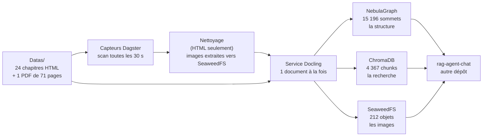

# État des lieux — ce que ce pipeline garantit, et ce qu'il reste à faire

> **Par où commencer.** Lire d'abord [`README.md`](../README.md), puis
> [`livraison.md`](livraison.md) (prérequis, `.env`, démarrage, ingestion,
> réingestion, vérification, retour arrière, défauts connus, prochaines
> étapes). [`axes_amelioration.md`](axes_amelioration.md) (le registre),
> [`pilotage_du_chantier.md`](pilotage_du_chantier.md) et
> [`campagnes/`](campagnes/) sont des **archives datées** : ils racontent
> comment l'état actuel a été atteint et ne sont pas tenus à jour.
>
> Ce document se lit **sans lancer le projet**, y compris depuis
> [`rag-agent-chat`](https://github.com/floSa/rag-agent-chat). Il dit l'état et
> renvoie aux pages détaillées.
>
> **Dates des mesures.** Les §3 à §7 reprennent la campagne du
> **2 septembre 2026** (relevée le 3), sauf mention contraire. Les §7 bis et
> §7 ter sont mesurés le **25 septembre 2026**. Chaque chiffre a été relevé par
> une commande dont la sortie a été lue ; un chiffre non remesuré est signalé
> comme tel.
>
> **Le stockage d'objets est SeaweedFS**, derrière une passerelle S3 (§7 ter).
> MinIO est retiré et supprimé depuis le 25 septembre 2026, 13:55 UTC.

---

## 1. Ce que fait ce projet, en trois phrases

Il avale des livres techniques et en fabrique trois choses qu'un agent
conversationnel interroge.

Ces trois choses sont un **graphe** (la structure : qui est le titre de quoi), un
**index vectoriel** (la recherche par le sens) et un **stockage d'objets** (les
images).

Il ne répond à aucune question : c'est le travail de `rag-agent-chat`, qui vit
dans un autre dépôt et lit ces trois stores.

## 2. Le chemin d'un document

Un fichier déposé, un capteur qui le voit, un nettoyage s'il est en HTML, une
extraction, trois écritures. **Le service Docling est le seul à écrire dans le
graphe et dans l'index vectoriel.** Le stockage d'objets reçoit aussi les images
des captures HTML, téléversées par l'étape de nettoyage
(`src/pipeline/media.py`) ; tout le reste orchestre.

> Détail : [architecture.md](architecture.md)

## 3. L'état mesuré

| | |
|---|---|
| documents indexés | **23** — 22 chapitres HTML retenus + le PDF |
| chunks dans l'index vectoriel | **4 367** |
| sommets dans le graphe | **15 196**, dont 15 173 liés par `PARENT_OF` |
| images servables par l'agent | **212 sur 212**, depuis SeaweedFS (§7 ter) |
| tests automatisés | **1 084** verts et **35 mutations rouges** au 25 septembre 2026 (884 au 3 septembre) |
| porte qualité `make all` | `rc=0` le 25 septembre 2026 ; tout code non nul est un défaut |

Une **mutation** est une altération volontaire du code livré : elle doit faire
échouer au moins un test, sinon ce test ne protège rien. `make all` les rejoue
(`scripts/rejouer-les-mutations.py`).

Ces chiffres viennent de la **première campagne de référence**, menée le
2 septembre 2026 : corpus purgé, réingéré entièrement par le code de `main`,
puis vérifié. Ils ont été retrouvés à l'identique le 25 septembre 2026
([`livraison.md`](livraison.md) §4.2). Le compte rendu complet, avec chaque
commande, est à
[`campagnes/2026-09-02-premiere-campagne-de-reference.md`](campagnes/2026-09-02-premiere-campagne-de-reference.md).

## 4. Les cinq exigences de l'agent, et leur état

Ce sont les conditions sans lesquelles `rag-agent-chat` ne peut pas travailler.
Leur texte de référence est le §0 de
[`axes_amelioration.md`](axes_amelioration.md) ; ce tableau dit l'état.

| | L'exigence | État |
|---|---|---|
| **1** | le modèle d'embedding est `paraphrase-multilingual-MiniLM-L12-v2`, identique des deux côtés | ✅ **tenue**, et protégée : le pipeline refuse de démarrer sur un autre modèle, et refuse d'écrire dans une collection produite par un autre |
| **2** | `element_id` déterministe, dérivé du contenu, 10 caractères hexadécimaux | ✅ **tenue** — 0 identifiant hors format sur 4 367, et 0 désaccord entre l'index et le graphe |
| **3** | `source_path` est l'identité d'un document, jamais `filename` seul | ✅ **tenue** — `Index.html` et `Preface.html` existent dans les deux ouvrages, et les 23 documents ont 23 identifiants distincts |
| **4** | `sequence` porte l'ordre de lecture, et il est monotone | ✅ **tenue** — 0 arête sans `sequence` sur 15 173, et 0 inversion de page |
| **5** | `POST /reindex` sur l'agent en fin de chaîne | ✅ **tenue depuis le 25 septembre 2026** — le service de l'agent tourne sur ce poste ; `agent_reindex_sensor` est parti seul 24 s après le dernier run d'ingestion, et son run rend `ok — 4367 chunks indexes` (registre §4.42). Côté agent, le même jour à 09:02 UTC : `POST /reindex` rend 4 367 chunks, et 267 ancrages concordent sans désaccord (§7 ter). **Non éprouvé** : la qualité des réponses — aucune question n'a été posée à l'agent pour la juger |

**L'exigence 1 est la panne la plus coûteuse du système, et elle est
silencieuse.** Les deux modèles candidats rendent des vecteurs de 384
dimensions : ChromaDB les accepte, aucune sonde ne réagit, et la recherche rend
des passages plausibles et faux. Vérifier la dimension ne protège de rien ;
c'est le **nom** du modèle qui discrimine. La panne s'est déjà produite une
fois.

## 5. Ce que l'agent doit savoir pour lire le graphe

Trois choses, qui ne se déduisent pas du schéma.

### 5.1 `depth` mélange deux échelles, et `label` dit laquelle

Chaque élément porte `depth` : le nombre de liens qui le séparent de la racine de
son document. Mais il ne compte pas la même chose selon l'élément :

| l'élément | ce que `depth` compte |
|---|---|
| un **titre** | les titres au-dessus de lui |
| **tout autre** élément | celui de son titre, **plus 1** |

Un paragraphe sous un titre de premier niveau vaut donc `1`, comme un sous-titre.
**La valeur seule est ambiguë : il faut lire `label` avec elle.**

### 5.2 `depth` n'est lisible que dans le graphe

Aucun titre n'est jamais un chunk. La métadonnée `depth` existe bien dans l'index
vectoriel, mais elle **ne décrit jamais un titre**. Un agent qui veut le niveau
d'un titre lit le sommet du graphe.

### 5.3 `sequence` a trois pièges, à documenter côté agent

`sequence` donne l'ordre de lecture. Elle est monotone et complète. Mais :

1. **elle repart à 0 dans chaque document** — tout « avant / après » doit être
   **borné au document** ;
2. **elle n'est pas contiguë sous un parent**, par construction : 167 parents sur
   763 ont des valeurs non contiguës, et l'écart s'explique entièrement par la
   taille du sous-arbre du frère précédent. Ce n'est pas une perte ;
3. **le plus grand écart entre deux enfants d'un même parent vaut 994** (993
   valeurs intercalaires). Un agent qui implémente « la fenêtre d'éléments »
   comme « les enfants de P dont `sequence ∈ [s−k, s+k]` » rendra
   **silencieusement moins** d'éléments que demandé.

**Ces trois réserves sont le seul point du contrat encore ouvert, et il ne peut
pas être fermé depuis ce dépôt** : elles décrivent comment l'agent *lit*, et sa
documentation vit ailleurs (registre §6.16).

## 6. Ce que le pipeline ne garantit pas

| | Ce que c'est | Gravité |
|---|---|---|
| **un curseur de capteur ne se relit pas par la CLI** | `dagster sensor cursor` n'a que `--set` et `--delete`. Le marqueur de réingestion se pose par une commande officielle, mais ni ce qu'il écrase ni sa consommation ne se vérifient sans sortir de la CLI (registre §4.42.a) | gênant — le geste de lecture est au §3.2 de [`livraison.md`](livraison.md) |
| 52 tables HTML comptées comme des images sans URL | une table HTML est du texte, il n'y a rien à téléverser. C'est le **compteur** qui fusionne deux chemins, pas la chaîne d'images qui est cassée | cosmétique |
| une conversion qui échoue durablement retire un document sain de l'index | choix assumé : une absence est visible, un document périmé ne l'est pas | assumé |
| la documentation n'est presque pas tenue par des tests, et le `Makefile` pas du tout | mesuré le 25 septembre 2026 : trois tests lisent la documentation. Deux exigent que le `README` nomme le marqueur `reingerer:` et les capteurs sur lesquels le poser (`tests/unit/test_factory.py`, registre §4.32.a) ; un exige que `orchestration.md` annonce la bonne durée de `max_runtime_seconds` (`tests/unit/test_dagster_yaml.py`, registre §4.35.a). `tests/unit/test_dependances_de_niveau_module.py` recopie en constante le compte de modules qu'annonce `services/docling.md`, sans lire le fichier. Le reste de la documentation n'est vérifié par rien | angle mort, borné |

**Réingérer par le chemin normal fonctionne** (registre §4.32.a et §4.42) : le
marqueur de curseur `reingerer:<étiquette>` a été mesuré le 25 septembre 2026 —
23 runs créés, 23 `SUCCESS`, clés de run portant l'étiquette et non le `mtime`.
Le geste est au §3.2 de [`livraison.md`](livraison.md).

**Ce qui protège l'index d'une réingestion non voulue.** Le seul déclencheur est
un `mtime` de fichier ou un marqueur posé à la main. D'où la règle « ne jamais
`toucher` le corpus » (§9 ci-dessous, et §6.5 de [`livraison.md`](livraison.md)).
Les capteurs restent armés : leur état est à `RUNNING` **en base**, et cet état
l'emporte sur le `default_status` déclaré dans le code (§6.1 de
[`livraison.md`](livraison.md)).

## 7. La campagne de référence, et ce qu'elle vaut

Trente questions ont été écrites **après** l'ingestion, en lisant quatre
chapitres dans le store, et elles désignent **44 identifiants réels**.

| Strate | Nombre | Ce qu'elle sert à voir |
|---|---|---|
| multi-passages, 2 ou 3 sections | 12 | rend une comparaison lisible |
| simple, un passage | 8 | plancher de contrôle |
| sans réponse | 4 | teste l'abstention |
| de suivi, avec historique | 4 | le suivi de conversation |
| reformulée | 2 | échantillon |

Premier plancher de rappel, recherche vectorielle seule : **55,3 % à k=5, 61,7 %
à k=10, 72,3 % à k=20** (et 80,9 % à k=50, remesuré le 25 septembre 2026).

**Ce que ces chiffres disent et ne disent pas.** Ils prouvent que la chaîne
fonctionne de bout en bout et qu'aucun défaut grossier ne subsiste. **Ils ne
suffisent pas à arbitrer un réglage** : un écart de deux points sur trente
questions est du bruit. Une première mesure est un contrôle de bon
fonctionnement, jamais une décision d'architecture.

Deux bornes à connaître :

- la strate « de suivi » rend 20 % **parce que la question est encodée sans son
  historique** — mesuré : avec l'historique, elle rend 60 %. C'est le périmètre
  de la mesure, pas un défaut ;
- le corpus est **entièrement anglais**. La mesure translinguistique est donc
  coupée en deux : « question française → document anglais » reste possible,
  l'inverse ne l'est pas.

> Le jeu : [`campagnes/2026-09-02-jeu-de-questions.yaml`](campagnes/2026-09-02-jeu-de-questions.yaml)

## 7 bis. La stabilité des identifiants

`src/equivalence_des_identifiants.py` n'est importé par aucun module du
pipeline : c'est un **instrument**. Il fige les `element_id` des trois stores
dans un instantané versionné
(`documentation/campagnes/2026-09-24-instantane-des-identifiants/`, empreinte
`e945893b1021e2f1aa3809434a889443ed9fb85e2a7e290cd329f077687f0f6d`), et sa
commande `comparer` confronte un état vivant à cet instantané, dans les deux
sens. La commande complète est au §4.3 de [`livraison.md`](livraison.md).

**Mesuré le 25 septembre 2026** : après purge et réingestion sans aucun
changement du code d'extraction, `comparer` rend **23 / 23 documents,
`DEPLACES 0`, `rc=0`**. Les identifiants sont stables d'une ingestion à
l'autre.

Les puces vides (202 `ListItem` sans texte) sont laissées en l'état : option
(a), décidée le 24 septembre 2026. Le registre porte le motif et les six options
chiffrées (§4.37), ainsi que cinq points non bloquants restés ouverts (§4.41).

## 7 ter. Le stockage d'objets

**Le stockage d'objets du pipeline est SeaweedFS**, par sa passerelle S3, à
l'adresse `seaweedfs:8333`, en service depuis le 25 septembre 2026. La fiche du
service est [`services/stockage_objet.md`](services/stockage_objet.md) ; le
compte rendu de la bascule est
[`campagnes/2026-09-25-bascule-seaweedfs.md`](campagnes/2026-09-25-bascule-seaweedfs.md).

**Le dépôt ne nomme le serveur nulle part.** Il parle à une passerelle S3 par un
client générique, construit à un seul site
(`src/docling_service/images.py:build_client`). Seule la variable `S3_ENDPOINT`
désigne le serveur en face. C'est ce qui permet de changer de serveur sans
modifier le code de téléversement ; cette propriété est à préserver. La
bibliothèque cliente Python est encore le paquet `minio` (minio-py) ; son
remplacement par `boto3` est au §8.6 de [`livraison.md`](livraison.md).

**Ce qui compte pour qui lit ce document depuis `rag-agent-chat` :**

| | |
|---|---|
| adresse du store | la valeur de `S3_ENDPOINT` — `seaweedfs:8333` |
| bucket | `documents` |
| nom des variables | `S3_ENDPOINT`, `S3_ACCESS_KEY`, `S3_SECRET_KEY`, `S3_BUCKET` — génériques, elles ne nomment aucun produit |
| valeur par défaut de l'adresse | **aucune** : sans `S3_ENDPOINT`, rien ne démarre (voir plus bas) |
| identifiants | **deux jeux aux droits distincts** : le pipeline écrit, l'agent lit |
| ce que le graphe publie | `media_url` (l'adresse) **et** `object_key` (la clé nue) |

**Côté agent, trois règles.**

1. **Son `.env` reçoit `S3_ENDPOINT=seaweedfs:8333`** et le **jeu lecture
   seule**, pas celui du pipeline. Ce jeu autorise `GetBucketLocation`,
   `ListBucket`, `GetObject` et `StatObject`, et rien d'autre.
2. **Il lit `media_url`.** La propriété du graphe, la métadonnée ChromaDB et le
   modèle Pydantic portent ce nom ; l'ancien nom, qui désignait un produit, a
   disparu du schéma et des données.
3. **Il peut lire `object_key`**, la clé nue de l'objet, celle passée à
   `put_object`. L'adresse contient l'hôte, donc elle change si le serveur
   change : la bascule a changé l'hôte des 212 objets d'un coup. La clé est
   l'identité de l'objet et ne change pas ; l'agent n'a pas à défaire l'adresse
   pour la retrouver.

**Un refus de droit ne fait pas de bruit.** Un refus S3 est un **403
`AccessDenied`**, et il remonte chez l'agent en **404 silencieux** : l'écran dit
« image absente », et le corpus a simplement l'air incomplet. Un jeu
d'identifiants mal posé ne se voit donc pas à l'usage ; il se voit par appel
direct, ce que fait `scripts/campagne/essayer-la-passerelle-s3.py`
([`livraison.md`](livraison.md) §4.4).

**L'adresse du store n'a pas de valeur par défaut, délibérément.**
`python -m src.wipe_stores` lit ces réglages et **vide** le bucket qu'ils
désignent. Une adresse par défaut écrite dans le code, lancée sans `.env`,
purgerait le mauvais serveur en rendant compte d'une purge réussie. Sans
défaut, le démarrage échoue. Le refus nomme la variable et dit quoi faire
(`src/reglages_s3.py`).

**Il n'y a pas de serveur de secours.** Le retour arrière est le **corpus** :
`Datas/` porte les 25 fichiers sources, et une purge suivie d'une réingestion
régénère les trois stores et les 212 objets ([`livraison.md`](livraison.md) §5).
Un second serveur gardé en vie sans être mesuré verrait sa configuration
dériver sans que rien ne le signale.

**Ce que la bascule a coûté à l'index : rien.** Mesuré le 25 septembre 2026
entre 09:01 et 09:05 UTC, les résultats sont identiques à ceux d'avant la
bascule (registre §4.43) :

| Instrument | Résultat, 25/09/2026 |
|---|---|
| `verify_contract` | `rc=1` sur la **seule** anomalie connue — 52 sommets visuels sur 264 sans adresse de média (registre §4.32.b). Les autres lignes sont identiques |
| `index_report` | `rc=0` : 4 367 chunks, 23 documents, médiane 299, 137 tronqués (3,1 %), `text` 2 604 / `code` 975 / `list_item` 484 / `table` 196 / `caption` 108, 4 367 `en` |
| `verifier-le-jeu-de-questions.py` | `rc=0` — les 44 ancrages concordent avec l'index, champ par champ |
| `mesurer-le-rappel-vectoriel.py` | `rc=0` — micro 55,3 / 61,7 / 72,3 / 80,9 % à k = 5, 10, 20, 50 |
| les huit comptes | tous égaux ([`livraison.md`](livraison.md) §4.2) |
| empreinte des 212 clés | `c91f5be6…b994`, égale |
| `comparer` contre l'instantané | 23 / 23, `DEPLACES 0`, `rc=0` |

Les **212** sommets porteurs d'une adresse de média (209 `Picture`, 3 `Table`)
la portent tous sous `http://seaweedfs:8333/documents/`.

**Le retrait du stockage précédent est déployé**, le 25 septembre 2026 entre 13:36 et
13:55 UTC (compte rendu au §11 de
[`campagnes/2026-09-25-retrait-du-stockage-precedent.md`](campagnes/2026-09-25-retrait-du-stockage-precedent.md)).
Après fusion, passage aux variables `S3_*`, purge et réingestion (23 runs, tous
`SUCCESS`), les huit comptes, l'empreinte `c91f5be6…b994` et `comparer`
(23 / 23, `DEPLACES 0`) rendent les mêmes valeurs. Le graphe porte **212**
`media_url` et **212** `object_key`, ensemble égal aux clés du bucket, et aucun
`minio_url`, ni au schéma ni dans les données. Le conteneur du stockage
précédent, ses données et ses images sont supprimés.

**État de l'agent à cette date** : il sert ses images (`/media` → 200), mais son
`.env` porte encore les anciens noms de variables (valeur `seaweedfs:8333`).

**Non mesuré** : ni débit, ni latence, ni tenue en charge, ni durabilité de
SeaweedFS ([`livraison.md`](livraison.md) §8.3).

> **Le mode d'emploi** — lancer, ingérer, réingérer, vérifier, revenir en
> arrière, les pièges silencieux, les défauts connus et les prochaines étapes :
> [`livraison.md`](livraison.md).

## 8. Ce qu'il reste à faire, par ordre

Le plan de ce dépôt est achevé : la campagne de stabilité des identifiants
(§7 bis) et la bascule vers SeaweedFS (§7 ter) sont faites. Les premiers rangs
ci-dessous sont à la frontière des deux dépôts.

| | Ce que c'est | Qui | Pourquoi ce rang |
|---|---|---|---|
| **1** | renommer les variables du `.env` de l'agent en `S3_*` — il lit déjà `media_url` (et l'ancien champ à défaut) | `rag-agent-chat` | l'agent sert ses images, mais sous des noms de variables qui désignent un produit retiré |
| **2** | documenter les trois réserves de `sequence` côté agent (§5.3) | `rag-agent-chat` | le test existe ici, l'explication manque là-bas. Petit, et débloque l'agent |
| **3** | écrire sous une clé provisoire puis basculer, pour qu'une conversion ratée ne retire plus un document sain (registre §4.29.i) | ce dépôt | amélioration nette, mais c'est un chantier |
| **4** | le second tour de questions : les questions pièges | relecture humaine | c'est la strate où l'on écrit le plus facilement un faux piège |
| **5** | étendre aux autres documents et au `Makefile` les tests qui vérifient la documentation (§6) | ce dépôt | dernier angle mort de la méthode |

Les points 1 et 2 sont pour `rag-agent-chat`. Ce document est leur point
d'entrée ; le §0 du registre porte le contrat mot pour mot.

> Ce tableau ordonne par la frontière entre les deux dépôts. Les prochaines
> étapes **de ce dépôt-ci**, chacune avec ce qui est décidé, ce qui reste à
> décider et ce qui est touché, sont au **§8 de [`livraison.md`](livraison.md)** :
> assainisseur de clé, observation du stockage d'objets, sources enfichables,
> points du registre §4.41, bibliothèque cliente S3.

## 9. Les six choses à ne pas faire

1. **Ne renommer aucun fichier du corpus, et ne pas le `toucher`.** Le chemin
   entre dans le calcul des identifiants : un renommage après ingestion invalide
   le jeu de 30 questions. Et le déclencheur d'un capteur est le **`mtime`** : un
   `touch`, un `cp` qui ne préserve pas les dates, un éditeur qui réenregistre
   sans rien changer — chacun arme les capteurs et lance une réingestion dans
   les 30 s, sans que personne l'ait demandé.
2. **Ne pas changer le modèle d'embedding d'un seul côté.** Voir §4.
3. **Ne pas démarrer le démon d'orchestration sans le décider.** Les capteurs
   sont livrés armés : le démarrer déclenche une ingestion.
4. **Avant toute réingestion, redémarrer `docling-service`.** C'est au démarrage
   du service que le schéma du graphe se met à jour. Sans cela, on écrit contre
   un schéma incomplet.
5. **Après une purge, ne pas redémarrer `agent-api`** (dans `rag-agent-chat`).
   L'agent rouvre sa session NebulaGraph lui-même ; ne le redémarrer que si son
   `/health` est encore rouge cinq minutes après la réingestion
   ([`livraison.md`](livraison.md) §6.6).
6. **« Réextraire » ne suffit pas pour retrouver les images HTML** : seule une
   exécution de l'étape de nettoyage les re-téléverse.

## 10. Comment ce projet a été vérifié

Chaque livraison a été relue par une session qui n'en avait écrit aucune ligne.
Deux règles ont produit presque toutes les trouvailles, et elles valent pour
n'importe quel projet :

1. **Un test se juge à la mutation qui doit le faire échouer, pas à sa
   lecture.** On casse volontairement le code livré ; si le test reste vert, il
   ne protège rien. `make all` rejoue ces mutations
   (`tests/mutations/table-des-mutations.json`).
2. **Une documentation fausse ne fait échouer aucun test.** D'où : chaque
   chiffre porte sa commande et sa date, et toute phrase du genre « le seul »,
   « aucun », « les trois » est soit bornée, soit vérifiée par un test.

> La méthode complète et son historique :
> [`pilotage_du_chantier.md`](pilotage_du_chantier.md). Le détail de chaque
> constat, ouvert ou fermé : [`axes_amelioration.md`](axes_amelioration.md).
> Ces deux documents sont des archives datées.
