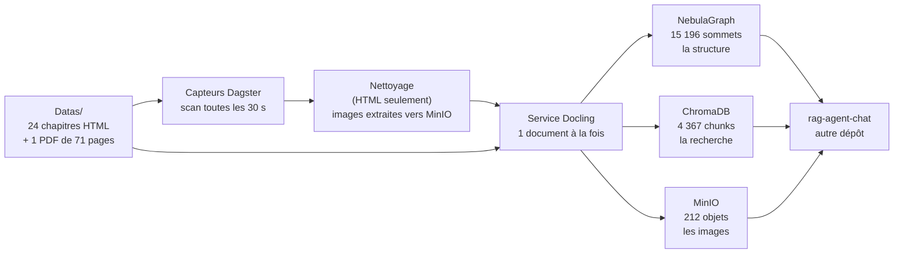

# État des lieux — ce que ce pipeline garantit, et ce qu'il reste à faire

> **À lire en premier**, que vous reprenez ce dépôt ou que vous partez travailler
> sur [`rag-agent-chat`](https://github.com/floSa/rag-agent-chat).
>
> Ce document se lit **sans lancer le projet**. Il ne remplace aucune page
> détaillée : il dit l'état, renvoie, et s'arrête.
>
> Dernière mesure : **3 septembre 2026**, sur `main`. Chaque chiffre ci-dessous a
> été relevé par une commande dont la sortie a été lue, puis **reproduit par une
> conversation indépendante**. Un chiffre non remesuré est signalé comme tel.

---

## 1. Ce que fait ce projet, en trois phrases

Il avale des livres techniques et en fabrique trois choses qu'un agent
conversationnel interroge.

Ces trois choses sont un **graphe** (la structure : qui est le titre de quoi), un
**index vectoriel** (la recherche par le sens) et un **stockage d'objets** (les
images).

Il ne répond à aucune question : c'est le travail de `rag-agent-chat`, qui vit
dans un autre dépôt et lit ces trois stores.

## 2. Le chemin d'un document

Un fichier déposé, un capteur qui le voit, un nettoyage s'il est en HTML, une
extraction, trois écritures. **Le service Docling est le seul à écrire dans les
stores** ; tout le reste orchestre.

> Détail : [architecture.md](architecture.md)

## 3. L'état mesuré, au 3 septembre 2026

| | |
|---|---|
| documents indexés | **23** — 22 chapitres HTML retenus + le PDF |
| chunks dans l'index vectoriel | **4 367** |
| sommets dans le graphe | **15 196**, dont 15 173 liés par `PARENT_OF` |
| images servables par l'agent | **212 sur 212** |
| tests automatisés | **884**, tous verts |
| la porte qualité `make all` | **verte, sans exception à connaître** |

Ces chiffres viennent de la **première campagne de référence**, menée le
2 septembre 2026 : corpus purgé, réingéré entièrement par le code de `main`,
puis vérifié. Le compte rendu complet, avec chaque commande, est à
[`campagnes/2026-09-02-premiere-campagne-de-reference.md`](campagnes/2026-09-02-premiere-campagne-de-reference.md).

## 4. Les cinq exigences de l'agent, et où on en est

Ce sont les conditions sans lesquelles `rag-agent-chat` ne peut pas travailler.
Leur site canonique est le §0 de
[`axes_amelioration.md`](axes_amelioration.md) ; ce tableau dit l'état.

| | L'exigence | État |
|---|---|---|
| **1** | le modèle d'embedding est `paraphrase-multilingual-MiniLM-L12-v2`, identique des deux côtés | ✅ **tenue**, et gardée : le pipeline refuse de démarrer sur un autre modèle, et refuse d'écrire dans une collection produite par un autre |
| **2** | `element_id` déterministe, dérivé du contenu, 10 caractères hexadécimaux | ✅ **tenue** — 0 identifiant hors format sur 4 367, et 0 désaccord entre l'index et le graphe |
| **3** | `source_path` est l'identité d'un document, jamais `filename` seul | ✅ **tenue** — `Index.html` et `Preface.html` existent dans les deux ouvrages, et les 23 documents ont 23 identifiants distincts |
| **4** | `sequence` porte l'ordre de lecture, et il est monotone | ✅ **tenue** — 0 arête sans `sequence` sur 15 173, et 0 inversion de page |
| **5** | `POST /reindex` sur l'agent en fin de chaîne | ⚠️ **non éprouvée** — l'appel part, mais l'agent ne tourne pas sur ce poste. Voir §8 |

**L'exigence 1 mérite un mot, parce que c'est la panne la plus coûteuse du
système et qu'elle est parfaitement silencieuse.** Les deux modèles candidats
rendent des vecteurs de 384 dimensions : ChromaDB accepte sans broncher, aucune
sonde ne voit rien, et la recherche rend des passages **plausibles et faux**.
Vérifier la dimension ne protège de rien — c'est le **nom** qui discrimine. C'est
déjà arrivé une fois.

## 5. Ce que l'agent doit savoir pour lire le graphe

Trois choses, et elles ne se déduisent pas du schéma.

### 5.1 `depth` mélange deux échelles, et `label` dit laquelle

Chaque élément porte `depth` : le nombre de liens qui le séparent de la racine de
son document. Mais il ne compte pas la même chose selon l'élément :

| l'élément | ce que `depth` compte |
|---|---|
| un **titre** | les titres au-dessus de lui |
| **tout autre** élément | celui de son titre, **plus 1** |

Un paragraphe sous un titre de premier niveau vaut donc `1`, comme un sous-titre.
**La valeur seule est ambiguë : il faut lire `label` avec elle.**

### 5.2 `depth` n'est lisible que dans le graphe

Aucun titre n'est jamais un chunk. La métadonnée `depth` existe bien dans l'index
vectoriel, mais elle **ne décrit jamais un titre**. Un agent qui veut le niveau
d'un titre lit le sommet du graphe.

### 5.3 `sequence` a trois pièges, et c'est la moitié qui reste à écrire côté agent

`sequence` donne l'ordre de lecture. Elle est monotone et complète. Mais :

1. **elle repart à 0 dans chaque document** — tout « avant / après » doit être
   **borné au document** ;
2. **elle n'est pas contiguë sous un parent**, par construction : 167 parents sur
   763 ont des valeurs non contiguës, et l'écart s'explique entièrement par la
   taille du sous-arbre du frère précédent. Ce n'est pas une perte ;
3. **le plus grand écart entre deux enfants d'un même parent vaut 994** (993
   valeurs intercalaires). Un agent qui implémente « la fenêtre d'éléments »
   comme « les enfants de P dont `sequence ∈ [s−k, s+k]` » rendra
   **silencieusement moins** d'éléments que demandé.

**Ces trois réserves sont le seul point du contrat qui reste ouvert, et il ne
peut pas être fermé depuis ce dépôt** : elles décrivent comment l'agent *lit*,
et sa documentation vit ailleurs. C'est le §6.16 du registre.

## 6. Ce que le pipeline ne garantit pas — la liste honnête

| | Ce que c'est | Gravité |
|---|---|---|
| **réingérer par le chemin normal ne marche pas, en silence** | le capteur demande 23 ingestions, l'orchestrateur en crée **zéro**, et n'écrit aucune raison. La clé de run dérive de la date du fichier, donc elle est déjà consommée | **grave** — et un message d'erreur du système dit pourtant « réingérez » |
| 52 tables HTML comptées comme des images sans URL | une table HTML est du texte, il n'y a rien à téléverser. C'est le **compteur** qui fusionne deux chemins, pas la chaîne d'images qui est cassée | cosmétique |
| une conversion qui échoue durablement retire un document sain de l'index | choix assumé : une absence est visible, un document périmé ne l'est pas | assumé |
| rien ne lit le `Makefile` ni les documents | la documentation peut donc encore dériver sans que rien ne rougisse | angle mort |

**Le premier point est le plus important de ce document, et il a une ironie qu'il
faut connaître** : c'est ce défaut qui **protège l'index en ce moment même**. Le
démon d'orchestration a démarré trois fois sans que personne le décide, et rien
n'a été réingéré par-dessus la campagne — uniquement parce que la clé de run
était déjà consommée. **Le jour où on le corrige, il faut avoir décidé si les
capteurs restent armés.**

## 7. La campagne de référence, et ce qu'elle vaut

Trente questions ont été écrites **après** l'ingestion, en lisant quatre
chapitres dans le store, et elles désignent **44 identifiants réels**.

| Strate | Nombre | Ce qu'elle sert à voir |
|---|---|---|
| multi-passages, 2 ou 3 sections | 12 | rend une comparaison lisible |
| simple, un passage | 8 | plancher de contrôle |
| sans réponse | 4 | teste l'abstention |
| de suivi, avec historique | 4 | il n'y en avait aucune avant |
| reformulée | 2 | échantillon |

Premier plancher de rappel, recherche vectorielle seule : **55,3 % à k=5, 61,7 %
à k=10, 72,3 % à k=20**.

**Ce que ces chiffres disent et ne disent pas.** Ils prouvent que la chaîne
fonctionne de bout en bout et qu'aucun défaut grossier ne subsiste. **Ils ne
suffisent pas à arbitrer un réglage** : un écart de deux points sur trente
questions est du bruit. Première mesure = contrôle de bon fonctionnement, jamais
décision d'architecture.

Deux bornes à connaître :

- la strate « de suivi » rend 20 % **parce que la question est encodée sans son
  historique** — mesuré : avec l'historique, elle rend 60 %. C'est le périmètre
  de la mesure, pas un défaut ;
- le corpus est **entièrement anglais**. La mesure translinguistique est donc
  coupée en deux : « question française → document anglais » reste possible,
  l'inverse a disparu.

> Le jeu : [`campagnes/2026-09-02-jeu-de-questions.yaml`](campagnes/2026-09-02-jeu-de-questions.yaml)

## 8. Ce qu'il reste à faire, par ordre

**Ce dépôt-ci est arrivé au bout de son plan.** Les six lots du chantier sont
fusionnés. Ce qui suit n'est pas commencé.

| | Ce que c'est | Qui | Pourquoi ce rang |
|---|---|---|---|
| **1** | réparer la réingestion par le chemin nominal (§4.32.a du registre) | ce dépôt | chemin de récupération cassé vers lequel un message d'erreur pointe |
| **2** | prouver l'exigence 5 — prévenir l'agent en fin de chaîne | **`rag-agent-chat`** | seule exigence du contrat non prouvée. Le dépôt de l'agent est présent sur le poste, avec un service `agent-api` sur `rag_network`, mais **sans `.env`** : il ne tourne pas |
| **3** | écrire les trois réserves de `sequence` côté agent (§5.3 ci-dessus) | **`rag-agent-chat`** | le garde existe ici, l'explication manque là-bas. Petit, et ça débloque l'agent |
| **4** | écrire sous une clé provisoire puis basculer, pour qu'une conversion ratée ne retire plus un document sain (§4.29.i) | ce dépôt | amélioration franche, mais c'est un chantier. La campagne dira si la panne est fréquente |
| **5** | le second tour de questions — les pièges | humain | c'est la strate où l'on écrit le plus facilement un faux piège. Demande une relecture humaine |
| **6** | faire lire le `Makefile` et les documents par un test (F7) | ce dépôt | dernier angle mort de la méthode |

**Les points 2 et 3 sont pour `rag-agent-chat`.** Ce document est leur point
d'entrée : tout ce qu'il faut savoir du pipeline est ci-dessus, et le §0 du
registre porte le contrat mot pour mot.

## 9. Les cinq choses à ne pas faire

1. **ne renommez aucun fichier du corpus.** Le chemin entre dans le calcul des
   identifiants : un renommage après ingestion tue le jeu de 30 questions ;
2. **ne changez pas le modèle d'embedding d'un seul côté.** Voir §4 ;
3. **ne démarrez pas le démon d'orchestration sans le décider.** Les capteurs
   sont livrés armés : le démarrer déclenche une ingestion ;
4. **avant toute réingestion, redémarrez `docling-service`.** C'est au démarrage
   du service que le schéma du graphe se met à jour. Sans ça, on écrit contre un
   schéma incomplet ;
5. **et sachez que « réextraire » ne suffit pas** pour retrouver les images :
   seule une exécution de l'étape de nettoyage les re-téléverse.

## 10. Comment ce projet a été audité, en cinq lignes

Six lots, chacun **audité par une conversation qui n'en avait écrit aucune
ligne**. Quinze passages, **quinze fois** l'audit a trouvé quelque chose de
matériel — y compris sur un lot qui n'avait produit aucun commit, et sur un lot
dont tous les chiffres étaient justes.

Deux règles ont produit presque toutes les trouvailles, et elles se transposent à
n'importe quel projet :

1. **un garde ne se juge jamais à sa lecture, seulement à la mutation qui doit le
   faire rougir.** On casse volontairement le code livré ; si le test reste vert,
   le garde est décoratif. **Treize gardes décoratifs** ont été trouvés ainsi,
   dont trois par le lot qui venait de les écrire ;
2. **une phrase ne rougit pas.** Une documentation fausse survit indéfiniment,
   contrairement à un bug. D'où : chaque chiffre porte sa commande et sa date, et
   toute phrase du genre « le seul », « aucun », « les trois » est soit bornée,
   soit gardée par un test.

> La méthode complète, les conventions et les erreurs à ne pas refaire :
> [`pilotage_du_chantier.md`](pilotage_du_chantier.md). Le détail de chaque
> constat, ouvert ou fermé : [`axes_amelioration.md`](axes_amelioration.md).
