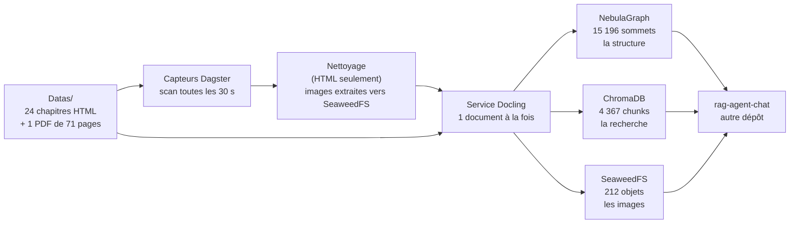

# État des lieux — ce que ce pipeline garantit, et ce qu'il reste à faire

> **À lire en premier**, que vous reprenez ce dépôt ou que vous partez travailler
> sur [`rag-agent-chat`](https://github.com/floSa/rag-agent-chat).
>
> Ce document se lit **sans lancer le projet**. Il ne remplace aucune page
> détaillée : il dit l'état, renvoie, et s'arrête.
>
> **Pour lancer le projet plutôt que pour le comprendre, allez directement à
> [`livraison.md`](livraison.md)** : prérequis, `.env`, démarrage, ingestion,
> réingestion, vérification, retour arrière, défauts connus, prochaines étapes.
>
> Dernière mesure : **3 septembre 2026**, sur `main` — sauf les §7 bis et
> §7 ter, `mesuré` le **25 septembre 2026**, le premier sur le commit de fusion
> du lot 11, le second après la **bascule vers SeaweedFS**, dont les quatre
> instruments ont été **remesurés le 25 septembre 2026 à 09:01 UTC**. **Le
> stockage d'objets est SeaweedFS, et le contrat a été renommé** : lisez le
> §7 ter avant de brancher quoi que ce soit. Chaque chiffre ci-dessous a
> été relevé par une commande dont la sortie a été lue, puis **reproduit par une
> conversation indépendante**. Un chiffre non remesuré est signalé comme tel.

---

## 1. Ce que fait ce projet, en trois phrases

Il avale des livres techniques et en fabrique trois choses qu'un agent
conversationnel interroge.

Ces trois choses sont un **graphe** (la structure : qui est le titre de quoi), un
**index vectoriel** (la recherche par le sens) et un **stockage d'objets** (les
images).

Il ne répond à aucune question : c'est le travail de `rag-agent-chat`, qui vit
dans un autre dépôt et lit ces trois stores.

## 2. Le chemin d'un document

Un fichier déposé, un capteur qui le voit, un nettoyage s'il est en HTML, une
extraction, trois écritures. **Le service Docling est le seul à écrire dans les
stores** ; tout le reste orchestre.

> Détail : [architecture.md](architecture.md)

## 3. L'état mesuré, au 3 septembre 2026

| | |
|---|---|
| documents indexés | **23** — 22 chapitres HTML retenus + le PDF |
| chunks dans l'index vectoriel | **4 367** |
| sommets dans le graphe | **15 196**, dont 15 173 liés par `PARENT_OF` |
| images servables par l'agent | **212 sur 212** — depuis **SeaweedFS**, voir §7 ter |
| tests automatisés | **884**, tous verts — et **1 084** au 25 septembre 2026, avec **35 mutations rouges** (§7 bis) |
| la porte qualité `make all` | **verte, sans exception à connaître** — rejouée `rc=0` le 25 septembre 2026 |

Ces chiffres viennent de la **première campagne de référence**, menée le
2 septembre 2026 : corpus purgé, réingéré entièrement par le code de `main`,
puis vérifié. Le compte rendu complet, avec chaque commande, est à
[`campagnes/2026-09-02-premiere-campagne-de-reference.md`](campagnes/2026-09-02-premiere-campagne-de-reference.md).

## 4. Les cinq exigences de l'agent, et où on en est

Ce sont les conditions sans lesquelles `rag-agent-chat` ne peut pas travailler.
Leur site canonique est le §0 de
[`axes_amelioration.md`](axes_amelioration.md) ; ce tableau dit l'état.

| | L'exigence | État |
|---|---|---|
| **1** | le modèle d'embedding est `paraphrase-multilingual-MiniLM-L12-v2`, identique des deux côtés | ✅ **tenue**, et gardée : le pipeline refuse de démarrer sur un autre modèle, et refuse d'écrire dans une collection produite par un autre |
| **2** | `element_id` déterministe, dérivé du contenu, 10 caractères hexadécimaux | ✅ **tenue** — 0 identifiant hors format sur 4 367, et 0 désaccord entre l'index et le graphe |
| **3** | `source_path` est l'identité d'un document, jamais `filename` seul | ✅ **tenue** — `Index.html` et `Preface.html` existent dans les deux ouvrages, et les 23 documents ont 23 identifiants distincts |
| **4** | `sequence` porte l'ordre de lecture, et il est monotone | ✅ **tenue** — 0 arête sans `sequence` sur 15 173, et 0 inversion de page |
| **5** | `POST /reindex` sur l'agent en fin de chaîne | ✅ **tenue depuis le 25 septembre 2026** — le service de l'agent tourne désormais sur ce poste, `agent_reindex_sensor` est parti **seul** 24 s après le dernier run d'ingestion, et son run rend `ok — 4367 chunks indexes` (§4.42 du registre). **Réserve, réduite le 25 septembre 2026 à 09:02 UTC** : le pilote de l'agent a mesuré chez lui un `POST /reindex` rendant **4 367 chunks**, et **267 ancrages avec 0 désaccord** (§7 ter). Ce qui reste non éprouvé est la **qualité des réponses** : aucune question n'a été posée à l'agent pour la juger |

**L'exigence 1 mérite un mot, parce que c'est la panne la plus coûteuse du
système et qu'elle est parfaitement silencieuse.** Les deux modèles candidats
rendent des vecteurs de 384 dimensions : ChromaDB accepte sans broncher, aucune
sonde ne voit rien, et la recherche rend des passages **plausibles et faux**.
Vérifier la dimension ne protège de rien — c'est le **nom** qui discrimine. C'est
déjà arrivé une fois.

## 5. Ce que l'agent doit savoir pour lire le graphe

Trois choses, et elles ne se déduisent pas du schéma.

### 5.1 `depth` mélange deux échelles, et `label` dit laquelle

Chaque élément porte `depth` : le nombre de liens qui le séparent de la racine de
son document. Mais il ne compte pas la même chose selon l'élément :

| l'élément | ce que `depth` compte |
|---|---|
| un **titre** | les titres au-dessus de lui |
| **tout autre** élément | celui de son titre, **plus 1** |

Un paragraphe sous un titre de premier niveau vaut donc `1`, comme un sous-titre.
**La valeur seule est ambiguë : il faut lire `label` avec elle.**

### 5.2 `depth` n'est lisible que dans le graphe

Aucun titre n'est jamais un chunk. La métadonnée `depth` existe bien dans l'index
vectoriel, mais elle **ne décrit jamais un titre**. Un agent qui veut le niveau
d'un titre lit le sommet du graphe.

### 5.3 `sequence` a trois pièges, et c'est la moitié qui reste à écrire côté agent

`sequence` donne l'ordre de lecture. Elle est monotone et complète. Mais :

1. **elle repart à 0 dans chaque document** — tout « avant / après » doit être
   **borné au document** ;
2. **elle n'est pas contiguë sous un parent**, par construction : 167 parents sur
   763 ont des valeurs non contiguës, et l'écart s'explique entièrement par la
   taille du sous-arbre du frère précédent. Ce n'est pas une perte ;
3. **le plus grand écart entre deux enfants d'un même parent vaut 994** (993
   valeurs intercalaires). Un agent qui implémente « la fenêtre d'éléments »
   comme « les enfants de P dont `sequence ∈ [s−k, s+k]` » rendra
   **silencieusement moins** d'éléments que demandé.

**Ces trois réserves sont le seul point du contrat qui reste ouvert, et il ne
peut pas être fermé depuis ce dépôt** : elles décrivent comment l'agent *lit*,
et sa documentation vit ailleurs. C'est le §6.16 du registre.

## 6. Ce que le pipeline ne garantit pas — la liste honnête

| | Ce que c'est | Gravité |
|---|---|---|
| ~~réingérer par le chemin normal ne marche pas, en silence~~ — **FERMÉ** | c'était le plus grave de ce document, et il ne l'est plus. Le lot 8 a livré le **marqueur de curseur** (`reingerer:<étiquette>`), et la campagne du 25 septembre 2026 l'a **mesuré** : marqueur posé, **23 runs créés**, 23 `SUCCESS`, clés de run portant l'étiquette et non le `mtime`. §4.32.a et §4.42 du registre | **traité** — le geste est au §3.2 de [`livraison.md`](livraison.md) |
| **on ne peut pas RELIRE un curseur** | ce qui reste du point ci-dessus : `dagster sensor cursor` n'a que `--set` et `--delete`. On pose le marqueur par une commande officielle, on ne vérifie ni ce qu'on écrase, ni qu'il a été consommé, sans sortir de la CLI (§4.42.a) | gênant — le geste de lecture est au §3.2 de [`livraison.md`](livraison.md) |
| 52 tables HTML comptées comme des images sans URL | une table HTML est du texte, il n'y a rien à téléverser. C'est le **compteur** qui fusionne deux chemins, pas la chaîne d'images qui est cassée | cosmétique |
| une conversion qui échoue durablement retire un document sain de l'index | choix assumé : une absence est visible, un document périmé ne l'est pas | assumé |
| **presque** rien ne lit les documents, et **rien** ne lit le `Makefile` | la phrase était écrite sans borne, et elle est **fausse pour les documents** : `mesuré le 25 septembre 2026`, **trois** gardes les lisent — deux exigent que le `README` nomme le marqueur `reingerer:` et les capteurs sur lesquels le poser (`test_factory.py:1722`, §4.32.a), un exige que `orchestration.md` annonce la bonne durée de `max_runtime_seconds` (`test_dagster_yaml.py:219`, §4.35.a). Ils **rougissent vraiment** : une réécriture du `README` ce jour-là a fait sortir `make all` en **rc=2**, sur `2 failed, 1082 passed`. Le reste de la documentation, lui, n'est tenu par rien, et le `Makefile` par rien du tout | angle mort, **borné** |

**Le premier point était le plus important de ce document, et sa fermeture
déplace la question qu'il posait.** Tant qu'il durait, c'est lui qui
**protégeait l'index** : le démon d'orchestration a démarré trois fois sans que
personne le décide, et rien n'a été réingéré par-dessus la campagne, uniquement
parce que la clé de run était déjà consommée. Cette protection fortuite a
disparu avec le défaut. **Ce qui protège l'index aujourd'hui est que le seul
déclencheur est un `mtime` ou un marqueur posé à la main** : d'où la règle « ne
jamais `toucher` le corpus » (§9 ci-dessous, et §6.5 de
[`livraison.md`](livraison.md)). Et les capteurs, eux, **restent armés** — ils
sont même passés de `DECLARED_IN_CODE` à `RUNNING` pendant la bascule, ce qui
persiste leur état en base et **retire au code la décision** (§6.1 de
[`livraison.md`](livraison.md)).

## 7. La campagne de référence, et ce qu'elle vaut

Trente questions ont été écrites **après** l'ingestion, en lisant quatre
chapitres dans le store, et elles désignent **44 identifiants réels**.

| Strate | Nombre | Ce qu'elle sert à voir |
|---|---|---|
| multi-passages, 2 ou 3 sections | 12 | rend une comparaison lisible |
| simple, un passage | 8 | plancher de contrôle |
| sans réponse | 4 | teste l'abstention |
| de suivi, avec historique | 4 | il n'y en avait aucune avant |
| reformulée | 2 | échantillon |

Premier plancher de rappel, recherche vectorielle seule : **55,3 % à k=5, 61,7 %
à k=10, 72,3 % à k=20**.

**Ce que ces chiffres disent et ne disent pas.** Ils prouvent que la chaîne
fonctionne de bout en bout et qu'aucun défaut grossier ne subsiste. **Ils ne
suffisent pas à arbitrer un réglage** : un écart de deux points sur trente
questions est du bruit. Première mesure = contrôle de bon fonctionnement, jamais
décision d'architecture.

Deux bornes à connaître :

- la strate « de suivi » rend 20 % **parce que la question est encodée sans son
  historique** — mesuré : avec l'historique, elle rend 60 %. C'est le périmètre
  de la mesure, pas un défaut ;
- le corpus est **entièrement anglais**. La mesure translinguistique est donc
  coupée en deux : « question française → document anglais » reste possible,
  l'inverse a disparu.

> Le jeu : [`campagnes/2026-09-02-jeu-de-questions.yaml`](campagnes/2026-09-02-jeu-de-questions.yaml)

## 7 bis. Le lot 11 — fusionné le 25 septembre 2026

`main` = **`2918ccc`**. Porte qualité rejouée sur le commit de fusion :
`make all`, rc=**0**, **1 084 tests passés**, **35 mutations rouges**.

Le lot n'ajoute **aucun** chemin de production : `src/equivalence_des_identifiants.py`
n'est importé par aucun module du pipeline. C'est un **instrument** — il fige les
`element_id` des trois stores dans un instantané versionné
(`documentation/campagnes/2026-09-24-instantane-des-identifiants/`, empreinte
`e945893b1021e2f1aa3809434a889443ed9fb85e2a7e290cd329f077687f0f6d`) et sait
comparer un état vivant à cet instantané, dans les deux sens.

**Tranché le 24 septembre 2026 — option (a) : on ne touche pas aux puces vides.**
La réparation **sort du plan**. Le registre porte le motif et les six options
chiffrées (§4.37), et les cinq points non bloquants restés ouverts après la
fusion (§4.41).

**Ce qui vient ensuite est la campagne** : purge, réingestion **sans aucun
changement du code d'extraction**, puis `comparer` contre l'instantané. Le
résultat attendu est **zéro `element_id` déplacé** — ce qui, s'il est constaté,
retire le dernier doute sur la stabilité des identifiants entre deux ingestions.

## 7 ter. Le stockage d'objets — en service depuis le 25 septembre 2026

**Le stockage d'objets du pipeline est SeaweedFS**, par sa passerelle S3, à
l'adresse `seaweedfs:8333`. La solution a été **retenue par le propriétaire du
chantier** en début de semaine du 21 septembre 2026, et elle est en service
depuis le 25. Le compte rendu de la bascule, avec ses mesures horodatées, est
[`campagnes/2026-09-25-bascule-seaweedfs.md`](campagnes/2026-09-25-bascule-seaweedfs.md) ;
la fiche du service est
[`services/stockage_objet.md`](services/stockage_objet.md).

**Le dépôt ne nomme le serveur nulle part.** Il parle à une **passerelle S3**,
par un client générique, construit à un seul site
(`src/docling_service/images.py:build_client`). Seule la variable `S3_ENDPOINT`
désigne le serveur en face. C'est cette propriété qui a rendu la bascule
possible sans qu'une ligne de téléversement bouge, et c'est elle qu'il faut
préserver.

**Ce qui compte pour qui lit ce document depuis `rag-agent-chat` :**

| | |
|---|---|
| adresse du store | la valeur de `S3_ENDPOINT` — `seaweedfs:8333` |
| bucket | `documents` |
| nom des variables | `S3_ENDPOINT`, `S3_ACCESS_KEY`, `S3_SECRET_KEY`, `S3_BUCKET` — **génériques**, ils ne nomment aucun produit |
| valeur par défaut de l'adresse | **aucune.** Sans `S3_ENDPOINT`, rien ne démarre — voir plus bas |
| identifiants | **deux jeux aux droits distincts** : le pipeline écrit, **l'agent LIT** |
| ce que le graphe publie | `media_url` (l'adresse) **et** `object_key` (la clé nue) |

**Trois choses à faire côté agent, et deux à savoir.**

1. **Son `.env` reçoit `S3_ENDPOINT=seaweedfs:8333`** et le **jeu lecture
   seule** — pas celui du pipeline. Les deux jeux ont des droits distincts :
   l'agent peut `GetBucketLocation`, `ListBucket`, `GetObject` et `StatObject`,
   et **rien d'autre**.
2. **Il lit `media_url`, et non plus le champ qui portait le nom d'un produit.**
   Un contrat public nomme ce qu'il publie, pas le logiciel qui le sert. La
   propriété du graphe, la métadonnée ChromaDB et le modèle Pydantic ont changé
   ensemble.
3. **Il peut lire `object_key`**, arrivée avec ce renommage : c'est la clé nue
   de l'objet, celle passée à `put_object`. **L'adresse porte l'hôte, donc elle
   périme** — la bascule a changé l'hôte de 212 objets d'un coup. La clé, elle,
   est l'identité de l'objet et lui survit ; l'agent n'a plus à défaire
   l'adresse pour retrouver ce qu'il veut lire.

**La première chose à savoir, parce qu'elle ne fait pas de bruit** : un refus de
droit est un **403 `AccessDenied`**, et il remonte chez l'agent en **404
silencieux**. L'écran dit « image absente », et le corpus a simplement l'air
incomplet. Un jeu d'identifiants mal posé ne se voit donc **pas à l'usage** : il
se voit par appel direct, ce que fait
`scripts/campagne/essayer-la-passerelle-s3.py`.

**La seconde : l'adresse du store n'a plus de valeur par défaut, et c'est
délibéré.** Elle en avait une, écrite dans le code à deux sites, et cette
adresse est restée juste tant qu'elle a désigné le stockage en service. Or
`python -m src.wipe_stores` lit ces mêmes réglages et **vide** le bucket qu'ils
désignent : lancé sans `.env`, il aurait purgé le mauvais serveur en rendant
compte d'une purge réussie. *Un défaut absent fait échouer le démarrage ; un
défaut faux fait réussir la purge du mauvais stockage.* Le refus nomme la
variable et dit quoi faire (`src/reglages_s3.py`).

**Il n'y a plus de serveur gardé debout comme retour arrière.** Le retour
arrière est le **corpus** : `Datas/` porte les 25 fichiers sources, et une purge
suivie d'une réingestion régénère les trois stores et les 212 objets. Un second
serveur maintenu en vie « au cas où » est un serveur que personne ne mesure et
dont la configuration dérive en silence.

**Ce que la bascule a coûté à l'index : rien.** Les huit comptes, l'empreinte
des 212 clés et `comparer` contre l'instantané rendent exactement ce qu'ils
rendaient avant. Les mesures sont au **§4.43** du registre.

**Et les quatre instruments que la bascule n'avait PAS rejoués l'ont été**, en
lecture seule, le **25 septembre 2026 entre 09:01 et 09:02 UTC**. Les quatre
rendent, **au dixième et à la ligne près**, ce qu'ils rendaient à la campagne du
matin :

| Instrument | Résultat, 25/09/2026 |
|---|---|
| `verify_contract` | **`rc=1`** sur la **seule** anomalie connue — 52 sommets visuels sur 264 sans adresse de média (§4.32.b). Les dix-sept autres lignes sont identiques |
| `index_report` | **`rc=0`**, identique : 4 367 chunks, 23 documents, médiane 299, 137 tronqués (3,1 %), `text` 2 604 / `code` 975 / `list_item` 484 / `table` 196 / `caption` 108, 4 367 `en` |
| `verifier-le-jeu-de-questions.py` | **`rc=0`** — **les 44 ancrages concordent** avec l'index, champ par champ |
| `mesurer-le-rappel-vectoriel.py` | **`rc=0`** — micro **55,3 / 61,7 / 72,3 / 80,9 %** à k = 5, 10, 20, 50 |

Remesurés le même jour à 09:05 UTC : les **huit comptes**, l'**empreinte des 212
clés** (`c91f5be6…0994`) et `comparer` contre l'instantané (**23 / 23,
`DEPLACES 0`, `rc=0`**) — tous égaux. Et les **212** sommets porteurs d'une
adresse de média (209 `Picture`, 3 `Table`) la portent **tous** sous
`http://seaweedfs:8333/documents/`.

> **Le mode d'emploi de tout cela** — lancer, ingérer, réingérer, vérifier,
> revenir en arrière, les pièges qui ne font pas de bruit, les défauts connus et
> les prochaines étapes : [`livraison.md`](livraison.md).

**Ce qui n'a PAS été mesuré**, et ne doit pas se lire comme acquis : ni débit,
ni latence, ni tenue en charge, ni durabilité de SeaweedFS ; et **aucune requête
n'a été posée à l'agent** contre le nouveau store.

## 8. Ce qu'il reste à faire, par ordre

**Ce dépôt-ci est arrivé au bout de son plan.** Les six lots du chantier sont
fusionnés, et le lot 11 l'est depuis le 25 septembre 2026 (§7 bis). **La
campagne annoncée ici est FAITE**, le 25 septembre : purge, réingestion sans
changement du code d'extraction, `comparer` contre l'instantané figé, **`DEPLACES
0`**. Et **la bascule vers SeaweedFS est faite le même jour** (§7 ter). Les deux
premiers rangs ci-dessous en découlent ; ils vivent, l'un comme l'autre, à la
frontière des deux dépôts.

| | Ce que c'est | Qui | Pourquoi ce rang |
|---|---|---|---|
| **1** | **prendre le contrat renommé** — `S3_*` dans son `.env`, `media_url` et `object_key` dans ce qu'il lit (§7 ter) | **`rag-agent-chat`** | le pipeline écrit déjà ainsi. **L'ordre est impératif** : l'agent doit d'abord servir une version qui lit `media_url`, et l'ancien champ à défaut, avant que ce dépôt ne réingère |
| **3** | écrire les trois réserves de `sequence` côté agent (§5.3 ci-dessus) | **`rag-agent-chat`** | le garde existe ici, l'explication manque là-bas. Petit, et ça débloque l'agent |
| **4** | écrire sous une clé provisoire puis basculer, pour qu'une conversion ratée ne retire plus un document sain (§4.29.i) | ce dépôt | amélioration franche, mais c'est un chantier. La campagne dira si la panne est fréquente |
| **5** | le second tour de questions — les pièges | humain | c'est la strate où l'on écrit le plus facilement un faux piège. Demande une relecture humaine |
| **6** | étendre F7 — **trois** gardes de texte existent déjà (§6 ci-dessus), le `Makefile` n'en a **aucun** et le reste de la documentation non plus | ce dépôt | dernier angle mort de la méthode, et il est plus petit qu'annoncé |

**Les points 1, 2 et 3 sont pour `rag-agent-chat`, ou à coordonner avec lui.**
Ce document est leur point d'entrée : tout ce qu'il faut savoir du pipeline est ci-dessus, et le §0 du
registre porte le contrat mot pour mot.

> **Ce tableau ordonne par la frontière entre les deux dépôts.** Les prochaines
> étapes **de ce dépôt-ci**, chacune avec ce qui est déjà décidé, ce qui reste à
> décider et qui est touché, sont au **§8 de
> [`livraison.md`](livraison.md)** — les sources enfichables, les points du
> §4.41. Le renommage du contrat et le retrait de l'ancien stockage, qui
> occupaient les deux premiers rangs, sont **faits**.

## 9. Les cinq choses à ne pas faire

1. **ne renommez aucun fichier du corpus, et ne le `touchez` pas.** Le chemin
   entre dans le calcul des identifiants : un renommage après ingestion tue le
   jeu de 30 questions. Et le déclencheur d'un capteur est le **`mtime`** : un
   `touch`, un `cp` qui ne préserve pas les dates, un éditeur qui réenregistre
   sans rien changer — chacun arme les capteurs et lance une réingestion dans
   les 30 s, sans que personne l'ait demandé ;
2. **ne changez pas le modèle d'embedding d'un seul côté.** Voir §4 ;
3. **ne démarrez pas le démon d'orchestration sans le décider.** Les capteurs
   sont livrés armés : le démarrer déclenche une ingestion ;
4. **avant toute réingestion, redémarrez `docling-service`.** C'est au démarrage
   du service que le schéma du graphe se met à jour. Sans ça, on écrit contre un
   schéma incomplet ;
5. **et sachez que « réextraire » ne suffit pas** pour retrouver les images :
   seule une exécution de l'étape de nettoyage les re-téléverse.

## 10. Comment ce projet a été audité, en cinq lignes

Six lots, chacun **audité par une conversation qui n'en avait écrit aucune
ligne**. Quinze passages, **quinze fois** l'audit a trouvé quelque chose de
matériel — y compris sur un lot qui n'avait produit aucun commit, et sur un lot
dont tous les chiffres étaient justes.

Deux règles ont produit presque toutes les trouvailles, et elles se transposent à
n'importe quel projet :

1. **un garde ne se juge jamais à sa lecture, seulement à la mutation qui doit le
   faire rougir.** On casse volontairement le code livré ; si le test reste vert,
   le garde est décoratif. **Treize gardes décoratifs** ont été trouvés ainsi,
   dont trois par le lot qui venait de les écrire ;
2. **une phrase ne rougit pas.** Une documentation fausse survit indéfiniment,
   contrairement à un bug. D'où : chaque chiffre porte sa commande et sa date, et
   toute phrase du genre « le seul », « aucun », « les trois » est soit bornée,
   soit gardée par un test.

> La méthode complète, les conventions et les erreurs à ne pas refaire :
> [`pilotage_du_chantier.md`](pilotage_du_chantier.md). Le détail de chaque
> constat, ouvert ou fermé : [`axes_amelioration.md`](axes_amelioration.md).
