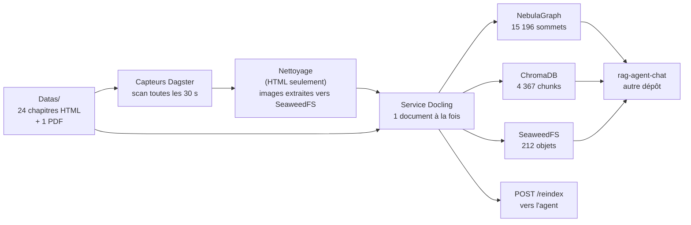

# Livraison — lancer, ingérer, vérifier, revenir en arrière

> **Mode d'emploi.** Ce document se lit dans l'ordre et se suffit : démarrer la
> pile, ingérer, vérifier, revenir en arrière, et ce qui reste à faire.
> L'historique du projet est dans des archives datées : le
> [registre](axes_amelioration.md), le [pilotage](pilotage_du_chantier.md) et
> les [comptes rendus de campagne](campagnes/).
>
> **Date de livraison : 25 septembre 2026.** Chaque chiffre porte la date de sa
> mesure. Chaque commande dit si elle a été exécutée : celles qui écrivent sont
> marquées « non exécutée », avec leur raison, au
> [§9](#9-chaque-commande-de-ce-document--exécutée-ou-non).
>
> **Le stockage d'objets est SeaweedFS**, en service depuis le 25 septembre
> 2026, 08:15 UTC. Le code ne nomme aucun serveur : il parle à une **passerelle
> S3** par un client générique, et seule `S3_ENDPOINT` désigne le serveur. Lire
> le [§6](#6-à-savoir-avant-de-toucher) avant de modifier une pile en service.
>
> *Historique : MinIO a été retiré et supprimé le 25 septembre 2026, entre
> 13:36 et 13:55 UTC — compte rendu :
> [`campagnes/2026-09-25-retrait-du-stockage-precedent.md`](campagnes/2026-09-25-retrait-du-stockage-precedent.md), §11 ;
> historique du remplacement : [`services/stockage_objet.md`](services/stockage_objet.md).*

---

## 1. Ce qu'est le projet

Le pipeline lit des livres techniques et en produit **trois stores**, qu'un
agent conversationnel interroge :

- un **graphe** (NebulaGraph) : la structure des documents ;
- un **index vectoriel** (ChromaDB) : la recherche par le sens ;
- un **stockage d'objets** (SeaweedFS) : les images.

Il ne répond à aucune question. Ce rôle est celui de
[`rag-agent-chat`](https://github.com/floSa/rag-agent-chat), un autre dépôt qui
lit ces trois stores.

### 1.1 Les services

| Service | Rôle | Adresse interne |
|---|---|---|
| `docling-service` | FastAPI : extraction Docling, découpage, encodage (embeddings locaux, `SentenceTransformers`). **Seul service à écrire dans les trois stores** | `docling-service:8000` |
| `dagster-webserver` / `dagster-daemon` | orchestration : capteurs, partitions, runs | `:3000` / — |
| `postgres-dagster` | métadonnées Dagster : **curseurs des capteurs et historique des runs** | `postgres-dagster:5432` |
| `graphd` + `metad` + `storaged` | NebulaGraph : la structure (`Document > Section > Text > Image/Table`) | `graphd:9669` |
| `nebula-studio` | console du graphe | `:7001` |
| `chromadb` | l'index vectoriel | `chromadb:8000` |
| `seaweedfs` | le stockage d'objets, par sa passerelle S3 | `seaweedfs:8333` |

Tout tourne en conteneurs, par Docker Compose, sur processeur.

`POST /extract` met un document en file et rend un `job_id`. Le débit est
limité à deux niveaux :

- la file Dagster : `max_concurrent_runs: 2` dans `dagster.yaml` ;
- le service Docling : un worker unique convertit **un document à la fois**.

Les sources sont déclarées dans `src/pipeline/sources.yaml`. Une fabrique
génère pour chaque source ses partitions (une par fichier), son job et son
capteur.

### 1.2 Le chemin d'un document



Les HTML passent par un nettoyage universel. Les PDF et les Markdown partent
directement à l'extraction.

### 1.3 Le contrat avec `rag-agent-chat`

La référence est le **§0 du [registre](axes_amelioration.md)**. Ce qui est
publié, et que l'agent lit :

| Ce qui est publié | Où | Ce qu'il faut en savoir |
|---|---|---|
| les chunks et leurs métadonnées | ChromaDB, collection `rag_documents` | `element_id` déterministe, 10 caractères hexadécimaux |
| la structure du document | NebulaGraph, space `rag_space` | `depth` mélange deux échelles, `label` dit laquelle ; `sequence` repart à 0 par document |
| l'adresse des images | propriété **`media_url`** des sommets `Picture` et `Table` | `http://<S3_ENDPOINT>/<bucket>/<clé>`. Adresse **interne et authentifiée** : un `GET` anonyme rend 403. L'agent sert de proxy ; l'adresse ne va jamais à un navigateur |
| la **clé** de ces mêmes objets | propriété **`object_key`** des mêmes sommets | la clé nue, celle passée à `put_object`. L'adresse contient l'hôte et devient fausse si l'hôte change ; la clé identifie l'objet et reste valable |
| le modèle d'embedding | `EMBEDDING_MODEL_NAME` | **doit être identique des deux côtés**. Un désaccord ne lève aucune erreur et rend des passages plausibles mais faux |

**Hors des stores : `POST /reindex`.** En fin d'ingestion, quand plus aucun run
n'est en cours, `agent_reindex_sensor` se déclenche et appelle
`AGENT_SERVICE_URL`. L'agent tient son index lexical BM25 en mémoire. Sans cet
appel, un document ingéré après le démarrage de l'agent est trouvable en
recherche dense mais invisible en recherche lexicale. Vider
`AGENT_SERVICE_URL` désactive l'appel ; Dagster l'annonce au démarrage.

---

## 2. Lancer

### 2.1 Prérequis

- **Docker** et **Docker Compose v2**. La pile démarre sur processeur, sans GPU
  ni NVIDIA Container Toolkit. Pour donner un GPU à Docling :
  `docker compose -f docker-compose.yml -f docker-compose.gpu.yml up -d`.
- **Python 3.12** et [`uv`](https://docs.astral.sh/uv/), pour la porte qualité
  seulement (`make all`). L'exploitation ne demande que Docker.
- De la place disque : les stores vivent sous `Datas/database/`.

### 2.2 Le `.env` — toutes les variables

```bash
cp .env.example .env
```

`.env.example` contient le gabarit complet, avec le format attendu de chaque
variable. Aucune valeur n'est écrite ici : `.env` n'est pas versionné.

| Variable | Rôle |
|---|---|
| `S3_ENDPOINT` | l'adresse du stockage d'objets : `seaweedfs:8333`. **Aucune valeur par défaut : sans elle, rien ne démarre** (voir le [§6.2](#62-ladresse-du-stockage-na-aucune-valeur-par-défaut)) |
| `S3_BUCKET` | `documents` |
| `S3_ACCESS_KEY` / `S3_SECRET_KEY` | ce que le **client** présente. **Ne pas les écrire dans le `.env`** : `docker-compose.yml` les dérive du jeu RW ci-dessous. Une seule valeur, écrite à un seul endroit |
| `SEAWEEDFS_RW_ACCESS_KEY` | identité du **serveur**, jeu **écriture** : le pipeline (`docling-service`, `wipe_stores`). Actions `Admin, Read, Write, List, Tagging`. `docker-compose.yml` la passe en `S3_ACCESS_KEY` |
| `SEAWEEDFS_RW_SECRET_KEY` | idem |
| `SEAWEEDFS_RO_ACCESS_KEY` | jeu **lecture seule** : `rag-agent-chat`. Actions `Read, List`, rien d'autre |
| `SEAWEEDFS_RO_SECRET_KEY` | idem |
| `NEBULA_HOST` / `NEBULA_PORT` | `graphd` / `9669` |
| `NEBULA_USER` / `NEBULA_PASSWORD` | identifiants du graphe |
| `CHROMA_HOST` / `CHROMA_PORT` | `chromadb` / `8000` |
| `DAGSTER_POSTGRES_USER` / `_PASSWORD` / `_DB` / `_HOST` | le Postgres de Dagster, qui contient les curseurs des capteurs |
| `EMBEDDING_MODEL_NAME` | **ne pas changer sans réingestion complète.** Doit être identique à celui de l'agent. Le service refuse de démarrer sur un autre modèle |
| `DOCLING_SERVICE_URL` | `http://docling-service:8000` |
| `AGENT_SERVICE_URL` | destination du `POST /reindex`. Vide : appel désactivé, annoncé au démarrage |
| `AGENT_API_KEY` | seulement si l'agent tourne avec sa propre clé |
| `SOURCE_DIR` | optionnel, défaut `/opt/dagster/app/Datas` |

Générer les quatre `SEAWEEDFS_*` :

```bash
openssl rand -hex 16                    # une clé d'accès
openssl rand -base64 32 | tr -d '/+='   # une clé secrète
```

**Les identités SeaweedFS ne sont montées depuis aucun fichier.**
`docker-compose.yml` écrit le fichier `-s3.config` au démarrage, dans un
**tmpfs** du conteneur, par un heredoc. Les clés ne passent pas en argument, qui
serait lisible dans `docker inspect` et dans la table des processus. Aucune clé
n'entre dans le dépôt.

### 2.3 Démarrer

```bash
docker compose up -d --build
```

> **Pas sur une pile déjà en service.** Un `docker compose up -d` sans nom de
> service recrée tout ce dont la configuration a changé, y compris ce qui ne
> devait pas bouger. Sur une pile en service, nommer les services et ajouter
> `--no-deps` (voir le
> [§6.3](#63-docker-compose-up-sans---no-deps-redémarre-les-dépendances)).

### 2.4 La santé des services

```bash
docker compose ps
```

`seaweedfs` et `docling-service` ont une sonde de santé et doivent afficher
`healthy`. `docling-service` a un `start_period` de **600 s** : il charge son
modèle. Les autres services n'affichent que `running`.

Mesuré le 25 septembre 2026 à 09:00 UTC : onze services debout, `seaweedfs` et
`docling-service` `healthy`. Ce compte incluait encore le stockage précédent,
retiré l'après-midi même ; `docker-compose.yml` déclare désormais dix services.

La sonde de SeaweedFS vise **`http://seaweedfs:8333/healthz`**, pour deux
raisons :

- `-ip=seaweedfs` fait écouter le serveur sur cette adresse **et sur elle
  seule** : une sonde sur la boucle locale reçoit `connection refused` sur un
  service sain ;
- la racine S3 non authentifiée rend un **403** (comportement normal), ce qui
  rendrait la sonde toujours rouge.

### 2.5 Les interfaces

| Service | URL | Note |
|---|---|---|
| **Dagster** | `http://localhost:3002` | les capteurs sont sous **Overview → Sensors** |
| **Nebula Studio** | `http://localhost:7001` | hôte `graphd`, port `9669` |

`docker-compose.yml` n'expose que ces deux interfaces. SeaweedFS n'a pas de
console : ses identités sont le fichier `-s3.config`, et ses droits se
contrôlent par appel direct ([§4.4](#44-la-passerelle-s3-et-ses-huit-critères)).

---

## 3. Ingérer et réingérer

### 3.1 Le chemin nominal — un fichier déposé

1. Déposer le fichier dans `Datas/pdfs/`, `Datas/htms/` ou `Datas/mds/` selon
   son type.
2. Le capteur de sa source (`pdfs_sensor`, `livres_html_sensor` ou
   `markdown_sensor`) le voit **dans les 30 s** : un `mtime` plus récent que le
   curseur crée une partition et un run.
3. Le run nettoie (HTML seulement), extrait, et écrit dans les trois stores.
4. Quand plus aucun run n'est en cours, `agent_reindex_sensor` se déclenche et
   appelle `POST /reindex`.

Rien n'est à lancer à la main. Le seul déclencheur est le `mtime`.

### 3.2 Réingérer — le marqueur sur le curseur

Un fichier **inchangé** n'est jamais réingéré automatiquement : sa clé de run
est déjà consommée. La réingestion se demande en posant un marqueur sur le
curseur du capteur :

```bash
docker compose exec -T -w /opt/dagster/app -e PYTHONPATH=/opt/dagster/app \
  dagster-webserver dagster sensor cursor livres_html_sensor \
    --set 'reingerer:<étiquette>' -w src/workspace.yaml
```

Faire de même pour `pdfs_sensor`.

**L'étiquette doit être neuve à chaque fois.** Elle entre dans la clé de run
(`livres_html_<partition>_reingestion_<étiquette>`). Une étiquette déjà
employée donne une clé déjà consommée : **zéro run, et aucun message**.
Convention : la date suivie du motif, par exemple
`reingerer:2026-09-25-bascule-seaweedfs`.

Pas de marqueur sur `markdown_sensor` (source vide) ni sur
`agent_reindex_sensor` (ce n'est pas un capteur de fichiers).

**Attendu sur ce corpus : 22 + 1 = 23 runs**, tous créés par les capteurs.

**La CLI ne sait pas lire un curseur.** `dagster sensor cursor` n'offre que
`--set` et `--delete` (mesuré le 25 septembre 2026 à 09:03 UTC,
`dagster sensor cursor --help`). Pour lire les curseurs — vérifier ce qui va
être écrasé, puis constater que le marqueur a été consommé :

```bash
docker compose exec -T -w /opt/dagster/app -e PYTHONPATH=/opt/dagster/app \
  dagster-webserver python -c "
from dagster import DagsterInstance
for s in DagsterInstance.get().all_instigator_state():
    print(s.instigator_name, s.status.value, s.instigator_data.cursor)
"
```

Référence : registre §4.42.a.

### 3.3 La purge, et le redémarrage qui la suit

`wipe_stores` vide les trois stores et le HTML nettoyé. Il vise le stockage
désigné par `S3_ENDPOINT`, et rien d'autre.

Trois protections encadrent la purge :

- `S3_ENDPOINT` n'a pas de valeur par défaut : si elle manque, la construction
  des réglages échoue avant qu'aucun client ne soit créé, donc avant toute
  suppression ([§6.2](#62-ladresse-du-stockage-na-aucune-valeur-par-défaut)).
- La purge affiche l'adresse qu'elle vide, avant le compte :
  `--- Stockage objet (seaweedfs:8333) ---`.
- Les instruments se lancent par `docker compose run --rm --no-deps`, et non par
  `docker run --env-file .env`. Le `.env` ne contient ni `S3_ACCESS_KEY` ni
  `S3_SECRET_KEY` : `docker-compose.yml` les dérive du jeu RW. Avec
  `docker run --env-file .env`, elles seraient vides, et les réglages refusent
  un identifiant vide. `compose run` reçoit la même dérivation que le service ;
  `--no-deps` ne démarre rien d'autre ; `--rm` supprime le conteneur à la fin.

```bash
docker compose run --rm --no-deps -T -e PYTHONPATH=/app -w /app \
  docling-service python -m src.wipe_stores
```

**Puis, obligatoirement :**

```bash
docker compose restart docling-service
```

La purge joue `DROP SPACE`, et `init_schema()` ne tourne qu'au démarrage du
service. Sans ce redémarrage, la réingestion écrit contre un schéma incomplet.
Le journal doit contenir ces deux lignes :

```
INFO [src.docling_service.images] Bucket 'documents' pret sur seaweedfs:8333.
INFO [src.docling_service.nebula] Schema semantique NebulaGraph pret.
```

**Ne pas redémarrer `agent-api` après une purge** (détail au
[§6.6](#66-après-une-purge-ne-pas-redémarrer-lagent)).

**Le compte annoncé par la purge est un point d'arrêt.** Sur la pile en
service, elle doit annoncer **212 objets supprimés**, sous l'adresse
`seaweedfs:8333` qu'elle vient d'afficher. Un autre compte ou une autre adresse
arrête la procédure : ne pas réingérer tant que l'écart n'est pas expliqué.

> `wipe_stores` n'est pas exécuté par ce document, parce qu'il écrit. Voir le
> [§9](#9-chaque-commande-de-ce-document--exécutée-ou-non).

---

## 4. Vérifier

**Tout ce qui suit est en lecture seule.** Les chiffres ont été mesurés le
25 septembre 2026 entre 09:01 et 09:05 UTC. Ils sont identiques à ceux de la
campagne du matin, mesurés avec le stockage précédent.

### 4.1 La porte qualité

```bash
uv sync
make all
```

`make all` enchaîne `lint`, `typecheck`, `test`, `mutations` (rejeu des
mutations) et `format-check`.

**Dans un worktree, `uv sync` et non `make install`** : `make install` écrit
dans le `.git/hooks` partagé un chemin d'interpréteur qui disparaîtra avec le
worktree. Dans le clone principal, `make install` est le bon geste : il installe
aussi les hooks git.

Mesuré le 25 septembre 2026 : **rc=0**, **1 084 tests passés**, `mypy`
« no issues found in **43** source files », **35 mutations rejouées, 35
rouges** (toutes détectées), « arbre de travail intact », `ruff format --check`
**85 fichiers déjà formatés**.

### 4.2 Les huit comptes, et l'empreinte des clés

Compter les sommets par `MATCH … RETURN count(n)`, **tag par tag**. Ne pas
utiliser `SHOW STATS`, qui rend 0 sur un space peuplé.

| Compte | Attendu | Mesuré le 25/09/2026 à 09:05 UTC |
|---|---|---|
| sommets, tous tags, `Document` compris | 15 196 | **15 196** |
| sommets `Document` | 23 | **23** |
| sommets `Paragraph` | 7 251 | **7 251** |
| sommets `ListItem` | 1 748 | **1 748** |
| sommets `Code` | 4 963 | **4 963** |
| arêtes `PARENT_OF` | 15 173 | **15 173** |
| chunks ChromaDB | 4 367 | **4 367** |
| objets dans le bucket `documents` | 212 | **212** |
| **empreinte des 212 clés** | `c91f5be6…b994` | **`c91f5be6…b994`** (en entier ci-dessous) |

L'empreinte en entier (ce paragraphe est la référence de sa recette) :

```
c91f5be6e24fbcba5f4a744119bf8da65fed44b7ecac79cce0ae1b027ed0b994
```

> **Coquille connue dans d'autres documents.** Le registre (§4.43.b et
> §4.43.d), les comptes rendus du 25 septembre et
> [`etat_des_lieux.md`](etat_des_lieux.md) abrègent l'empreinte en
> `c91f5be6…0994`. L'abréviation juste est `c91f5be6…b994` (fin : `…7ed0b994`).
> C'est une erreur d'écriture, pas un désaccord de mesure : la valeur entière
> écrite dans les comptes rendus est bien celle ci-dessus. Ces documents sont des
> archives datées et ne sont pas corrigés.

**La recette de l'empreinte** (registre §4.43.b) :

> Les clés d'objet **distinctes** (`set`), triées par `sorted()` de Python,
> jointes par `"\n"`, **avec un `"\n"` final**, encodées en **UTF-8**,
> condensées en **SHA-256**, rendues en hexadécimal minuscule.

```python
cles = sorted({o.object_name for o in client.list_objects(bucket, recursive=True)})
empreinte = hashlib.sha256(("\n".join(cles) + "\n").encode("utf-8")).hexdigest()
```

**Sa limite.** L'agent calcule son empreinte à partir des adresses du
**graphe** ; ce dépôt la calcule à partir du **bucket**. Les deux concordent
parce que les deux ensembles sont égaux (212 de part et d'autre, mesuré le
25 septembre 2026), et non parce que les deux calculs seraient identiques par
construction. Le graphe publie aussi `object_key` : la clé y est lisible
directement, sans la déduire de l'adresse.

Contrôle propre au stockage, mesuré le 25 septembre 2026 à 09:05 UTC : les
**212** sommets qui portent une adresse de média (209 `Picture` + 3 `Table`) la
portent **tous** sous `http://seaweedfs:8333/documents/`.

### 4.3 `comparer` contre l'instantané

L'instantané fige les `element_id` des trois stores dans un fichier versionné.
`comparer` confronte l'état en service à cet instantané, dans les deux sens.

```bash
docker compose run --rm --no-deps -T \
  -v "$PWD/scripts":/app/scripts:ro \
  -v "$PWD/documentation/campagnes":/app/documentation/campagnes:ro \
  -v "$PWD/Datas":/corpus:ro \
  -v /tmp/sp-comparer:/sp \
  -v "$PWD/Datas/.cleaned":/sp/cleaned:ro \
  -e COMMIT_MESURE="$(git rev-parse HEAD)" -e PYTHONPATH=/app -w /app \
  docling-service \
  python scripts/campagne/verifier-l-equivalence-des-identifiants.py \
    comparer documentation/campagnes/2026-09-24-instantane-des-identifiants
```

Les copies nettoyées de production sont montées en lecture seule : le script ne
peut pas modifier ce qu'il mesure.

Mesuré le 25 septembre 2026, 09:03:45 → 09:05:11 UTC (86 s), **`rc=0`** :

```
INSTANTANE e945893b1021e2f1aa3809434a889443ed9fb85e2a7e290cd329f077687f0f6d
DOCUMENTS COMPARES 23 / 23 de l'instantane
DEPLACES 0, DECLARES 0
ATTRIBUTION (exacte, par appariement) : {}
OK : l'ensemble deplace est exactement l'ensemble declare.
```

### 4.4 La passerelle S3 et ses huit critères

`scripts/campagne/essayer-la-passerelle-s3.py` évalue la passerelle. Pour
chaque critère et **chaque jeu d'identifiants**, il fait l'appel que le pipeline
ou l'agent ferait, avec la même bibliothèque cliente S3, et lit le refus dans
l'exception.

**Pourquoi par appel direct** : un refus S3 est un **403 `AccessDenied`**, qui
arrive chez l'agent sous la forme d'un **404 silencieux**. L'écran affiche
« image absente », et le corpus semble simplement incomplet. Un jeu
d'identifiants mal configuré ne se voit donc pas à l'usage.

```bash
ESSAI_S3_ENDPOINT=seaweedfs:8333 \
ESSAI_S3_BUCKET=<un bucket d'essai, JAMAIS documents> \
ESSAI_S3_RW_ACCESS_KEY=… ESSAI_S3_RW_SECRET_KEY=… \
ESSAI_S3_RO_ACCESS_KEY=… ESSAI_S3_RO_SECRET_KEY=… \
python scripts/campagne/essayer-la-passerelle-s3.py
```

Les identifiants viennent de l'environnement, jamais de la ligne de commande :
un secret passé en argument est lisible dans la table des processus.

Code de sortie : `0` si les sept premiers critères passent, `1` dès qu'un seul
échoue. **Contrôle négatif** : rejouer avec un jeu d'identifiants faux ; le
script doit alors sortir en `1`.

Le **critère 8** (l'empreinte des clés après réingestion) n'est pas dans ce
script : il se mesure sur le store réel, au [§4.2](#42-les-huit-comptes-et-lempreinte-des-clés).

> **Ce script n'est pas exécuté par ce document, parce qu'il écrit** (critère 5 :
> cinq écritures ; il crée aussi son bucket d'essai). Les huit critères ont été
> joués et sont passés le 25 septembre 2026 — compte rendu :
> [`campagnes/2026-09-25-bascule-seaweedfs.md`](campagnes/2026-09-25-bascule-seaweedfs.md), §2 et §3.

### 4.5 `verify_contract` — le contrat avec l'agent

```bash
docker compose run --rm --no-deps -T -e PYTHONPATH=/app -w /app \
  docling-service python -m src.verify_contract
```

Mesuré le 25 septembre 2026 à 09:01 UTC, **`rc=1`** :

```
chunks examines                : 4367
element_id au mauvais format   : 0
element_id != graph_node_id    : 0
cles de metadonnees manquantes : aucune
ids de chunk suffixes en #n    : 976
chunks sans source_path        : 0
chunk_index hors de chunk_count: 0
elements au jeu de chunks troue: 0
modele des vecteurs            : paraphrase-multilingual-MiniLM-L12-v2
aretes PARENT_OF examinees     : 15173
aretes sans sequence           : 0
inversions de page dans l'ordre: 0
sommets sans depth             : 0/15173
sommets sans page_no_end       : 0/15173
colonnes du tag Document       : 7, manquantes aucune
sommets visuels sans media_url : 52/264
sommets visuels sans object_key : 52/264
ancres presentes dans le graphe : 3750/3750

ANOMALIE : 52 sommets visuels sur 264 sans media_url
```

**`rc=1` est le résultat attendu sur ce corpus ; c'est la seule anomalie
connue.** Ce sont les 52 tables HTML du registre §4.32.b : une table HTML est du
texte, il n'y a rien à téléverser. Le compteur regroupe deux cas différents ; la
chaîne d'images n'est pas cassée. `verify_contract` ne peut donc pas rendre 0
ici.

Un vrai défaut se reconnaît à :

- une **autre** ligne d'anomalie, ou un autre chiffre que 52/264 ;
- un écart entre le compte d'`object_key` et celui de `media_url` : les deux
  sont posés ensemble, un écart signifierait qu'un chemin d'image en oublie un.

### 4.6 `index_report` — l'index vectoriel

```bash
docker compose run --rm --no-deps -T -e PYTHONPATH=/app -w /app \
  docling-service python -m src.index_report
```

Mesuré le 25 septembre 2026 à 09:01 UTC, **`rc=0`**, identique à la campagne
du matin :

- **4 367** chunks, **23** documents distincts ;
- longueur : médiane **299** caractères (moyenne 303, min/max 8 / 683) ;
- **137** chunks tronqués par le modèle (**3,1 %**), tokens médiane 95 /
  maximum 149 ;
- labels : `text` **2 604** / `code` **975** / `list_item` **484** / `table`
  **196** / `caption` **108** ;
- langue : **4 367** en `en` (corpus entièrement anglais).

### 4.7 Le jeu de questions et le rappel vectoriel

Les deux scripts se lancent avec le même montage : `scripts` et
`documentation` en lecture seule.

```bash
docker compose run --rm --no-deps -T \
  -v "$PWD/scripts":/app/scripts:ro \
  -v "$PWD/documentation":/app/documentation:ro \
  -e PYTHONPATH=/app -w /app \
  docling-service \
  python scripts/campagne/verifier-le-jeu-de-questions.py \
    documentation/campagnes/2026-09-02-jeu-de-questions.yaml
```

Mesuré le 25 septembre 2026 à 09:01 UTC, **`rc=0`** (code de sortie lu
directement, sans tube) :

```
index interroge           : 4367 chunks
chunks annonces par le jeu: 4367
ancrages a verifier       : 44

Jeu valide : les 44 ancrages concordent avec l'index, champ par champ.
```

Le rappel se mesure avec le même montage, en remplaçant la dernière commande par
`python scripts/campagne/mesurer-le-rappel-vectoriel.py
documentation/campagnes/2026-09-02-jeu-de-questions.yaml`.

Mesuré le 25 septembre 2026, 09:01:50 → 09:02:26 UTC (36 s), **`rc=0`**, sur
les 4 367 chunks. La sortie compte **30 lignes JSON**, une par question. Les
agrégats en sont calculés : `micro@k = somme(trouvés@k) / somme(attendus)`, sur
les **26** questions qui ont une réponse, soit **47** passages attendus :

| k | trouvés / attendus | micro@k |
|---|---|---|
| 5 | 26 / 47 | **55,3 %** |
| 10 | 29 / 47 | **61,7 %** |
| 20 | 34 / 47 | **72,3 %** |
| 50 | 38 / 47 | **80,9 %** |

Les quatre valeurs sont celles de la campagne du matin, au dixième près.

**Ce que ces chiffres ne mesurent pas.** Ils mesurent la recherche **dense
seule**, celle que produit ce dépôt. BM25, la reconstruction par le graphe, le
reranker et l'abstention vivent dans `rag-agent-chat`. Avec 30 questions, un
écart de deux points est du bruit : ce jeu ne suffit pas à arbitrer un réglage.

### 4.8 L'agent sert ses images depuis SeaweedFS — mesuré chez lui

**Cette mesure n'est pas celle de ce dépôt.** Elle a été faite dans le dépôt
`rag-agent-chat`, le 25 septembre 2026 entre 09:00 et 09:02 UTC, et se vérifie
là-bas.

| Ce qui a été mesuré | Résultat |
|---|---|
| le `.env` de l'agent | pointe `seaweedfs:8333`, avec le jeu **lecture seule** |
| le fichier témoin `temoin-bascule/bascule-2026-09-25.txt` | **lu** par le client de l'agent, SHA-256 `39e06d1d6e344080d078ef44f086452726def1cd0daf93feac07922a29e75ae0` |
| son journal | connexion au store à `seaweedfs:8333`, et « Proxy média : 212 objets autorisés » |
| `GET /media/…/086f1173cb_picture.png` | **200**, octets **identiques** à ceux d'avant le changement de stockage |
| les ancrages | **267**, **0 désaccord** |
| l'empreinte des 212 clés, vue de l'agent | `c91f5be6…` |
| le graphe, vu de l'agent | **23** `Document`, **15 173** arêtes |
| `POST /reindex` | **4 367** chunks |

Le retour arrière de l'agent est son ancien `.env`, copié hors de son dépôt ; ce
dépôt ne le gère pas.

**Non mesuré** : la qualité des réponses de l'agent. Les 267 ancrages sont ceux
de l'agent, pas les 44 du jeu de questions de ce dépôt
([§4.7](#47-le-jeu-de-questions-et-le-rappel-vectoriel)).

---

## 5. Revenir en arrière

**Le retour arrière repose sur le corpus, et sur rien d'autre.** `Datas/`
contient les 25 fichiers sources, qui déterminent tout : les `element_id`
dérivent de leur contenu et de leur chemin, les 212 objets sont leurs images,
les 4 367 chunks leur texte. **Une purge suivie d'une réingestion régénère les
trois stores à l'identique** ; `comparer` contre l'instantané le vérifie
(`DEPLACES 0`, [§4.3](#43-comparer-contre-linstantané)).

Aucun second stockage n'est gardé en réserve. Un serveur maintenu sans être
mesuré voit sa configuration dériver sans bruit ; il ferait un retour arrière
qui peut échouer en silence.

**Coût : une purge et une réingestion complète.** Le basculement n'est pas
instantané : `images.py` stocke l'adresse `http://{S3_ENDPOINT}/{S3_BUCKET}/{clé}`
dans le graphe, donc changer d'endpoint change toutes les adresses stockées.
Les clés, elles, ne changent pas (critère 8) ; c'est pourquoi le contrat publie
`object_key` à côté de l'adresse.

Procédure : celle du [§3](#3-ingérer-et-réingérer), sans variante — purge,
redémarrage de `docling-service`, marqueur de réingestion avec une étiquette
**neuve**, puis les mesures du [§4](#4-vérifier). Les huit comptes et
l'empreinte des 212 clés doivent revenir aux mêmes valeurs.

**Changer de stockage d'objets ne demande pas de code** : seule `S3_ENDPOINT`
désigne le serveur. Un candidat s'évalue avec
`scripts/campagne/essayer-la-passerelle-s3.py`, ses huit critères et ses deux
jeux d'identifiants ([§4.4](#44-la-passerelle-s3-et-ses-huit-critères)).

---

## 6. À savoir avant de toucher

Six points. Aucun ne produit d'erreur visible.

### 6.1 Les capteurs sont passés de `DECLARED_IN_CODE` à `RUNNING`

Mesuré le 25 septembre 2026 à 09:02 UTC : les **quatre** capteurs
(`livres_html_sensor`, `pdfs_sensor`, `markdown_sensor`, `agent_reindex_sensor`)
sont à **`RUNNING`**. Ils étaient à `DECLARED_IN_CODE` avant le changement de
stockage.

- `DECLARED_IN_CODE` : aucun état en base, le capteur suit le code. Le code
  déclare `default_status=DefaultSensorStatus.RUNNING` (`factory.py:670` pour
  les trois capteurs de fichiers, `reindex_job.py:320` pour
  `agent_reindex_sensor` ; ce sont les deux seules occurrences de
  `default_status` du dépôt).
- `RUNNING` : un état est enregistré dans la base Dagster, et il prime sur le
  code.

**Aujourd'hui, aucun effet observable** : les deux valeurs coïncident, les
capteurs tournent. **Conséquence future** : passer `default_status` à
`DefaultSensorStatus.STOPPED` n'aurait aucun effet, sans aucun signal. À
retenir : **l'état en base prime sur le code.**

Ces états ont été écrits par les `dagster sensor stop` / `start` de la
procédure de changement de stockage (§4.3 du compte rendu), qui empêchaient une
ingestion pendant la recréation du démon.

**Revenir à l'état déclaré.** `dagster sensor` n'offre que `start`, `stop`,
`cursor`, `list` et `preview` (mesuré le 25 septembre 2026 à 09:03 UTC,
`dagster sensor --help`). Aucune commande ne revient à `DECLARED_IN_CODE` : il
faut supprimer la ligne d'état dans le Postgres de Dagster. Ce geste écrit ; il
n'est pas documenté ici.

### 6.2 L'adresse du stockage n'a aucune valeur par défaut

`S3_ENDPOINT` **doit** être dans le `.env`. Sans elle, la construction des
réglages échoue : le service d'extraction ne démarre pas, `wipe_stores` ne purge
rien, `verify_data` n'interroge rien. Le message d'erreur nomme la variable et
dit quoi faire.

**Pourquoi.** `wipe_stores` vide le bucket que ce réglage désigne. Une valeur
par défaut écrite dans le code deviendrait fausse au premier changement de
serveur : lancé sans `.env` (shell, conteneur recréé, tâche planifiée), il
purgerait alors le mauvais serveur et rendrait compte d'une purge réussie. Un
défaut absent fait échouer le démarrage ; un défaut faux fait réussir la purge
du mauvais stockage.

- Site du refus : `src/reglages_s3.py`.
- Test : `tests/unit/test_settings.py::TestLAdresseDuStockageObjetNAAucunDefaut`,
  qui couvre les **deux** classes de réglages (les deux construisent un client).

**Seconde protection** : `wipe_stores` affiche l'adresse qu'il va vider, avant
le compte (`--- Stockage objet (seaweedfs:8333) ---`).

**Les identifiants ne sont écrits qu'une fois.** `SEAWEEDFS_RW_*` déclare les
identités du **serveur** ; `docker-compose.yml` en dérive `S3_ACCESS_KEY` et
`S3_SECRET_KEY`, que présente le **client**. Recopier la même clé sous deux noms
dans le `.env` ferait deux valeurs à garder d'accord ; le jour où elles
divergeraient, le serveur rendrait 403 avec une configuration d'apparence juste.

### 6.3 `docker compose up` sans `--no-deps` redémarre les dépendances

`docker compose up -d <service>` démarre aussi les services dont il **dépend**.
Recréer les services Dagster redémarre ainsi `postgres-dagster`, qui contient
les curseurs des capteurs et l'historique des runs. Un Postgres qui repartirait
vide perdrait les deux ensemble, et un simple `docker compose up -d`
réingérerait alors **tout le corpus**, sans message (registre §4.26).

Pour toucher un seul service et rien d'autre : `--no-deps`.

### 6.4 `restart` ne relit pas le `.env`

`docker compose restart <service>` relance le conteneur **avec son ancien
environnement**. Après une modification du `.env`, utiliser
`docker compose up -d --force-recreate <service>`, puis vérifier :

```bash
docker compose exec <service> printenv <VARIABLE>
```

Seule exception : le `restart` **après une purge**
([§3.3](#33-la-purge-et-le-redémarrage-qui-la-suit)), dont le but est de
rejouer `init_schema()` sans changer l'environnement.

### 6.5 Ne jamais `toucher` le corpus

Le déclencheur d'un capteur est le **`mtime`** d'un fichier. Un `touch`, un `cp`
qui ne préserve pas les dates, un éditeur qui réenregistre sans rien changer :
chacun déclenche une réingestion dans les 30 s.

**Ne renommer aucun fichier du corpus** : le chemin entre dans le calcul des
`element_id`. Un renommage après ingestion change les identifiants et rend
faux le jeu de 30 questions.

Mesuré le 25 septembre 2026 (registre §4.41) : **0** fichier du corpus n'a un
`mtime` postérieur au 24 septembre 2026. Pour compter le corpus, écarter
`.cleaned`, sinon la commande rend 47 au lieu de 25 :

```bash
find Datas -path 'Datas/.cleaned' -prune -o \( -name '*.pdf' -o -name '*.html' \) -print
```

### 6.6 Après une purge, ne pas redémarrer l'agent

**Ne pas redémarrer `agent-api` après une purge.** Depuis le 25 septembre 2026,
l'agent détecte la purge et rouvre lui-même sa session NebulaGraph (journal :
« Session NebulaGraph périmée … réouverture du pool »). Son `/health` passe au
rouge pendant la purge : c'est normal.

1. Cinq minutes après la fin de la réingestion, relever son `/health` et un
   `GET /media/<clé>`.
2. Ne redémarrer que si `/health` est encore rouge.

La reprise après recréation du schéma n'a pas encore été mesurée ; la prochaine
purge le fera.

Le redémarrage, s'il est nécessaire, se fait dans l'autre dépôt :

```bash
docker compose restart agent-api    # dans le depot rag-agent-chat, et seulement si /health est encore rouge
```

---

## 7. Défauts connus

Un par ligne, avec sa référence au registre. **Aucun n'est bloquant.**

| Défaut | Description | Référence |
|---|---|---|
| **52 tables HTML sans image** | `verify_contract` rend `rc=1` à cause d'elles et **ne peut pas rendre 0**. Une table HTML est du texte : rien à téléverser. Le compteur regroupe deux cas | §4.32.b |
| **l'émiettement** | Docling découpe un `<li>` ou un paragraphe mis en forme en plusieurs éléments : **742** d'un seul caractère (dont 208 « . » et 121 « ) ») et **1 564** vides, sur 15 173. **Tous HTML** — le PDF n'en a aucun. Chacun occupe une place de la fenêtre de l'agent. Compté, **non corrigé** : le corriger déplacerait des milliers d'identifiants | §4.38.g |
| **les puces vides, laissées en l'état** | **202** `ListItem` vides. Six options ont été chiffrées ; l'option (a), ne rien changer, a été retenue le 24 septembre 2026. Leur texte est déjà entièrement dans le graphe, et ChromaDB ne le duplique pas | §4.37.g, §4.37.h |
| **cinq points ouverts** | (a) une borne ChromaDB écrite **trop pessimiste** à deux endroits ; (b) deux tests (`B1`, `N1`) sans mutation qui les exerce ; (c) `A6-b` rouge pour une autre raison que son intitulé ; (d) la couverture de `chromadb.api.async_client` est **fortuite** ; (e) « 3 classes sur 20 noms publics » doit se lire « 3 sur 20 **classes** » | §4.41 |
| **la CLI Dagster ne sait pas lire un curseur** | `dagster sensor cursor` n'offre que `--set` et `--delete`. Le marqueur de réingestion se pose par une commande officielle, mais celle-ci ne permet ni de vérifier ce qu'elle écrase, ni de constater qu'il a été consommé. La commande de lecture est au [§3.2](#32-réingérer--le-marqueur-sur-le-curseur) | §4.42.a |
| **les 886 `FAILURE` de l'historique — expliqués et clos** | **tous** des `agent_reindex_job`, **une seule cause** : une `ReindexError` sur le `POST /reindex` vers un service d'agent absent du poste. **Aucun run d'ingestion n'a échoué.** Cinq fenêtres (68 / 498 / 9 / 59 / 252, somme **886**, seuil de découpe **300 s**), **aucun échec depuis le 3 septembre 2026, 08:37 UTC** | §4.43.a |

**Défaut de conception corrigé** : une même variable configurait le serveur de
stockage **et** authentifiait le client (§4.43.c). Les deux rôles ont désormais
deux jeux de noms ; le second est dérivé du premier dans `docker-compose.yml`,
sans valeur recopiée ([§6.2](#62-ladresse-du-stockage-na-aucune-valeur-par-défaut)).

---

## 8. Prochaines étapes, dans l'ordre

### 8.1 Le renommage du contrat — fait

Les trois premières étapes de cette liste sont faites, en un seul lot :
renommage des variables, renommage du contrat publié, retrait du stockage
précédent et regroupement du code S3 en un seul endroit.

**Ce qui a changé, dans les deux dépôts :**

| Avant | Maintenant |
|---|---|
| des variables qui nommaient un produit et configuraient **deux** choses | `S3_ENDPOINT`, `S3_ACCESS_KEY`, `S3_SECRET_KEY`, `S3_BUCKET` — **génériques** ; le jeu du serveur reste distinct |
| une adresse de stockage **par défaut**, dans le code | **aucune** — le démarrage échoue si elle manque ([§6.2](#62-ladresse-du-stockage-na-aucune-valeur-par-défaut)) |
| une propriété du graphe nommée d'après un produit | **`media_url`**, plus **`object_key`** qui porte la clé nue |
| **deux** chemins S3, chacun avec son client | **un seul point de construction**, `images.build_client` |

**L'ordre de déploiement est impératif** ; il est écrit dans
[`campagnes/2026-09-25-retrait-du-stockage-precedent.md`](campagnes/2026-09-25-retrait-du-stockage-precedent.md).
L'agent sert d'abord une version qui lit la nouvelle propriété (et l'ancienne à
défaut) ; ensuite seulement, ce dépôt réingère. L'ordre inverse priverait
l'agent de ses images pendant la réingestion, sans erreur.

### 8.2 La variante d'assainisseur de clé, et le radical non assaini

**Ouvert.**

- `images.sanitize_key` autorise le point dans une clé d'objet, ce qui laisse
  passer des segments `..`. La variante de `media.py` (`[A-Za-z0-9/_-]`) les
  refuse.
- `crop_and_upload` écrit `f"images/{pdf_stem}/{image_id}_{element_type}.png"`
  sans passer `pdf_stem` par `sanitize_key`, alors qu'`upload_file` l'assainit.

**À décider** : unifier demande une **réingestion si une clé change** ;
l'empreinte des 212 clés le montrera. Le corpus actuel n'expose aucun des deux
défauts ; un nom de PDF mal formé exposerait le second.

**Impact** : ce dépôt seul, **sauf si une clé change** — l'agent est alors
concerné aussi, puisque son empreinte se calcule sur ce que publie le graphe.

### 8.3 La période d'observation du stockage d'objets

**À décider** : ce qu'on observe. Rien de ce qui suit n'est mesuré : débit,
latence, tenue en charge, durabilité. Le volume a survécu à **une** recréation
de conteneur ; rien n'a été mesuré sur un redémarrage de la machine, une coupure
en cours d'écriture ou un disque plein. `-master.volumeSizeLimitMB=1024` et
`-volume.max=0` sont des réglages mono-nœud **choisis, non éprouvés**.

**Impact** : ce dépôt.

### 8.4 Les sources enfichables

**Décidé** : le mécanisme existe. `src/pipeline/sources.yaml` déclare les
sources ; une fabrique génère pour chacune ses partitions, son job et son
capteur ; les trois types (PDF, HTML, Markdown) sont en service. Ajouter une
source d'un type existant est **une entrée dans un fichier YAML**, documentée
dans [`guide_du_depot.md`](guide_du_depot.md).

**À décider** : le **type** de la prochaine source, et s'il demande un nouveau
nettoyage (le nettoyage universel est **HTML seulement**). Et si une source peut
vivre **ailleurs que sur le disque** : le déclencheur est aujourd'hui le seul
`mtime` d'un fichier.

**Impact** : ce dépôt. L'agent est concerné **par le corpus**, pas par le code :
toute nouvelle source change les comptes et l'empreinte des clés, et **rend
obsolète le jeu de 30 questions**, dont les 44 ancrages désignent des
`element_id` réels.

### 8.5 Les cinq points du §4.41

**Décidé** : ils sont **non bloquants** (la vérification finale les a acceptés)
et inscrits au registre.

**À décider** : lesquels valent leur coût.

- (a) et (e) : corrections de texte, deux endroits chacune, sans code.
- (b) et (c) : écrire des mutations dans `tests/mutations/table-des-mutations.json`.
- (d) : écrire un test qui garantisse la couverture de
  `chromadb.api.async_client`, aujourd'hui fortuite.

**Impact** : ce dépôt seul. Aucun n'est visible de l'agent.

### 8.6 La bibliothèque cliente S3

**À faire** : remplacer la bibliothèque cliente `minio` (minio-py) par `boto3`,
pour qu'aucune trace du nom ne subsiste.

**Impact** : ce dépôt seul — `images.build_client` est le seul point de
construction ([§8.1](#81-le-renommage-du-contrat--fait)).

### 8.7 Lisibilité — améliorations de structure non faites

La relecture finale du 25 septembre 2026 n'a changé que du texte : docstrings,
commentaires, documentation. Les points ci-dessous changeraient du code. Ils
sont repérés et non faits. Chacun donne quoi, pourquoi, et ce qu'il touche.

| Quoi | Pourquoi | Ce que ça touche |
|---|---|---|
| Sortir `src/equivalence_des_identifiants.py` de `src/` (vers `scripts/campagne/` ou un paquet d'outils) | c'est un instrument de mesure, pas du code de production ; il est pourtant monté dans les conteneurs avec `src/` | `scripts/campagne/*.py`, `scripts/rejouer-les-mutations.py`, ses tests, les 27 entrées de `tests/mutations/table-des-mutations.json` |
| Regrouper `wipe_stores`, `verify_contract`, `verify_data`, `index_report`, `init_nebula` dans un paquet `src/outils/` | séparer les instruments d'exploitation du code qui ingère | chaque commande `python -m src.<outil>` de ce document, du guide et des fiches ; les tests correspondants |
| Remplacer la bibliothèque `minio` par `boto3` | voir le §8.6 | `src/docling_service/images.py`, `scripts/campagne/essayer-la-passerelle-s3.py`, les dépendances, la mutation `S1` (qui ajoute justement `import boto3`) |
| Ne plus lire de texte exécuté dans les docstrings | `argparse` prend la première ligne du docstring de `rejouer-les-mutations.py` et de `compter-l-emiettement.py` ; `essayer-la-passerelle-s3.py` imprime `fonction.__doc__` comme intitulé de critère ; ces docstrings ne peuvent donc pas être relus librement | ces trois scripts |
| Harmoniser les messages exécutés (journal, assertions, `description=` de `sources.py`) avec le style impersonnel | ils gardent des majuscules d'emphase et du récit, qu'une relecture de texte seul ne pouvait pas toucher | `src/pipeline/factory.py`, `src/pipeline/sources.py`, les tests qui vérifient ces messages par sous-chaîne |
| Une seule source pour `COMMENT_REINGERER` | `verify_contract.py` recopie une constante de `factory.py`, et un test vérifie la concordance | un petit module sans dépendance Dagster, importé par les deux |
| `verify_data.py` importe `COLLECTION_NAME` et `SPACE` | il code en dur `"rag_documents"` et `rag_space` ; un renommage passerait inaperçu | `src/verify_data.py` |
| Générer le schéma du tag `Document` depuis `ngql.DOCUMENT_PROPERTIES` | `nebula._create_tags` le recopie en dur, alors que les autres tags sont générés par `tag_schema_statements` | `nebula.py`, `ngql.py`, `test_ngql.py` |
| `vectors.build_chunks` utilise `elements.ROOT_REFERENCE` | il écrit le littéral `"DOC"` | `vectors.py` |
| `_decrire_le_run` devient public | `factory.py` importe une fonction privée de `reindex_job.py` | `factory.py`, `reindex_job.py`, les tests |
| `media.py` journalise par `logger` | l'échec d'export passe par `print` et échappe au journal Dagster | `media.py`, `test_cleaning.py` |
| Une sonde de santé commune (`make sante` ou un script) | l'image `docling-service` n'a pas `curl` ; la documentation répète des `python -c urllib…` | `Makefile` ou `scripts/`, les commandes de santé des fiches |
| Mettre en facteur les aides répétées de `test_equivalence_des_identifiants.py` | `_lancer`, `_fige` et le faux `Fausse` sont recopiés dans plusieurs classes | ce fichier de tests |
| Relire les commentaires du `Makefile`, de `dagster.yaml` et de `docker-compose.yml` | hors du périmètre de la relecture (`src/`, `scripts/`, `tests/`) ; ils racontent encore le chantier (lots, reprises) | ces trois fichiers ; `dagster.yaml` est lu par `test_dagster_yaml.py` |

---

## 9. Chaque commande de ce document : exécutée ou non

**Exécutées le 25 septembre 2026, en lecture seule, avec SeaweedFS :**

| Commande | § | Heure UTC | Résultat |
|---|---|---|---|
| `docker compose ps` | 2.4 | 09:00 | 11 services debout (dont le stockage précédent, retiré depuis), `seaweedfs` et `docling-service` `healthy` |
| `make all` (précédé d'`uv sync`) | 4.1 | 09:02 → 09:03 | **rc=0** — 1 084 tests, mypy 43 fichiers, 35 mutations rouges, 85 fichiers formatés |
| les huit comptes + empreinte des clés | 4.2 | 09:05 | **les neuf valeurs attendues, à l'unité et à l'empreinte près** |
| les adresses de média du graphe, par tag | 4.2 | 09:05 | **212** sous `seaweedfs:8333` |
| `comparer` contre l'instantané | 4.3 | 09:03:45 → 09:05:11 | **rc=0**, 23 / 23, **`DEPLACES 0`** |
| `python -m src.verify_contract` | 4.5 | 09:01 | **rc=1**, seule anomalie connue : 52/264 |
| `python -m src.index_report` | 4.6 | 09:01 | **rc=0**, identique à la campagne du matin |
| `verifier-le-jeu-de-questions.py` | 4.7 | 09:01 | **rc=0**, **44 ancrages concordants** |
| `mesurer-le-rappel-vectoriel.py` | 4.7 | 09:01:50 → 09:02:26 | **rc=0** — 55,3 / 61,7 / 72,3 / 80,9 % |
| `dagster sensor --help`, `dagster sensor cursor --help` | 3.2, 6.1 | 09:03 | `cursor` n'a que `--set` / `--delete` ; aucune commande de retour à `DECLARED_IN_CODE` |
| la lecture des quatre curseurs | 3.2 | 09:02 | les quatre capteurs à **`RUNNING`**, marqueurs consommés |

**Rejouées une seconde fois**, en lecture seule, le 25 septembre 2026 entre
09:33 et 09:40 UTC, après les corrections de la journée :

| Commande rejouée | § | Concorde ? |
|---|---|---|
| `docker compose ps` | 2.4 | **oui** — 11 services, `seaweedfs` et `docling-service` `healthy` |
| `make all` (précédé d'`uv sync`) | 4.1 | **oui** — `rc=0`, **1 084** tests, mypy **43** fichiers, **35** mutations rejouées, **35** rouges, « arbre de travail intact », **85** fichiers déjà formatés ; les trois tests qui lisent le `README` et `orchestration.md` passent |
| les huit comptes + empreinte | 4.2 | **oui** — 15 196 / 23 / 7 251 / 1 748 / 4 963 / 15 173 / 4 367 / 212, empreinte identique |
| les adresses de média par tag | 4.2 | **oui** — 209 `Picture` + 3 `Table` sous `seaweedfs:8333` |
| `comparer` contre l'instantané | 4.3 | **oui** — `rc=0`, même `INSTANTANE e945893b…`, 23 / 23, `DEPLACES 0` |
| `python -m src.verify_contract` | 4.5 | **oui** — `rc=1`, sortie identique ligne pour ligne, 52/264 |
| `python -m src.index_report` | 4.6 | **oui** — `rc=0`, 4 367 / 23, médiane 299, 137 tronqués (3,1 %), labels identiques |
| la lecture des quatre curseurs | 3.2, 6.1 | **oui** — les quatre à `RUNNING`, aucun marqueur `reingerer:` résiduel |

Non rejoués à ce moment : le jeu de questions et le rappel vectoriel
([§4.7](#47-le-jeu-de-questions-et-le-rappel-vectoriel)), qui chargent le modèle
d'embedding et prennent plusieurs minutes. Leurs chiffres restent ceux de
09:01 UTC ; `index_report`, rejoué, montre le même index à la même taille.

**Exécutées lors du retrait du stockage précédent**, le 25 septembre 2026
après-midi, **y compris celles qui écrivent** (c'était l'objet de ce
déploiement). Détail au §11 du
[compte rendu](campagnes/2026-09-25-retrait-du-stockage-precedent.md) :

| Commande | § | Heure UTC | Résultat |
|---|---|---|---|
| `docker compose up -d --force-recreate --no-deps` des trois services | 6.3 | 13:37 | rc=0 ; 0 `MINIO_*`, `S3_*` présentes et non vides dans les trois |
| `docker compose run … python -m src.wipe_stores` | 3.3 | 13:38 | **rc=0**, `seaweedfs:8333`, **212 objets supprimés** |
| `docker compose restart docling-service` | 3.3 | 13:38 | `healthy` ; `media_url` et `object_key` au schéma, plus de `minio_url` |
| `dagster sensor cursor … --set 'reingerer:2026-09-25-sans-minio'` | 3.2 | 13:39 | **23 runs créés, tous `SUCCESS`**, puis `agent_reindex` `SUCCESS` (4 367 chunks) |
| `docker restart rag-agent-api` | 6.6 | 13:40 | `healthy` ; `GET /media/<clé>` → 200 |
| les huit comptes + empreinte + champs de média | 4.2 | 13:47 | **tous égaux** ; 212 `media_url`, 212 `object_key` = clés du bucket, 0 `minio_url` |
| `comparer` contre l'instantané | 4.3 | 13:48 | **rc=0**, 23 / 23, **`DEPLACES 0`** |
| `python -m src.verify_contract` | 4.5 | 13:50 | **rc=1**, 52/264 pour **les deux** champs, seule anomalie |

Les formes `docker compose run` ci-dessus sont celles du §4 :
`docker run --env-file .env` ne démarre plus, car le `.env` ne contient pas les
identifiants que `docker-compose.yml` dérive.

**Non exécutées, et pourquoi :**

| Commande | § | Raison |
|---|---|---|
| `docker compose up -d --build` | 2.3 | **démarre et recrée des services** ; la pile en service ne devait pas bouger |
| `python -m src.wipe_stores` | 3.3 | **écrit : vide les trois stores** (exécutée lors du retrait, ci-dessus) |
| `docker compose restart docling-service` | 3.3 | **redémarre un service** (exécutée lors du retrait, ci-dessus) |
| `dagster sensor cursor … --set 'reingerer:…'` | 3.2 | **écrit un curseur et déclenche 23 runs** (exécutée lors du retrait, ci-dessus) |
| `essayer-la-passerelle-s3.py` | 4.4 | **écrit** (critère 5 : cinq écritures ; crée son bucket d'essai). Joué et passé le 25 septembre 2026, compte rendu du changement de stockage, §2–§3 |
| toute la procédure du **§5** | 5 | **c'est le retour arrière : purge et réingestion.** Ces deux étapes ont été exécutées et mesurées séparément (ci-dessus) |
| `find Datas … -print` | 6.5 | non rejouée ; le chiffre cité (**25**, et 0 `mtime` récent) date du 25 septembre 2026, registre §4.41 |
| `docker compose exec <service> printenv` | 6.4 | non jouée : elle afficherait une valeur du `.env`, et ce document n'en cite aucune |
| tout le [§4.8](#48-lagent-sert-ses-images-depuis-seaweedfs--mesuré-chez-lui) | 4.8 | **hors de ce dépôt** : mesure faite dans `rag-agent-chat`. Ce dépôt n'a ni son `.env` ni son conteneur |
| `docker compose restart agent-api` | 6.6 | **redémarre un service de l'autre dépôt**, et seulement si son `/health` est encore rouge cinq minutes après la réingestion |

---

## 10. Non vérifié

Ce que cette livraison **n'établit pas**.

1. **La qualité des réponses de l'agent n'est pas mesurée.** L'agent sert bien
   ses images depuis SeaweedFS ([§4.8](#48-lagent-sert-ses-images-depuis-seaweedfs--mesuré-chez-lui)),
   mais aucune question ne lui a été posée pour juger ses réponses. Le rappel
   du [§4.7](#47-le-jeu-de-questions-et-le-rappel-vectoriel) mesure la
   recherche **dense seule**, celle de ce dépôt.
2. **La mesure du §4.8 est rapportée, pas reproduite ici.** Elle a été faite
   dans l'autre dépôt ; ce dépôt ne peut pas la rejouer (ni `.env`, ni
   conteneur de l'agent). Ce qui est vérifiable d'ici l'a été : la passerelle
   sert le jeu lecture seule ([§4.4](#44-la-passerelle-s3-et-ses-huit-critères)).
3. **Aucune mesure de performance sur SeaweedFS** : ni débit, ni latence, ni
   tenue en charge, ni comportement à volume croissant.
4. **La durabilité de SeaweedFS n'est pas éprouvée** : une recréation de
   conteneur, rien d'autre. Ni redémarrage machine, ni coupure en écriture, ni
   disque plein.
5. **Les trois réserves sur `sequence` ne sont pas documentées côté agent.** Le
   test existe ici, l'explication manque là-bas (§5.3 de
   [`etat_des_lieux.md`](etat_des_lieux.md)).
6. **Purge et réingestion ont été exécutées et mesurées** lors du retrait du
   stockage précédent, le 25 septembre 2026 après-midi
   ([§9](#9-chaque-commande-de-ce-document--exécutée-ou-non)). Restent écrits
   sans être rejoués depuis : `docker compose up -d --build`, la passerelle S3
   (§4.4), le jeu de questions et le rappel (§4.7), mesurés le matin seulement.
7. **Le retour à `DECLARED_IN_CODE` n'est ni écrit ni essayé**
   ([§6.1](#61-les-capteurs-sont-passés-de-declared_in_code-à-running)). Seul
   est mesuré qu'aucune commande `dagster sensor` ne le propose.
8. **Aucun test ne lit ce document.** Rien ne vérifie qu'une commande citée ici
   existe encore, ni qu'un chiffre y est juste (registre, point F7). D'où la
   règle suivie ici : chaque chiffre porte sa date, chaque commande dit si elle
   a tourné. Trois tests lisent d'autres documents : deux exigent que le
   `README` nomme le marqueur `reingerer:` et les capteurs sur lesquels le
   poser (`tests/unit/test_factory.py`,
   `TestLaDocumentationNommeLeGesteQuExisteVraiment`), un exige que
   [`orchestration.md`](orchestration.md) et `dagster.yaml` annoncent la bonne
   durée de `max_runtime_seconds` (`tests/unit/test_dagster_yaml.py`). Le
   `Makefile` et le reste de la documentation ne sont lus par aucun test.
