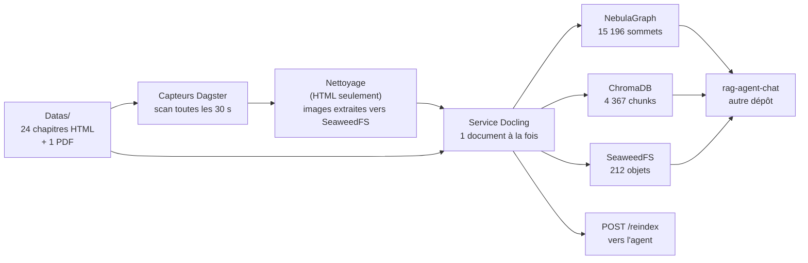

# Livraison — lancer, ingérer, vérifier, revenir en arrière

> **Pour qui n'a jamais vu ce dépôt.** Ce document se lit dans l'ordre et il
> suffit : il démarre la pile, ingère, vérifie, revient en arrière, et dit ce
> qui reste à faire. Il ne raconte **pas** le chantier — l'histoire est au
> [registre](axes_amelioration.md) et au [pilotage](pilotage_du_chantier.md).
>
> **Date de livraison : 25 septembre 2026.** Chaque chiffre de ce document
> porte sa date, et **chaque commande écrite ici a été exécutée**, en lecture
> seule, sauf celles qui écrivent — elles sont marquées « non exécutée » avec
> leur raison, au [§9](#9-chaque-commande-de-ce-document--exécutée-ou-non).
>
> **Le stockage d'objets est SeaweedFS**, en service depuis le 25 septembre
> 2026, 08:15 UTC. Le dépôt ne le nomme nulle part : il parle à une
> **passerelle S3**, et seule `S3_ENDPOINT` désigne le serveur. Lisez le
> [§6](#6-à-savoir-avant-de-toucher) **avant** de toucher à quoi que ce soit.
>
> **MinIO est retiré, et supprimé**, le 25 septembre 2026 entre 13:36 et
> 13:55 UTC : variables `S3_*`, contrat `media_url` + `object_key`, purge,
> réingestion, mesures toutes égales, puis conteneur, données et images
> supprimés. Le compte rendu est
> [`campagnes/2026-09-25-retrait-du-stockage-precedent.md`](campagnes/2026-09-25-retrait-du-stockage-precedent.md), §11.

---

## 1. Ce qu'est le projet

Il avale des livres techniques et en fabrique **trois choses** qu'un agent
conversationnel interroge : un **graphe** (la structure), un **index vectoriel**
(la recherche par le sens), un **stockage d'objets** (les images).

Il ne répond à aucune question. C'est le travail de
[`rag-agent-chat`](https://github.com/floSa/rag-agent-chat), qui vit dans un
autre dépôt et lit ces trois stores.

### 1.1 Les services

| Service | Rôle | Adresse interne |
|---|---|---|
| `docling-service` | extraction, découpage, encodage — **le seul à écrire dans les trois stores** | `docling-service:8000` |
| `dagster-webserver` / `dagster-daemon` | orchestration : capteurs, partitions, runs | `:3000` / — |
| `postgres-dagster` | métadonnées Dagster — **curseurs des capteurs et historique des runs** | `postgres-dagster:5432` |
| `graphd` + `metad` + `storaged` | NebulaGraph — la structure | `graphd:9669` |
| `nebula-studio` | console du graphe | `:7001` |
| `chromadb` | l'index vectoriel | `chromadb:8000` |
| **`seaweedfs`** | **le stockage d'objets, par sa passerelle S3** | **`seaweedfs:8333`** |

Le débit est cadencé à deux niveaux : la file Dagster (`max_concurrent_runs: 2`
dans `dagster.yaml`) et le service Docling, qui ne convertit **qu'un document à
la fois**.

### 1.2 Le chemin d'un document



### 1.3 Le contrat avec `rag-agent-chat`

Le site canonique est le **§0 du [registre](axes_amelioration.md)**. Ce qui est
**publié**, et qu'il lit :

| Ce qui est publié | Où | Ce qu'il faut en savoir |
|---|---|---|
| les chunks et leurs métadonnées | ChromaDB, collection `rag_documents` | `element_id` déterministe, 10 caractères hexadécimaux |
| la structure du document | NebulaGraph, space `rag_space` | `depth` mélange deux échelles, `label` dit laquelle ; `sequence` repart à 0 par document |
| l'adresse des images | propriété **`media_url`** des sommets `Picture` et `Table` | `http://<S3_ENDPOINT>/<bucket>/<clé>`. **Interne et authentifiée** : un `GET` anonyme y rend 403, l'agent est le proxy, elle ne va jamais à un navigateur |
| la **clé** de ces mêmes objets | propriété **`object_key`** des mêmes sommets | la clé NUE, celle passée à `put_object`. L'adresse porte l'hôte et **périme** avec lui ; la clé est l'identité de l'objet et lui survit |
| le modèle d'embedding | `EMBEDDING_MODEL_NAME` | **doit être identique des deux côtés** : un désaccord ne lève aucune erreur et rend des passages plausibles et faux |

**Et une chose qui n'est pas dans les stores : `POST /reindex`.** En **fin
d'ingestion**, quand plus aucun run n'est en vol, `agent_reindex_sensor` part
seul et appelle `AGENT_SERVICE_URL`. L'agent tient son index lexical BM25 **en
mémoire** : sans cet appel, un document ingéré après son démarrage reste
trouvable en recherche dense mais **invisible** en recherche lexicale. Vider
`AGENT_SERVICE_URL` désactive l'appel — c'est un choix possible, annoncé au
démarrage de Dagster, pas un oubli silencieux.

---

## 2. Lancer

### 2.1 Prérequis

- **Docker** et **Docker Compose v2**. La pile démarre **sur processeur**, sans
  GPU ni NVIDIA Container Toolkit. Pour rendre un GPU à Docling :
  `docker compose -f docker-compose.yml -f docker-compose.gpu.yml up -d`.
- **Python 3.12** et [`uv`](https://docs.astral.sh/uv/), pour la porte qualité
  seulement. L'exploitation ne demande que Docker.
- De la place disque : les stores vivent sous `Datas/database/`.

### 2.2 Le `.env` — toutes les variables

```bash
cp .env.example .env
```

`.env.example` porte le gabarit complet, **avec le motif de chaque variable**.
Aucune valeur n'est écrite ici, et aucune ne doit l'être : `.env` n'est pas
versionné.

| Variable | Ce qu'elle décide |
|---|---|
| `S3_ENDPOINT` | l'adresse du stockage d'objets — `seaweedfs:8333`. **AUCUNE valeur par défaut : sans elle, rien ne démarre**, voir le [§6.2](#62-ladresse-du-stockage-na-aucune-valeur-par-défaut) |
| `S3_BUCKET` | `documents` |
| `S3_ACCESS_KEY` / `S3_SECRET_KEY` | ce que le **client** présente. **Ne les écrivez pas dans le `.env`** : `docker-compose.yml` les dérive du jeu RW ci-dessous — une seule valeur, deux noms, un seul endroit qui la porte |
| `SEAWEEDFS_RW_ACCESS_KEY` | identité du **serveur** — jeu **écriture** : le pipeline (`docling-service`, `wipe_stores`). Actions `Admin, Read, Write, List, Tagging`. C'est lui que `docker-compose.yml` passe en `S3_ACCESS_KEY` |
| `SEAWEEDFS_RW_SECRET_KEY` | idem |
| `SEAWEEDFS_RO_ACCESS_KEY` | jeu **lecture seule** : `rag-agent-chat`. Actions `Read, List`, **rien d'autre** |
| `SEAWEEDFS_RO_SECRET_KEY` | idem |
| `NEBULA_HOST` / `NEBULA_PORT` | `graphd` / `9669` |
| `NEBULA_USER` / `NEBULA_PASSWORD` | identifiants du graphe |
| `CHROMA_HOST` / `CHROMA_PORT` | `chromadb` / `8000` |
| `DAGSTER_POSTGRES_USER` / `_PASSWORD` / `_DB` / `_HOST` | le Postgres de Dagster — **il porte les curseurs des capteurs** |
| `EMBEDDING_MODEL_NAME` | **NE PAS CHANGER sans réingestion complète.** Doit être identique à celui de l'agent. Le service **refuse de démarrer** sur un autre modèle |
| `DOCLING_SERVICE_URL` | `http://docling-service:8000` |
| `AGENT_SERVICE_URL` | où part le `POST /reindex`. Vide ⇒ appel désactivé, annoncé au démarrage |
| `AGENT_API_KEY` | seulement si l'agent tourne avec sa propre clé |
| `SOURCE_DIR` | optionnel, défaut `/opt/dagster/app/Datas` |

Les quatre `SEAWEEDFS_*` se génèrent ainsi :

```bash
openssl rand -hex 16                    # une clé d'accès
openssl rand -base64 32 | tr -d '/+='   # une clé secrète
```

**Les identités SeaweedFS ne sont montées depuis nulle part.**
`docker-compose.yml` **écrit** le fichier `-s3.config` au démarrage, dans un
**tmpfs** du conteneur, par un heredoc — jamais en argument, qui se lirait dans
`docker inspect` et dans la table des processus. Aucune clé n'entre dans le
dépôt.

### 2.3 Démarrer

```bash
docker compose up -d --build
```

> **Mais pas sur une pile déjà en service.** Un `docker compose up -d` **nu**
> recrée tout ce dont la configuration a changé, y compris ce qu'on ne voulait
> pas toucher. Sur une pile en service, on **nomme les services**, et on ajoute
> `--no-deps` — voir le
> [§6.3](#63-docker-compose-up-sans---no-deps-redémarre-les-dépendances).

### 2.4 La santé des services

```bash
docker compose ps
```

`seaweedfs` et `docling-service` portent une sonde et doivent afficher
`healthy` — `docling-service` a un `start_period` de **600 s**, il charge son
modèle. Les autres n'affichent que `running`.

`mesuré le 25 septembre 2026 à 09:00 UTC`, les onze services sont debout,
`seaweedfs` et `docling-service` `healthy`.

La sonde de SeaweedFS vise **`http://seaweedfs:8333/healthz`**, et les deux
détails comptent : `-ip=seaweedfs` fait écouter le serveur sur cette adresse-là
**et sur elle seule** (une sonde sur la boucle locale reçoit `connection
refused` sur un service parfaitement sain), et la racine S3 non authentifiée
rend un **403**, qui est le bon comportement et qui rendrait la sonde
éternellement rouge.

### 2.5 Les interfaces

| Service | URL | Note |
|---|---|---|
| **Dagster** | `http://localhost:3002` | les capteurs sont sous **Overview → Sensors** |
| **Nebula Studio** | `http://localhost:7001` | hôte `graphd`, port `9669` |

Seuls ces deux-là sont exposés par `docker-compose.yml`. **SeaweedFS n'a pas de
console propriétaire** : ses identités sont le fichier `-s3.config`, et ses
droits se contrôlent **par appel direct**, jamais à l'écran ([§4.4](#44-la-passerelle-s3-et-ses-huit-critères)).

---

## 3. Ingérer et réingérer

### 3.1 Le chemin nominal — un fichier déposé

1. Déposez le fichier dans `Datas/pdfs/`, `Datas/htms/` ou `Datas/mds/` selon
   son type.
2. Le capteur de sa source le voit **dans les 30 s** : un `mtime` plus récent
   que le curseur crée **une partition et un run**.
3. Le run nettoie (HTML seulement), extrait, et écrit dans les trois stores.
4. Quand plus aucun run n'est en vol, `agent_reindex_sensor` part seul et
   appelle `POST /reindex`.

**Rien à lancer à la main.** Le déclencheur est le `mtime`, et lui seul.

### 3.2 Réingérer — le marqueur sur le curseur

Un fichier **inchangé** n'est jamais réingéré tout seul : sa clé de run est déjà
consommée. La réingestion **se demande**, en posant un marqueur sur le curseur
du capteur :

```bash
docker compose exec -T -w /opt/dagster/app -e PYTHONPATH=/opt/dagster/app \
  dagster-webserver dagster sensor cursor livres_html_sensor \
    --set 'reingerer:<étiquette>' -w src/workspace.yaml
```

et de même pour `pdfs_sensor`. **L'étiquette doit être neuve à chaque fois** :
elle entre dans la clé de run
(`livres_html_<partition>_reingestion_<étiquette>`), et une étiquette déjà
employée est une clé déjà consommée, donc **zéro run et aucun message**. La
convention en service est la date suivie du motif —
`reingerer:2026-09-25-bascule-seaweedfs`.

Pas de marqueur sur `markdown_sensor` (source vide) ni sur
`agent_reindex_sensor` (ce n'est pas un capteur de fichiers).

**Attendu sur ce corpus : 22 + 1 = 23 runs**, tous créés par les capteurs,
aucun à la main.

**Et la CLI ne sait pas relire ce qu'elle vient d'écrire.** `dagster sensor
cursor` n'offre que `--set` et `--delete` — `mesuré le 25 septembre 2026,
09:03 UTC`, `dagster sensor cursor --help`. Pour **lire** un curseur, et donc
pour vérifier ce qu'on écrase et constater que le marqueur a été consommé :

```bash
docker compose exec -T -w /opt/dagster/app -e PYTHONPATH=/opt/dagster/app \
  dagster-webserver python -c "
from dagster import DagsterInstance
for s in DagsterInstance.get().all_instigator_state():
    print(s.instigator_name, s.status.value, s.instigator_data.cursor)
"
```

C'est le §4.42.a du registre.

### 3.3 La purge, et le redémarrage qui la suit

`wipe_stores` **vide les trois stores et le HTML nettoyé**. Il vise ce que
`S3_ENDPOINT` désigne, et rien d'autre.

> **Ce réglage avait une valeur par défaut, et elle a survécu au serveur
> qu'elle désignait.** Un `.env` absent, ou un `.env` qui aurait perdu cette
> ligne, faisait donc purger le **mauvais** stockage — sans une erreur et sans
> un avertissement. Le défaut a été **retiré** : la construction des réglages
> échoue si `S3_ENDPOINT` manque, **avant qu'aucun client ne soit bâti**, donc
> avant toute suppression, avec un message qui nomme la variable et dit quoi
> faire. *Un défaut absent fait échouer le démarrage ; un défaut faux fait
> réussir la purge du mauvais stockage.*
>
> **Et la purge annonce désormais l'adresse qu'elle vide**, avant le compte et
> non après : `--- Stockage objet (seaweedfs:8333) ---`. Ce bloc disait le nom
> d'un produit, écrit dans le code ; il l'aurait dit à l'identique en vidant un
> tout autre serveur.
>
> **Les instruments se lancent par `docker compose run --no-deps`, et non par
> `docker run --env-file .env`.** Le `.env` ne porte pas `S3_ACCESS_KEY` ni
> `S3_SECRET_KEY` : c'est `docker-compose.yml` qui les dérive du jeu RW. Un
> `docker run --env-file .env` les laissait vides — la purge rendait 403 sur le
> stockage objet — et, depuis que les réglages refusent un identifiant vide,
> il ne démarre plus. `compose run` reçoit la même dérivation que le service ;
> `--no-deps` ne démarre rien d'autre, et `--rm` efface le conteneur.

```bash
docker compose run --rm --no-deps -T -e PYTHONPATH=/app -w /app \
  docling-service python -m src.wipe_stores
```

**Puis, obligatoirement :**

```bash
docker compose restart docling-service
```

La purge joue `DROP SPACE`, et `init_schema()` **ne tourne qu'au démarrage** du
service. Sans ce redémarrage, la réingestion écrit contre un schéma incomplet.
Le journal doit porter les deux lignes :

```
INFO [src.docling_service.images] Bucket 'documents' pret sur seaweedfs:8333.
INFO [src.docling_service.nebula] Schema semantique NebulaGraph pret.
```

**Ne PAS redémarrer `agent-api` après une purge.** Depuis le 25 septembre
2026, l'agent détecte la purge et rouvre sa session NebulaGraph lui-même (son
journal : « Session NebulaGraph périmée … réouverture du pool »). Son `/health`
passe au ROUGE pendant la purge, et c'est normal. Relever son `/health` et un
`GET /media/<clé>` cinq minutes après la fin de la réingestion. Ne redémarrer
que s'il est encore rouge. La reprise après recréation du schéma n'a pas encore
été mesurée : la prochaine purge le fera
([§6.6](#66-après-une-purge-ne-pas-redémarrer-lagent)).

**Le compte que la purge annonce est un signal d'arrêt.** Sur la pile en
service, elle doit annoncer **212 objets supprimés**, sous l'adresse
`seaweedfs:8333` qu'elle vient d'afficher. Un autre compte, ou une autre
adresse, arrête la procédure : on ne réingère pas par-dessus un doute.

> `wipe_stores` **n'est pas exécuté par ce document** : il écrit. Voir le
> [§9](#9-chaque-commande-de-ce-document--exécutée-ou-non).

---

## 4. Vérifier

**Tout ce qui suit est en lecture seule et n'écrit dans aucun store.** Les
chiffres sont ceux du 25 septembre 2026 entre 09:01 et 09:05 UTC, et ils sont
**identiques** à ceux de la campagne du matin, prise derrière le stockage
précédent.

### 4.1 La porte qualité

```bash
uv sync
make all
```

**`uv sync` et non `make install`** dans un worktree : `make install` grave dans
le `.git/hooks` **partagé** un chemin d'interpréteur qui mourra avec cet arbre.
Dans le clone principal, `make install` est le bon geste.

`mesuré le 25 septembre 2026`, dans le worktree de livraison : **rc=0**,
**1 084 tests passés**, `mypy` « no issues found in **43** source files »,
**35 mutations rejouées, 35 rouges**, « arbre de travail intact », `ruff format
--check` **85 fichiers déjà formatés**.

*(43 et 85 là où la campagne du matin écrivait 42 et 84 : la fusion de la
branche de bascule a ajouté `scripts/campagne/essayer-la-passerelle-s3.py`, que
`mypy` et `ruff` voient tous deux depuis le lot 11.)*

### 4.2 Les huit comptes, et l'empreinte des clés

Le compte de sommets se fait par `MATCH … RETURN count(n)`, **tag par tag**, et
**jamais** par `SHOW STATS`, qui rend 0 sur un space peuplé.

| Compte | Attendu | `mesuré` le 25/09/2026 à 09:05 UTC |
|---|---|---|
| sommets, tous tags, `Document` compris | 15 196 | **15 196** |
| sommets `Document` | 23 | **23** |
| sommets `Paragraph` | 7 251 | **7 251** |
| sommets `ListItem` | 1 748 | **1 748** |
| sommets `Code` | 4 963 | **4 963** |
| arêtes `PARENT_OF` | 15 173 | **15 173** |
| chunks ChromaDB | 4 367 | **4 367** |
| objets dans le bucket `documents` | 212 | **212** |
| **empreinte des 212 clés** | `c91f5be6…b994` | **`c91f5be6…b994`** (en entier ci-dessous) |

L'empreinte **en entier**, parce que ce § est le site de sa recette :

```
c91f5be6e24fbcba5f4a744119bf8da65fed44b7ecac79cce0ae1b027ed0b994
```

> **Et une coquille à connaître, parce qu'elle est partout ailleurs.** Le reste
> de la documentation l'abrège en **`c91f5be6…0994`** — registre §4.43.b et
> §4.43.d, comptes rendus des deux campagnes du 25 septembre,
> [`etat_des_lieux.md`](etat_des_lieux.md). **`0994` n'est pas la fin de ce
> condensé** : il finit par `…7ed0b994`. L'abrègement juste est `c91f5be6…b994`.
> C'est une coquille d'écriture, **pas un désaccord de mesure** : la valeur
> entière est écrite au long aux deux comptes rendus, et elle est bien celle
> ci-dessus, remesurée ce jour. Les sites fautifs ne sont pas corrigés par cette
> branche — ils appartiennent au registre et aux comptes rendus, qui sont des
> pièces datées et closes.

**La recette de l'empreinte, parce qu'une empreinte sans sa recette n'est pas un
témoin mais un chiffre** (§4.43.b du registre) :

> Les clés d'objet **distinctes** (`set`), triées par `sorted()` de Python,
> jointes par `"\n"`, **avec un `"\n"` final**, encodées en **UTF-8**,
> condensées en **SHA-256**, rendues en hexadécimal minuscule.

```python
cles = sorted({o.object_name for o in client.list_objects(bucket, recursive=True)})
empreinte = hashlib.sha256(("\n".join(cles) + "\n").encode("utf-8")).hexdigest()
```

**Sa borne, et elle compte.** L'agent calcule la sienne à partir des adresses
du **graphe** ; ce dépôt la calcule à partir du **bucket**. Les deux s'accordent
parce que les deux ensembles sont **égaux** — 212 de part et d'autre, remesuré
ce jour — et **non** parce que la recette serait la même par construction.

*(Le graphe publie désormais `object_key` à côté de `media_url` : la clé y est
lisible sans défaire l'adresse, ce qui retire la dernière raison qu'avait un
consommateur de refaire cette dérivation chez lui.)*

Et le témoin propre à la bascule, `mesuré le 25 septembre 2026 à 09:05 UTC` :
les **212** sommets porteurs d'une adresse de média (209 `Picture` + 3 `Table`)
la portent **tous** sous `http://seaweedfs:8333/documents/`.

### 4.3 `comparer` contre l'instantané

L'instantané fige les `element_id` des trois stores dans un fichier versionné.
`comparer` confronte l'état vivant à cet instantané, **dans les deux sens**.

```bash
docker compose run --rm --no-deps -T \
  -v "$PWD/scripts":/app/scripts:ro \
  -v "$PWD/documentation/campagnes":/app/documentation/campagnes:ro \
  -v "$PWD/Datas":/corpus:ro \
  -v /tmp/sp-comparer:/sp \
  -v "$PWD/Datas/.cleaned":/sp/cleaned:ro \
  -e COMMIT_MESURE="$(git rev-parse HEAD)" -e PYTHONPATH=/app -w /app \
  docling-service \
  python scripts/campagne/verifier-l-equivalence-des-identifiants.py \
    comparer documentation/campagnes/2026-09-24-instantane-des-identifiants
```

Les copies nettoyées **de production** sont montées **en lecture seule** : le
harnais ne peut pas altérer son propre sujet.

`mesuré le 25 septembre 2026, 09:03:45 → 09:05:11 UTC` (86 s), **`rc=0`** :

```
INSTANTANE e945893b1021e2f1aa3809434a889443ed9fb85e2a7e290cd329f077687f0f6d
DOCUMENTS COMPARES 23 / 23 de l'instantane
DEPLACES 0, DECLARES 0
ATTRIBUTION (exacte, par appariement) : {}
OK : l'ensemble deplace est exactement l'ensemble declare.
```

### 4.4 La passerelle S3 et ses huit critères

`scripts/campagne/essayer-la-passerelle-s3.py` est le **juge** de la passerelle.
Il n'interroge aucune console : pour chaque critère et **chaque jeu
d'identifiants**, il fait **l'appel** que le pipeline ou l'agent ferait, avec la
**même bibliothèque cliente S3**, et il lit le refus dans l'exception.

**Pourquoi par appel direct, et c'est le point de tout le script** : un refus S3
est un **403 `AccessDenied`**, et il remonte chez l'agent en **404 silencieux**.
L'écran dit « image absente », et le corpus a simplement l'air incomplet. **Un
jeu d'identifiants mal posé ne se voit donc pas à l'usage.**

```bash
ESSAI_S3_ENDPOINT=seaweedfs:8333 \
ESSAI_S3_BUCKET=<un bucket d'essai, JAMAIS documents> \
ESSAI_S3_RW_ACCESS_KEY=… ESSAI_S3_RW_SECRET_KEY=… \
ESSAI_S3_RO_ACCESS_KEY=… ESSAI_S3_RO_SECRET_KEY=… \
python scripts/campagne/essayer-la-passerelle-s3.py
```

Les identifiants viennent de l'environnement, **jamais de la ligne de commande**
— un secret passé en argument se lit dans la table des processus. Sortie : `0`
si les sept premiers critères passent, `1` dès qu'un seul échoue. Le **contrôle
négatif** consiste à rejouer avec un jeu **faux** : le script doit alors sortir
en `1`. Un essai qui ne sait pas échouer ne prouve rien.

Le **critère 8** — l'empreinte des clés après réingestion — ne vit pas dans ce
script : il se mesure sur le store réel, au [§4.2](#42-les-huit-comptes-et-lempreinte-des-clés).

> **Ce script n'est pas exécuté par ce document : il ÉCRIT** (critère 5, les
> cinq écritures, et il crée son bucket d'essai). Ses huit critères ont été
> joués et sont passés le 25 septembre 2026 — compte rendu à
> [`campagnes/2026-09-25-bascule-seaweedfs.md`](campagnes/2026-09-25-bascule-seaweedfs.md), §2 et §3.

### 4.5 `verify_contract` — le contrat avec l'agent

```bash
docker compose run --rm --no-deps -T -e PYTHONPATH=/app -w /app \
  docling-service python -m src.verify_contract
```

`mesuré le 25 septembre 2026 à 09:01 UTC`, derrière SeaweedFS, **`rc=1`** :

```
chunks examines                : 4367
element_id au mauvais format   : 0
element_id != graph_node_id    : 0
cles de metadonnees manquantes : aucune
ids de chunk suffixes en #n    : 976
chunks sans source_path        : 0
chunk_index hors de chunk_count: 0
elements au jeu de chunks troue: 0
modele des vecteurs            : paraphrase-multilingual-MiniLM-L12-v2
aretes PARENT_OF examinees     : 15173
aretes sans sequence           : 0
inversions de page dans l'ordre: 0
sommets sans depth             : 0/15173
sommets sans page_no_end       : 0/15173
colonnes du tag Document       : 7, manquantes aucune
sommets visuels sans media_url : 52/264
sommets visuels sans object_key : 52/264
ancres presentes dans le graphe : 3750/3750

ANOMALIE : 52 sommets visuels sur 264 sans media_url
```

**`rc=1` est l'ATTENDU sur ce corpus, et c'est la seule anomalie connue.** Ce
sont les 52 tables HTML du §4.32.b : une table HTML est du texte, il n'y a rien
à téléverser. C'est le **compteur** qui fusionne deux chemins, pas la chaîne
d'images qui est cassée. `verify_contract` **ne peut pas rendre 0** ici. Un
`rc=1` accompagné d'une **autre** ligne d'anomalie, ou d'un autre chiffre que
52/264, est un vrai défaut. **Le compte d'`object_key` doit être le même que
celui de `media_url`** : les deux sont posés d'un seul geste, et un écart entre
eux dirait qu'un chemin d'image en a oublié un.

### 4.6 `index_report` — l'index vectoriel

```bash
docker compose run --rm --no-deps -T -e PYTHONPATH=/app -w /app \
  docling-service python -m src.index_report
```

`mesuré le 25 septembre 2026 à 09:01 UTC`, **`rc=0`**, et **identique à la
campagne du matin** : **4 367** chunks, **23** documents distincts, médiane
**299** caractères (moyenne 303, min/max 8 / 683), **137** chunks tronqués par
le modèle (**3,1 %**), tokens médiane 95 / maximum 149, répartition par label
`text` **2 604** / `code` **975** / `list_item` **484** / `table` **196** /
`caption` **108**, et **4 367** en `en` — le corpus est entièrement anglais.

### 4.7 Le jeu de questions et le rappel vectoriel

Les deux scripts se lancent avec le même montage — `src`, `scripts`,
`documentation` en lecture seule, plus le volume des modèles :

```bash
docker compose run --rm --no-deps -T \
  -v "$PWD/scripts":/app/scripts:ro \
  -v "$PWD/documentation":/app/documentation:ro \
  -e PYTHONPATH=/app -w /app \
  docling-service \
  python scripts/campagne/verifier-le-jeu-de-questions.py \
    documentation/campagnes/2026-09-02-jeu-de-questions.yaml
```

`mesuré le 25 septembre 2026 à 09:01 UTC`, **`rc=0`**, lu **sans tube** :

```
index interroge           : 4367 chunks
chunks annonces par le jeu: 4367
ancrages a verifier       : 44

Jeu valide : les 44 ancrages concordent avec l'index, champ par champ.
```

**Les 44 ancrages concordent**, derrière SeaweedFS comme derrière le stockage
précédent.

Et le rappel, même montage, `python scripts/campagne/mesurer-le-rappel-vectoriel.py
documentation/campagnes/2026-09-02-jeu-de-questions.yaml` —
`mesuré le 25 septembre 2026, 09:01:50 → 09:02:26 UTC` (36 s), **`rc=0`**,
contre les 4 367 chunks. La sortie est **30 lignes JSON**, une par question ;
les agrégats sont **dérivés**, `micro@k = somme(trouvés@k) / somme(attendus)`
sur les **26** questions à réponse, dont les attendus font **47** :

| k | trouvés / attendus | micro@k |
|---|---|---|
| 5 | 26 / 47 | **55,3 %** |
| 10 | 29 / 47 | **61,7 %** |
| 20 | 34 / 47 | **72,3 %** |
| 50 | 38 / 47 | **80,9 %** |

**Les quatre valeurs de la campagne du matin, au dixième.**

**Ce que ces chiffres ne disent pas.** Ils mesurent la recherche **dense seule**,
celle que ce dépôt produit. Ni BM25, ni la reconstruction par le graphe, ni le
reranker, ni l'abstention : tout cela vit dans `rag-agent-chat`. Et 30 questions
ne suffisent pas à arbitrer un réglage — **un écart de deux points est du
bruit**.

### 4.8 L'agent sert ses images depuis SeaweedFS — mesuré chez lui

**Ce paragraphe ne rapporte pas une mesure de ce dépôt.** Il rapporte celle du
**pilote de `rag-agent-chat`**, faite dans son dépôt, le **25 septembre 2026
entre 09:00 et 09:02 UTC**. Elle est citée ici parce qu'elle ferme le point qui
était, jusqu'à ce matin, le premier du [§10](#10-non-vérifié) — mais elle se
vérifie là-bas, pas ici.

| Ce qui a été mesuré | Résultat |
|---|---|
| le `.env` de l'agent | pointe `seaweedfs:8333`, avec le jeu **LECTURE SEULE** |
| le témoin `temoin-bascule/bascule-2026-09-25.txt` | **lu** par le client de l'agent, SHA-256 `39e06d1d6e344080d078ef44f086452726def1cd0daf93feac07922a29e75ae0` |
| son journal | la connexion au store à `seaweedfs:8333`, et « Proxy média : 212 objets autorisés » |
| `GET /media/…/086f1173cb_picture.png` | **200**, octets **identiques** à ceux d'avant la bascule |
| les ancrages | **267**, **0 désaccord** |
| l'empreinte des 212 clés, vue de l'agent | `c91f5be6…` |
| le graphe, vu de l'agent | **23** `Document`, **15 173** arêtes |
| `POST /reindex` | **4 367** chunks |

**Son retour arrière est son ancien `.env`, copié hors de son dépôt.** Il est à
lui : ce dépôt ne le tient pas.

**Ce que cela ne dit toujours pas** : la qualité des réponses de l'agent n'est
pas mesurée ici, et les 267 ancrages sont les siens, pas les 44 du jeu de
questions de ce dépôt ([§4.7](#47-le-jeu-de-questions-et-le-rappel-vectoriel)).

---

## 5. Revenir en arrière

**Le retour arrière est le CORPUS, et il n'est rien d'autre.** `Datas/` porte
les 25 fichiers sources, versionnés, et ce sont eux qui décident de tout : les
`element_id` dérivent de leur contenu et de leur chemin, les 212 objets sont
leurs images, les 4 367 chunks leur texte. **Une purge suivie d'une réingestion
régénère les trois stores à l'identique** — c'est exactement ce que
`comparer` contre l'instantané établit, `DEPLACES 0`
([§4.3](#43-comparer-contre-linstantané)).

**Il y a eu, un temps, un second stockage gardé debout « au cas où ».** Il a été
retiré. Un serveur maintenu en vie sans être mesuré est un serveur dont la
configuration dérive en silence : le `.env` en service ne portait plus ses
identifiants, si bien qu'un `docker compose up -d` **nu** — qui recrée tout ce
dont la configuration a changé — l'aurait redémarré avec les mauvaises clés et
aurait rendu ses objets inaccessibles sans un mot. Le retour arrière avait donc
un mode de perte silencieux, et c'est la définition de ce que ce dépôt refuse.

**Ce que ce retour arrière coûte : une purge et une réingestion complète.** Ce
n'est pas un basculement instantané, et il ne peut pas l'être : `images.py`
stocke l'adresse `http://{S3_ENDPOINT}/{S3_BUCKET}/{clé}` **dans le graphe**,
donc changer d'endpoint change toutes les adresses stockées. **Les clés, elles,
ne changent pas** — c'est ce que le critère 8 établit, et c'est pourquoi le
contrat publie désormais `object_key` à côté de l'adresse.

La procédure est celle du [§3](#3-ingérer-et-réingérer), sans variante : purge,
redémarrage de `docling-service`, marqueur de réingestion avec une étiquette **neuve**, puis les mesures du
[§4](#4-vérifier). Les huit comptes et l'empreinte des 212 clés doivent revenir
aux mêmes valeurs.

**Changer de stockage d'objets ne demande pas de code** : le dépôt ne nomme
aucun serveur, seule `S3_ENDPOINT` le désigne. Le juge d'un candidat est
`scripts/campagne/essayer-la-passerelle-s3.py`, avec ses huit critères et ses
deux jeux d'identifiants ([§4.4](#44-la-passerelle-s3-et-ses-huit-critères)).

---

## 6. À SAVOIR AVANT DE TOUCHER

**Six** choses. Aucune ne fait de bruit, et chacune a déjà coûté quelque chose.

### 6.1 Les capteurs sont passés de `DECLARED_IN_CODE` à `RUNNING`

`mesuré le 25 septembre 2026 à 09:02 UTC` : les **quatre** capteurs —
`livres_html_sensor`, `pdfs_sensor`, `markdown_sensor`, `agent_reindex_sensor` —
sont à **`RUNNING`**. Ils étaient à **`DECLARED_IN_CODE`** avant la bascule.

**Ce que ça change.** `DECLARED_IN_CODE` veut dire « aucun état persisté :
le capteur suit ce que le code déclare », et le code déclare
`default_status=DefaultSensorStatus.RUNNING` (`factory.py:670`,
`reindex_job.py:320`). `RUNNING` veut dire « un état est **persisté en base**,
et il l'emporte ». **Le comportement observable est le même — les capteurs
tournent dans les deux cas.** Ce qui change est que **le code ne décide plus** :
changer `default_status` en `DefaultSensorStatus.STOPPED` n'aurait désormais
**aucun effet**, et rien ne le dirait.

**Ce que ça change concrètement AUJOURD'HUI : rien, et c'est justement le
piège.** Les deux valeurs **coïncident** — le code déclare `RUNNING`
(`factory.py:670` pour les trois capteurs de fichiers, `reindex_job.py:320` pour
`agent_reindex_sensor` ; `mesuré le 25 septembre 2026` sur le code, ce sont les
**deux seules** occurrences de `default_status` du dépôt), et la base porte
`RUNNING` pour les quatre. Tant que personne ne touche à `default_status`, **il
n'existe aucun écart observable**, et aucun test ne peut en montrer un. Le coût
est **entièrement futur** : il se paiera le jour où quelqu'un changera cette
ligne du code, relira le code pour savoir ce que font les capteurs, et **aura
tort** — sans que rien ne rougisse. C'est pourquoi la seule chose à retenir
tient en une phrase : **l'état en base l'emporte sur le code.**

C'est le `dagster sensor stop` / `start` de la procédure de bascule (§4.3 du
compte rendu) qui a écrit ces états — le geste « ceinture et bretelles » qui
évitait qu'une ingestion parte pendant la recréation du démon. Le compte rendu
annonçait ce coût : « l'état est persistant et **s'oublie** ».

**Comment revenir à l'état déclaré.** `dagster sensor` n'offre que `start`,
`stop`, `cursor`, `list` et `preview` — `mesuré le 25 septembre 2026 à
09:03 UTC`, `dagster sensor --help`. **Il n'existe aucune commande pour revenir
à `DECLARED_IN_CODE`** : il faut retirer la ligne d'état de l'instance Dagster,
dans le Postgres de Dagster. Ce n'est pas un geste de routine, et il n'est pas
écrit ici parce qu'il **écrit** : tant qu'on ne le fait pas, retenir que l'état
en base l'emporte sur le code suffit.

### 6.2 L'adresse du stockage n'a AUCUNE valeur par défaut

`S3_ENDPOINT` **doit** être dans le `.env`. Sans elle, la construction des
réglages échoue — le service d'extraction ne démarre pas, `wipe_stores` ne purge
rien, `verify_data` n'interroge rien — avec un message qui nomme la variable et
dit quoi faire.

**Ce n'est pas une rigidité, c'est un garde-fou, et il a une histoire.** Ce
réglage avait un défaut écrit dans le code, à deux sites : l'adresse du stockage
d'alors. Elle est restée juste tant qu'elle a désigné le stockage en service.
Le jour où le stockage a changé, elle a cessé de pointer vers l'ancien
« au pire » et s'est mise à pointer vers le **mauvais**. Or `wipe_stores` lit ce
même réglage et **vide** le bucket qu'il désigne : lancé depuis un shell sans
`.env`, depuis un conteneur recréé sans elle, ou depuis une tâche planifiée, il
aurait purgé le mauvais serveur **en rendant compte d'une purge réussie**.

*Un défaut absent fait échouer le démarrage ; un défaut faux fait RÉUSSIR la
purge du mauvais stockage.* Une purge ne prévient pas : elle rend compte.

Le site du refus et son motif sont à `src/reglages_s3.py` ; le garde est
`tests/unit/test_settings.py::TestLAdresseDuStockageObjetNAAucunDefaut`, et il
tient les **deux** classes de réglages, puisque les deux construisent un client.

**Second garde-fou, au même endroit** : `wipe_stores` **affiche l'adresse qu'il
s'apprête à vider**, avant le compte et non après
(`--- Stockage objet (seaweedfs:8333) ---`).

**Et les identifiants ne sont écrits qu'une fois.** `SEAWEEDFS_RW_*` déclare les
identités du **serveur** ; `docker-compose.yml` en **dérive** `S3_ACCESS_KEY` et
`S3_SECRET_KEY`, ce que le **client** présente. Recopier la même clé sous deux
noms dans le `.env` ferait deux valeurs à tenir d'accord, et le jour où elles
divergeraient le serveur rendrait 403 sur une pile dont la configuration aurait
l'air juste.

### 6.3 `docker compose up` sans `--no-deps` redémarre les dépendances

Nommer un service ne suffit pas toujours : `docker compose up -d <service>`
démarre aussi ce dont il **dépend**. Pendant la bascule, recréer les services
Dagster a **redémarré `postgres-dagster`** — celui qui porte les curseurs des
capteurs et l'historique des runs. Rien n'a été perdu ce jour-là, mais **un
Postgres qui repartirait vierge perdrait curseurs et historique ensemble**, et
un simple `docker compose up -d` réingérerait alors le corpus **entier, sans un
mot**. C'est arrivé sur ce poste, au lot 3 (registre §4.26).

Quand on veut toucher un seul service et rien d'autre : `--no-deps`.

### 6.4 `restart` ne relit pas le `.env`

`docker compose restart <service>` relance le conteneur **avec son ancien
environnement**. Après toute modification du `.env`, c'est
`docker compose up -d --force-recreate <service>`, puis la vérification :

```bash
docker compose exec <service> printenv <VARIABLE>
```

La seule exception est le `restart` **après une purge** ([§3.3](#33-la-purge-et-le-redémarrage-qui-la-suit)),
où ce qu'on veut est justement de rejouer `init_schema()` sans changer
l'environnement.

### 6.5 Ne jamais `toucher` le corpus

Le déclencheur d'un capteur est le **`mtime`** d'un fichier. Un `touch`, un
`cp` qui ne préserve pas les dates, un éditeur qui réenregistre sans rien
changer : **chacun arme les capteurs et lance une réingestion**, dans les 30 s,
sans que personne l'ait demandé.

Et **ne renommez aucun fichier du corpus** : le chemin entre dans le calcul des
`element_id`. Un renommage après ingestion déplace les identifiants et **tue le
jeu de 30 questions**.

`mesuré le 25 septembre 2026` (registre §4.41) : **0** fichier du corpus porte
un `mtime` postérieur au 24 septembre 2026. La commande qui compte le corpus
doit **écarter `.cleaned`**, faute de quoi elle rend 47 au lieu de 25 :

```bash
find Datas -path 'Datas/.cleaned' -prune -o \( -name '*.pdf' -o -name '*.html' \) -print
```

### 6.6 Après une purge, NE PAS redémarrer l'agent

**Ne PAS redémarrer `agent-api` après une purge.** Depuis le 25 septembre 2026,
l'agent détecte la purge et rouvre sa session NebulaGraph lui-même (son
journal : « Session NebulaGraph périmée … réouverture du pool »). Son `/health`
passe au ROUGE pendant la purge, et c'est normal. Relever son `/health` et un
`GET /media/<clé>` cinq minutes après la fin de la réingestion. Ne redémarrer
que s'il est encore rouge. La reprise après recréation du schéma n'a pas encore
été mesurée : la prochaine purge le fera.

Le redémarrage, s'il faut y venir, se joue dans l'autre dépôt :

```bash
docker compose restart agent-api    # dans le depot rag-agent-chat, et seulement si /health est encore rouge
```

---

## 7. Défauts connus

Un par ligne, avec son site au registre. **Aucun n'est bloquant**, et aucun
n'est masqué.

| Défaut | Ce que c'est | Site |
|---|---|---|
| **52 tables HTML sans image** | `verify_contract` rend `rc=1` là-dessus, et **ne peut pas rendre 0**. Une table HTML est du texte : il n'y a rien à téléverser. C'est le **compteur** qui fusionne deux chemins | §4.32.b |
| **l'émiettement** | Docling découpe un `<li>` ou un paragraphe mis en forme en plusieurs éléments : **742** d'un seul caractère (dont 208 « . » et 121 « ) ») et **1 564** vides, sur 15 173. **Tous HTML** — le PDF n'en a aucun. Chacun coûte une place de fenêtre à l'agent. Compté, **non corrigé** : le corriger déplacerait des milliers d'identifiants | §4.38.g |
| **les puces vides, laissées en l'état** | **202** `ListItem` vides. Six options ont été chiffrées ; **l'option (a) — on n'y touche pas — est tranchée le 24 septembre 2026**. Leur texte est **déjà tout entier dans le graphe**, et ChromaDB ne le duplique pas | §4.37.g, §4.37.h |
| **les cinq points ouverts d'après-fusion** | (a) une borne ChromaDB écrite **trop pessimiste** à deux sites ; (b) deux gardes (`B1`, `N1`) sans mutation qui les exerce ; (c) `A6-b` rouge pour une autre raison que son intitulé ; (d) la couverture de `chromadb.api.async_client` est **fortuite** ; (e) « 3 classes sur 20 noms publics » doit se lire « 3 sur 20 **classes** » | §4.41 |
| **la CLI Dagster ne sait pas LIRE un curseur** | `dagster sensor cursor` n'offre que `--set` et `--delete`. On peut poser le marqueur de réingestion par une commande officielle, mais ni vérifier ce qu'on écrase, ni constater qu'il a été consommé. Le geste de lecture est au [§3.2](#32-réingérer--le-marqueur-sur-le-curseur) | §4.42.a |
| **les 886 `FAILURE` de l'historique — expliqués et CLOS** | **tous** des `agent_reindex_job`, **une seule cause** 886 fois sur 886 : une `ReindexError` sur le `POST /reindex` vers un service d'agent **absent** du poste. **Aucun run d'ingestion n'a jamais échoué.** Cinq fenêtres (68 / 498 / 9 / 59 / 252, somme **886**, seuil de découpe **300 s**), et **aucun échec depuis le 3 septembre 2026, 08:37 UTC** | §4.43.a |

**Et le défaut de conception qui occupait cette place est FERMÉ** : une même
variable configurait le serveur de stockage **et** authentifiait le client
auprès de lui (§4.43.c). Les deux rôles sont désormais deux jeux de noms, et le
second est **dérivé** du premier dans `docker-compose.yml`, sans qu'aucune
valeur soit recopiée ([§6.2](#62-ladresse-du-stockage-na-aucune-valeur-par-défaut)).

---

## 8. Prochaines étapes, dans l'ordre

### 8.1 Le renommage du contrat — FAIT

**Les trois premières étapes de cette liste sont faites.** Elles formaient un
seul lot, et il a été livré : le renommage des variables, le renommage du
contrat publié, le retrait du stockage précédent et le regroupement du code S3
sur un seul site.

**Ce que cela a changé, et qui touche les deux dépôts :**

| Avant | Maintenant |
|---|---|
| des variables qui nommaient un produit et configuraient **deux** choses | `S3_ENDPOINT`, `S3_ACCESS_KEY`, `S3_SECRET_KEY`, `S3_BUCKET` — **génériques**, et le jeu du serveur reste distinct |
| une adresse de stockage **par défaut**, dans le code | **aucune** — le démarrage échoue si elle manque ([§6.2](#62-ladresse-du-stockage-na-aucune-valeur-par-défaut)) |
| une propriété du graphe nommée d'après un produit | **`media_url`**, plus **`object_key`** qui porte la clé nue |
| **deux** chemins S3, chacun avec son client | **un seul site de construction**, `images.build_client` |

**L'ordre de déploiement est impératif, et il est écrit** dans
[`campagnes/2026-09-25-retrait-du-stockage-precedent.md`](campagnes/2026-09-25-retrait-du-stockage-precedent.md) :
l'agent sert **d'abord** une version qui lit la nouvelle propriété — et
l'ancienne à défaut — et ce n'est qu'ensuite que ce dépôt réingère. L'inverse
rendrait ses images muettes le temps de la réingestion, sans une erreur.

### 8.2 La variante d'assainisseur de clé, et le radical non assaini

**Ce point reste ouvert, et il n'a pas été emporté par le regroupement.**
`images.sanitize_key` autorise le point dans une clé d'objet, ce qui laisse
passer des segments `..` ; la variante de `media.py` (`[A-Za-z0-9/_-]`) ne les
laisse pas. Et `crop_and_upload` écrit
`f"images/{pdf_stem}/{image_id}_{element_type}.png"` **sans passer `pdf_stem`
par `sanitize_key`**, alors qu'`upload_file` l'assainit bien vingt lignes plus
haut.

**Reste à décider** : unifier demande une **réingestion si une clé change**, et
l'empreinte des 212 clés est le témoin qui le dira. Le corpus actuel n'expose
ni l'un ni l'autre défaut ; un nom de PDF mal formé exposerait le second.

**Qui est touché** : ce dépôt seul, **sauf si une clé change** — alors l'agent
l'est aussi, son empreinte se calculant à partir de ce que le graphe publie.

### 8.3 La période d'observation du stockage d'objets

**Reste à décider** : **ce qu'on observe**. Ce qui n'a pas été mesuré est nommé
et ne doit pas se lire comme acquis : ni débit, ni latence, ni tenue en charge,
ni durabilité. Le volume a survécu à **une** recréation de conteneur ; rien n'a
été mesuré sur un redémarrage de la machine, une coupure en cours d'écriture, ou
un disque plein. `-master.volumeSizeLimitMB=1024` et `-volume.max=0` sont des
réglages de confort mono-nœud, **choisis et non éprouvés**.

**Qui est touché** : ce dépôt.

### 8.4 Les sources enfichables

**Décidé** : la mécanique existe déjà. `src/pipeline/sources.yaml` déclare les
sources, une fabrique génère pour chacune ses partitions, son job et son capteur,
et les trois types — PDF, HTML, Markdown — sont en service. Ajouter une source
du même type est **une entrée dans un fichier YAML**, documentée au
[`guide_du_depot.md`](guide_du_depot.md).

**Reste à décider** : le **type** de la prochaine source, et s'il demande un
nouveau chemin de nettoyage (le nettoyage universel est **HTML seulement**). Et
si une source peut vivre **ailleurs que sur le disque** — le déclencheur est
aujourd'hui un `mtime` de fichier, et rien d'autre.

**Qui est touché** : ce dépôt. L'agent l'est **par le corpus**, pas par le code :
toute nouvelle source déplace les comptes, l'empreinte des clés, et **périme le
jeu de 30 questions**, dont les 44 ancrages désignent des `element_id` réels.

### 8.5 Les cinq points du §4.41

**Décidé** : ils sont **non bloquants** — la vérification finale du lot 11 les a
laissés passer en le déclarant fusionnable — et ils sont **inscrits**, ce qui
est leur seule garantie de survie.

**Reste à décider** : lesquels valent leur coût. (a) et (e) sont des
**corrections de prose** à deux sites chacune, sans code. (b) et (c) demandent
d'**écrire des mutations** dans `tests/mutations/table-des-mutations.json`.
(d) demande un test qui **tienne** la couverture de `chromadb.api.async_client`,
aujourd'hui fortuite.

**Qui est touché** : ce dépôt seul. Aucun n'est visible de l'agent.

### 8.6 La bibliothèque cliente S3

**Reste à faire** : remplacer la bibliothèque cliente `minio` (minio-py) par
`boto3`, pour qu'aucune trace du nom ne subsiste.

**Qui est touché** : ce dépôt seul — `images.build_client` est le seul site de
construction ([§8.1](#81-le-renommage-du-contrat--fait)).

---

## 9. Chaque commande de ce document : exécutée ou non

**Exécutées le 25 septembre 2026, en lecture seule, derrière SeaweedFS :**

| Commande | § | Heure UTC | Résultat |
|---|---|---|---|
| `docker compose ps` | 2.4 | 09:00 | 11 services debout, `seaweedfs` et `docling-service` `healthy` |
| `make all` (précédé d'`uv sync`) | 4.1 | 09:02 → 09:03 | **rc=0** — 1 084 tests, mypy 43 fichiers, 35 mutations rouges, 85 fichiers formatés |
| les huit comptes + empreinte des clés | 4.2 | 09:05 | **les neuf attendus, à l'unité et à l'empreinte près** |
| les adresses de média du graphe, par tag | 4.2 | 09:05 | **212** sous `seaweedfs:8333` |
| `comparer` contre l'instantané | 4.3 | 09:03:45 → 09:05:11 | **rc=0**, 23 / 23, **`DEPLACES 0`** |
| `python -m src.verify_contract` | 4.5 | 09:01 | **rc=1**, la **seule** anomalie connue : 52/264 |
| `python -m src.index_report` | 4.6 | 09:01 | **rc=0**, identique à la campagne du matin |
| `verifier-le-jeu-de-questions.py` | 4.7 | 09:01 | **rc=0**, **44 ancrages concordants** |
| `mesurer-le-rappel-vectoriel.py` | 4.7 | 09:01:50 → 09:02:26 | **rc=0** — 55,3 / 61,7 / 72,3 / 80,9 % |
| `dagster sensor --help`, `dagster sensor cursor --help` | 3.2, 6.1 | 09:03 | `cursor` n'a que `--set` / `--delete` ; aucune commande de retour à `DECLARED_IN_CODE` |
| la lecture des quatre curseurs | 3.2 | 09:02 | les quatre capteurs à **`RUNNING`**, marqueurs consommés |

**Rejouées une seconde fois au moment de la fusion**, en lecture seule, le
25 septembre 2026 **entre 09:33 et 09:40 UTC**, pour vérifier que ce document
dit encore vrai après les corrections de la journée :

| Commande rejouée | § | Concorde ? |
|---|---|---|
| `docker compose ps` | 2.4 | **oui** — 11 services, `seaweedfs` et `docling-service` `healthy` |
| `make all` (précédé d'`uv sync`) | 4.1 | **oui** — `rc=0`, **1 084** tests, mypy **43** fichiers, **35** mutations rejouées **35 rouges**, « arbre de travail intact », **85** fichiers déjà formatés. **Rejoué APRÈS les corrections de ce document** : les trois gardes qui lisent le `README` et `orchestration.md` passent |
| les huit comptes + empreinte | 4.2 | **oui** — 15 196 / 23 / 7 251 / 1 748 / 4 963 / 15 173 / 4 367 / 212, empreinte identique |
| les adresses de média par tag | 4.2 | **oui** — 209 `Picture` + 3 `Table` sous `seaweedfs:8333` |
| `comparer` contre l'instantané | 4.3 | **oui** — `rc=0`, même `INSTANTANE e945893b…`, 23 / 23, `DEPLACES 0` |
| `python -m src.verify_contract` | 4.5 | **oui** — `rc=1`, sortie identique **ligne pour ligne**, 52/264 |
| `python -m src.index_report` | 4.6 | **oui** — `rc=0`, 4 367 / 23, médiane 299, 137 tronqués (3,1 %), labels identiques |
| la lecture des quatre curseurs | 3.2, 6.1 | **oui** — les quatre à `RUNNING`, aucun marqueur `reingerer:` résiduel |

**Une seule section exécutée le matin n'a pas été rejouée ici** : le jeu de
questions et le rappel vectoriel ([§4.7](#47-le-jeu-de-questions-et-le-rappel-vectoriel)).
Ils chargent le modèle d'embedding et coûtent plusieurs minutes ; leurs chiffres
restent ceux de 09:01 UTC, et `index_report` — qui, lui, a été rejoué — tient le
même index à la même taille.

**Exécutées au déploiement du retrait de MinIO**, le 25 septembre 2026
après-midi, **y compris celles qui écrivent** — c'était l'objet du déploiement.
Le détail est au §11 du
[compte rendu](campagnes/2026-09-25-retrait-du-stockage-precedent.md) :

| Commande | § | Heure UTC | Résultat |
|---|---|---|---|
| `docker compose up -d --force-recreate --no-deps` des trois services | 6.3 | 13:37 | rc=0 ; 0 `MINIO_*`, `S3_*` présentes et non vides dans les trois |
| `docker compose run … python -m src.wipe_stores` | 3.3 | 13:38 | **rc=0**, `seaweedfs:8333`, **212 objets supprimés** |
| `docker compose restart docling-service` | 3.3 | 13:38 | `healthy` ; `media_url` et `object_key` au schéma, plus de `minio_url` |
| `dagster sensor cursor … --set 'reingerer:2026-09-25-sans-minio'` | 3.2 | 13:39 | **23 runs créés, tous `SUCCESS`**, puis `agent_reindex` `SUCCESS` (4 367 chunks) |
| `docker restart rag-agent-api` | 6.6 | 13:40 | `healthy` ; `GET /media/<clé>` → 200 |
| les huit comptes + empreinte + champs de média | 4.2 | 13:47 | **tous égaux** ; 212 `media_url`, 212 `object_key` = clés du bucket, 0 `minio_url` |
| `comparer` contre l'instantané | 4.3 | 13:48 | **rc=0**, 23 / 23, **`DEPLACES 0`** |
| `python -m src.verify_contract` | 4.5 | 13:50 | **rc=1**, 52/264 pour **les deux** champs, seule anomalie |

Les formes `docker compose run` ci-dessus sont celles du §4 : **`docker run
--env-file .env` ne démarre plus**, le `.env` ne portant pas les identifiants
que seul `docker-compose.yml` dérive.

**NON exécutées, et pourquoi :**

| Commande | § | Raison |
|---|---|---|
| `docker compose up -d --build` | 2.3 | **démarre et recrée des services.** La pile est en service et ne devait pas bouger |
| `python -m src.wipe_stores` | 3.3 | **ÉCRIT — elle vide les trois stores** |
| `docker compose restart docling-service` | 3.3 | **redémarre un service** |
| `dagster sensor cursor … --set 'reingerer:…'` | 3.2 | **ÉCRIT un curseur, et déclenche 23 runs** |
| `essayer-la-passerelle-s3.py` | 4.4 | **ÉCRIT — critère 5, les cinq écritures, et il crée son bucket d'essai.** Joué et passé le 25 septembre 2026, compte rendu de la bascule, §2–§3 |
| toute la procédure du **§5** | 5 | **c'est le retour arrière : il purge et réingère.** Sa validité tient de ce que la purge et la réingestion ont, elles, été exécutées et mesurées le matin même |
| `find Datas … -print` | 6.5 | non rejouée ici ; le chiffre cité (**25**, et 0 `mtime` récent) est du 25 septembre 2026, registre §4.41 |
| `docker compose exec <service> printenv` | 6.4 | non jouée : elle lirait une **valeur du `.env`**, et ce document n'en cite aucune |
| tout le [§4.8](#48-lagent-sert-ses-images-depuis-seaweedfs--mesuré-chez-lui) | 4.8 | **hors de ce dépôt** : la mesure est celle du pilote de `rag-agent-chat`, faite chez lui. Ce dépôt n'a ni son `.env` ni son conteneur |
| `docker compose restart agent-api` | 6.6 | **redémarre un service, et dans l'AUTRE dépôt** — et ne se joue plus que si son `/health` est encore rouge cinq minutes après la réingestion |

---

## 10. NON VÉRIFIÉ

Ce que cette livraison **n'établit pas**, nommé pour que personne ne le croie
fait.

1. **La qualité des réponses de l'agent n'est pas mesurée.** Que
   `rag-agent-chat` serve ses images depuis SeaweedFS **a été vu** ce matin, et
   c'est au [§4.8](#48-lagent-sert-ses-images-depuis-seaweedfs--mesuré-chez-lui) —
   *ce point ne dit donc plus « l'agent n'a pas été essayé », et c'est le
   changement du jour.* Ce qui reste ouvert est autre chose : **aucune question
   n'a été posée à l'agent pour juger de ses réponses**, ni ici ni là-bas. Le
   rappel du [§4.7](#47-le-jeu-de-questions-et-le-rappel-vectoriel) mesure la
   recherche **dense seule**, celle de ce dépôt.
2. **La mesure du §4.8 est rapportée, pas reproduite ici.** Elle a été faite
   dans l'autre dépôt, par son pilote ; ce dépôt n'a pas rejoué ses commandes et
   **ne peut pas** les rejouer — il n'a ni son `.env`, ni son conteneur. Ce qui
   est vérifiable d'ici, et qui l'a été, est que la passerelle **sert** le jeu
   lecture seule ([§4.4](#44-la-passerelle-s3-et-ses-huit-critères)).
3. **Aucune mesure de performance sur SeaweedFS** : ni débit, ni latence, ni
   tenue en charge, ni comportement à volume croissant.
4. **La durabilité de SeaweedFS n'est pas éprouvée** : une recréation de
   conteneur, et rien d'autre. Ni redémarrage machine, ni coupure en écriture,
   ni disque plein.
5. **Les trois réserves de `sequence` ne sont pas écrites côté agent.** Le garde
   existe ici, l'explication manque là-bas (§5.3 de
   [`etat_des_lieux.md`](etat_des_lieux.md)).
6. **La purge et la réingestion ont été exécutées au retrait de MinIO**, le
   25 septembre 2026 après-midi, et mesurées ([§9](#9-chaque-commande-de-ce-document--exécutée-ou-non)).
   Ce qui reste **écrit sans être rejoué** : `docker compose up -d --build`, la
   passerelle S3 (§4.4), le jeu de questions et le rappel (§4.7), rejoués le
   matin seulement.
7. **Le retour à `DECLARED_IN_CODE` n'est ni écrit ni essayé**
   ([§6.1](#61-les-capteurs-sont-passés-de-declared_in_code-à-running)). Ce qui
   est mesuré est qu'aucune commande `dagster sensor` ne le propose.
8. **Rien ne lit CE document-ci.** Aucun test ne vérifie qu'une commande citée
   ici existe encore, ni qu'un chiffre y est juste. C'est l'angle mort de la
   méthode (F7) : **une phrase ne rougit pas.** D'où la règle tenue partout
   ci-dessus — chaque chiffre porte sa date, et chaque commande dit si elle a
   tourné.

   **Mais l'angle mort est plus petit que le §6 d'[`etat_des_lieux.md`](etat_des_lieux.md)
   ne l'écrivait, et c'est cette livraison qui l'a mesuré.** Trois gardes lisent
   bien de la documentation : deux exigent que le `README` nomme le marqueur
   `reingerer:` et les capteurs sur lesquels le poser
   (`tests/unit/test_factory.py:1722`), un exige que
   [`orchestration.md`](orchestration.md) annonce la bonne durée de
   `max_runtime_seconds` (`tests/unit/test_dagster_yaml.py:219`). **Ils
   rougissent vraiment** : la réécriture du `README` de ce jour a d'abord fait
   sortir `make all` en **rc=2**, sur `2 failed, 1082 passed`, parce que le
   `README` court avait perdu le geste de réingestion — qui y a donc été
   remis. Le `Makefile`, lui, n'est lu par **aucun** test, et le reste de la
   documentation non plus.
